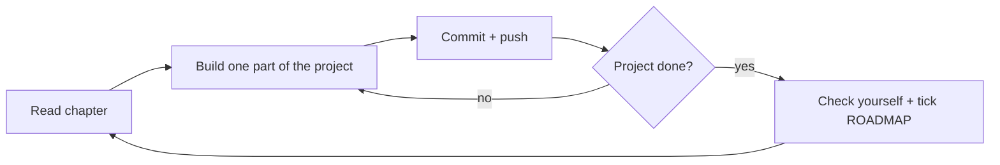

# LiteLLM Mastery

Learning [LiteLLM](https://github.com/BerriAI/litellm) from zero to top 1%, by building projects.

- [`ROADMAP.md`](./ROADMAP.md): the path. Level 0, then small, medium, large projects, then top 1%. Tracks progress.
- [`theory/`](./theory/README.md): one chapter per project. Plain words, diagrams, small runnable demos, a project brief, and self-check questions.

Every output shown in `theory/` was captured from a real run with `litellm 1.104.0`.
No API keys were used: demos use LiteLLM's `mock_response`, local fake servers, and Docker.

## How I work through it



I write all project code myself. Each project lives in its own folder (for example `projects/s1-model-switcher/`).

## Setup

```bash
uv venv --python 3.12
source .venv/bin/activate
uv pip install "litellm==1.104.0" python-dotenv
```

API keys go in `.env`, which is git-ignored. Never commit keys.
