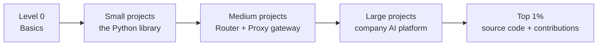

# LiteLLM Mastery — Roadmap

Theory for every project: [`theory/`](./theory/README.md). Read the chapter, then build.

Goal: go from zero to top 1% LiteLLM engineer by **building projects** (top-down).
Each project teaches only the concepts it needs, right when it needs them.

**What is LiteLLM?** One Python library + one server that lets you call 100+ AI model
providers (OpenAI, Anthropic, Gemini, Bedrock, local Ollama, ...) with **one** OpenAI-style API.
Companies run it as an **AI gateway**: every team's AI request goes through it, so the company
controls keys, cost, limits, failover, and logging in one place.

**Money rule:** we start with **Ollama** (free models on your laptop) and free tiers.
Paid keys are optional.

Progress: tick `[x]` when a project is done.

---

## Level 0 — Basics (no LiteLLM yet)

- [ ] L0.1 What an LLM API call is: request, response, tokens, cost
- [ ] L0.2 Why companies need a gateway (the "10 teams, 5 providers" mess)
- [ ] L0.3 Setup: Python virtual env, `pip install litellm`, Ollama, `.env` for keys

---

## Small projects — the LiteLLM Python library

| # | Project | You learn | How big companies use it |
|---|---------|-----------|--------------------------|
| S1 | **Model switcher CLI**: ask one question to 3 models with the same code | `completion()`, model names like `ollama/llama3.2`, response object, tokens | Swap providers without rewriting apps |
| S2 | **Streaming terminal chatbot with a cost meter** | `stream=True`, chat history, `token_counter`, `completion_cost` | Show live answers; track cost per request |
| S3 | **Unbreakable caller**: survives timeouts and dead providers | `num_retries`, `timeout`, `fallbacks`, LiteLLM exception types | Keep products up when one provider is down |
| S4 | **Tool-calling assistant** (weather + calculator) and JSON extractor | function/tool calling, `response_format`, structured output | Agents, data extraction pipelines |
| S5 | **Async batch summarizer**: summarize 100 docs fast | `acompletion`, `asyncio`, `embedding()`, concurrency limits | Bulk jobs, nightly pipelines |

---

## Medium projects — Router and the Proxy (AI Gateway)

| # | Project | You learn | How big companies use it |
|---|---------|-----------|--------------------------|
| M1 | **Load balancer** across several deployments of the same model | `litellm.Router`, `model_list`, routing strategies, cooldowns, rpm/tpm | Spread traffic across regions/accounts to avoid rate limits |
| M2 | **Self-hosted AI gateway** in Docker | Proxy server, `config.yaml`, master key, OpenAI SDK pointed at the proxy, admin UI | One internal endpoint for all AI traffic |
| M3 | **Multi-team cost control** | Postgres, virtual keys, teams, users, budgets, rate limits, spend logs, alerts | Charge each team for its AI use; stop runaway bills |
| M4 | **Fast + observable gateway** | Redis cache, semantic cache, callbacks, Langfuse / OpenTelemetry / Prometheus, custom logger | Cut cost/latency; debug every request |
| M5 | **Safe RAG service** behind the gateway | embeddings via proxy, vector DB, guardrails (PII masking, prompt-injection checks) | Internal "chat with company docs" bots |

---

## Large projects — build it like a big tech platform team

| # | Project | You learn | How big companies use it |
|---|---------|-----------|--------------------------|
| L1 | **Company AI platform** on Kubernetes | Helm, multiple proxy replicas, shared Redis + Postgres, health checks, Grafana dashboards, load testing (Locust) | Central AI gateway serving thousands of requests/sec |
| L2 | **Cost-aware smart router** | custom routing, pre-call hooks, cheap-vs-strong model routing, A/B tests, evals | Send easy prompts to cheap models, hard ones to strong models |
| L3 | **Agent platform with MCP gateway** | MCP servers behind LiteLLM, per-key tool permissions, audit logs, custom guardrails | Let agents use internal tools safely |

---

## Top 1% — beyond users

- [ ] T1 Read the source: how `completion()`, `Router`, and the proxy request flow work inside
- [ ] T2 Add a custom provider / custom callback / custom guardrail as a plugin
- [ ] T3 Chaos drills: kill a provider, kill Redis, fill a budget; prove the system survives
- [ ] T4 Performance: measure gateway latency overhead, tune workers, find bottlenecks
- [ ] T5 Security: key rotation, least-privilege keys, pinned dependency versions, secret managers
- [ ] T6 Contribute a real PR (bug fix or docs) to `github.com/BerriAI/litellm`

---

## Progress

- [ ] Level 0
- [ ] S1  - [ ] S2  - [ ] S3  - [ ] S4  - [ ] S5
- [ ] M1  - [ ] M2  - [ ] M3  - [ ] M4  - [ ] M5
- [ ] L1  - [ ] L2  - [ ] L3
- [ ] Top 1% (T1–T6)
