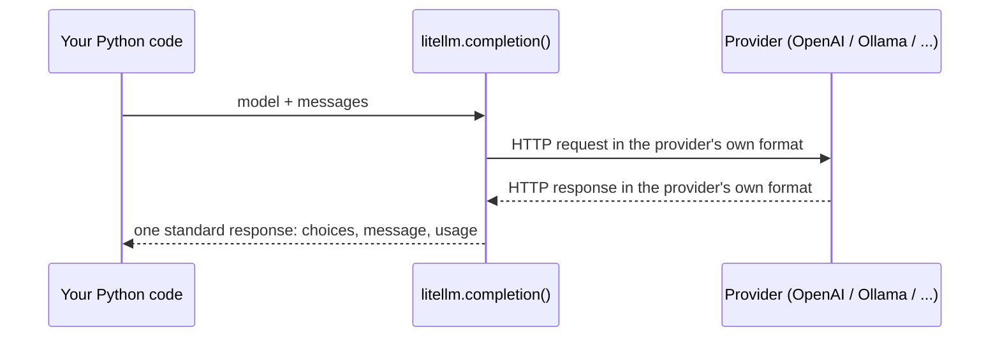
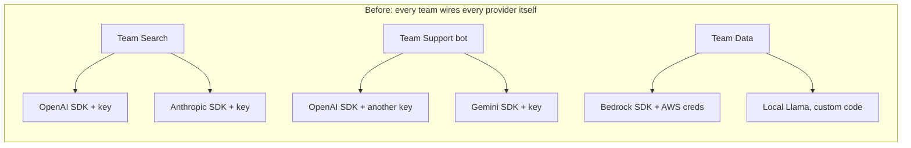
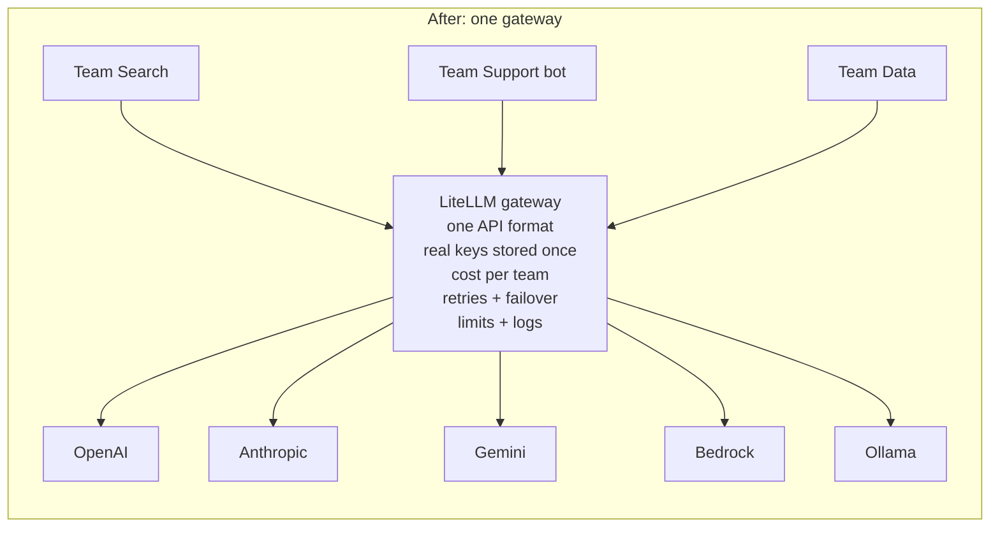

# 01 — What an LLM API call is, and why companies put a gateway in front of it

Project: L0 Setup checklist (ROADMAP.md, Level 0: L0.1–L0.3) · Read: before you start building

Previous: none, this is the first chapter · Next: [02 — completion() and providers](./02-completion-and-providers.md)

---

## The idea in plain words

Think of a large language model (LLM) as a very smart translator who sits in another city.
You cannot walk over and talk to them. You send a letter. They send a letter back.

- The **letter you send** is the *request*. It says which translator you want (the *model*)
  and contains the conversation so far (the *messages*).
- The **letter you get back** is the *response*. It contains the answer, plus a receipt
  that says how many words were read and written (the *usage*).
- The translator charges **per word piece**, not per letter. Those word pieces are called
  *tokens*. Reading is cheap. Writing is more expensive.

An **API** (Application Programming Interface) is just the agreed format of those letters.
Your Python code writes the letter as data, sends it over the internet, and reads the reply.

Now imagine a company with 10 teams, and each team writes letters to 5 different translators,
each with its own envelope format and its own password. Nobody knows the total bill. When one
translator is sick, the team's app breaks. A **gateway** is the company mailroom: every letter
goes through one desk that knows all the formats, holds all the passwords, writes down every
cost, and redirects letters when a translator is away. LiteLLM is that mailroom.

---

## Jargon table

| Term | Full name | What it does | Tiny example |
|------|-----------|--------------|--------------|
| LLM | Large Language Model | A program that predicts the next piece of text | GPT-4o, Claude, Llama |
| API | Application Programming Interface | The agreed request/response format to talk to a program | `POST /chat/completions` |
| Provider | — | The company or software that runs the model | OpenAI, Anthropic, Ollama |
| Model | — | One specific LLM you pick by name | `gpt-4o-mini`, `ollama/llama3.2` |
| Message | — | One turn in a conversation: a role plus text | `{"role": "user", "content": "Hi"}` |
| Role | — | Who said the message | `system`, `user`, `assistant` |
| Token | — | A small chunk of text, the unit models read, write and bill | `"Hello"` = 1 token |
| Usage | — | The receipt: tokens in, tokens out, total | `prompt_tokens=10` |
| Prompt tokens | — | Tokens you sent (input) | the whole message list |
| Completion tokens | — | Tokens the model wrote (output) | the reply |
| API key | — | A secret password that proves who pays | `sk-...` |
| SDK | Software Development Kit | A library a provider gives you to call its API | `openai`, `anthropic` packages |
| Gateway | AI gateway / LLM proxy | One server all AI calls go through | LiteLLM Proxy |
| Failover | — | Switching to a backup model when one fails | OpenAI down → use Claude |
| venv | virtual environment | A private folder of Python packages for one project | `.venv/` |
| `.env` | dotenv file | A file holding secrets as `NAME=value` lines, never committed | `OPENAI_API_KEY=sk-...` |
| Ollama | — | Free app that runs open models on your own laptop | `ollama pull llama3.2` |

---

## L0.1 — One LLM API call, end to end



The request has two required parts:

1. `model`: which model to use.
2. `messages`: a list. Each item has a `role` and `content`.
   - `system`: rules for the model ("You are a short, friendly assistant.").
   - `user`: what the human typed.
   - `assistant`: what the model said earlier (you send it back so the model "remembers").

The response has three parts you will use every day:

- `choices`: a list of answers. Almost always you take `choices[0]`.
- `choices[0].message`: the answer itself, with `role="assistant"` and `content`.
- `usage`: the token receipt.

### About `mock_response`

There are no API keys on the machine where this chapter was written. So every demo uses
`mock_response="..."`. This tells LiteLLM: "do not call the network, pretend the model replied
with this text". You get a real response object, same shape as a real call. It is also how
companies test their code without paying.

### Part 1 — Hello world

```python
import litellm

# A request is a model name plus a list of messages.
messages = [
    {"role": "system", "content": "You are a short, friendly assistant."},
    {"role": "user", "content": "Say hello in five words."},
]

# mock_response = LiteLLM skips the network and pretends the model said this.
response = litellm.completion(
    model="gpt-4o-mini",
    messages=messages,
    mock_response="Hello there, nice to meet!",
)

print(response.choices[0].message.content)
```

Output (real, captured with litellm 1.104.0):

```
Hello there, nice to meet!
```

With a real key (not run here): delete the `mock_response` line and put `OPENAI_API_KEY` in
your `.env`. With Ollama (not run here): use `model="ollama/llama3.2"`, no key needed.

### Part 2 — Look inside the response

```python
import litellm

response = litellm.completion(
    model="gpt-4o-mini",
    messages=[{"role": "user", "content": "Say hello in five words."}],
    mock_response="Hello there, nice to meet!",
)

first_choice = response.choices[0]
print("id:           ", response.id)
print("model:        ", response.model)
print("role:         ", first_choice.message.role)
print("content:      ", first_choice.message.content)
print("finish_reason:", first_choice.finish_reason)
print("usage:        ", response.usage)
```

Output (real, captured with litellm 1.104.0):

```
id:            chatcmpl-ffbc1d6f-4e46-49c9-a997-9a30b236f345
model:         gpt-4o-mini
role:          assistant
content:       Hello there, nice to meet!
finish_reason: stop
usage:         Usage(completion_tokens=20, prompt_tokens=10, total_tokens=30, completion_tokens_details=None, prompt_tokens_details=None)
```

- `finish_reason: stop` means the model finished normally. `length` would mean it hit the
  token limit and the answer was cut off.
- Careful: in mock mode the usage `10` and `20` are **fixed placeholder numbers**
  (`DEFAULT_MOCK_RESPONSE_PROMPT_TOKEN_COUNT` and `DEFAULT_MOCK_RESPONSE_COMPLETION_TOKEN_COUNT`
  in `litellm/constants.py`). A real provider returns the true counts.

### Part 3 — The model has no memory

```python
import litellm

# The model has no memory. YOU send the whole conversation every time.
messages = [
    {"role": "system", "content": "You answer in one short sentence."},
    {"role": "user", "content": "My name is Abhishek."},
    {"role": "assistant", "content": "Nice to meet you, Abhishek."},
    {"role": "user", "content": "What is my name?"},
]

response = litellm.completion(
    model="gpt-4o-mini",
    messages=messages,
    mock_response="Your name is Abhishek.",
)

reply = response.choices[0].message
print("reply role:", reply.role)
print("reply text:", reply.content)

# To continue the chat, append the reply and the next question.
messages.append({"role": "assistant", "content": reply.content})
print("messages now in history:", len(messages))
```

Output (real, captured with litellm 1.104.0):

```
reply role: assistant
reply text: Your name is Abhishek.
messages now in history: 5
```

Every turn you resend the full history. So long chats cost more and more input tokens.

---

## Tokens: what they are and why the bill uses them

A model does not see letters or words. It sees **tokens**: chunks from a fixed dictionary.
Common English words are often 1 token. Rare words split into several. Non-English text
often needs more tokens per word.

Why bill by tokens? Because the model's work is done token by token. More tokens in means
more reading. More tokens out means more writing, and writing is slower, so it costs more.
That is why every price list has two numbers: **input price** and **output price**.

### Part 4 — Count tokens offline

`litellm.token_counter` counts tokens on your laptop, no network. For `gpt-4o*` models it uses
OpenAI's `o200k_base` tokenizer (the dictionary that model uses).

```python
import litellm

sentences = [
    "Hello",
    "Hello, how are you today?",
    "Antidisestablishmentarianism",
    "नमस्ते, आप कैसे हैं?",
]

for text in sentences:
    count = litellm.token_counter(model="gpt-4o-mini", text=text)
    print(f"{count:3d} tokens  <-  {text}")
```

Output (real, captured with litellm 1.104.0):

```
  1 tokens  <-  Hello
  7 tokens  <-  Hello, how are you today?
  6 tokens  <-  Antidisestablishmentarianism
  9 tokens  <-  नमस्ते, आप कैसे हैं?
```

### Part 5 — Messages cost more than their text

```python
import litellm

messages = [
    {"role": "system", "content": "You are a short, friendly assistant."},
    {"role": "user", "content": "Say hello in five words."},
]

# Count the whole conversation, not just the text.
# Each message adds a few hidden "wrapper" tokens for the role.
prompt_tokens = litellm.token_counter(model="gpt-4o-mini", messages=messages)

just_text_tokens = 0
for message in messages:
    just_text_tokens = just_text_tokens + litellm.token_counter(
        model="gpt-4o-mini", text=message["content"]
    )

print("tokens of the text only:     ", just_text_tokens)
print("tokens of the full messages: ", prompt_tokens)
```

Output (real, captured with litellm 1.104.0):

```
tokens of the text only:      14
tokens of the full messages:  25
```

The extra 11 tokens are the envelope: role markers and separators. Small per message,
but it adds up across millions of requests.

---

## Cost per request: by hand, then automatically

The formula is simple:

$$
\text{cost} = \text{prompt\_tokens} \times \text{input price} + \text{completion\_tokens} \times \text{output price}
$$

LiteLLM ships a big price list: `litellm.model_cost`. It is a dict from model name to prices
(dollars **per single token**) and limits.

### Part 6 — Cost by hand from `model_cost`

```python
import litellm

# model_cost is a big dict shipped inside LiteLLM: model name -> prices and limits.
prices = litellm.model_cost["gpt-4o-mini"]
input_price = prices["input_cost_per_token"]    # dollars per 1 input token
output_price = prices["output_cost_per_token"]  # dollars per 1 output token

print("input  $ per 1M tokens:", input_price * 1_000_000)
print("output $ per 1M tokens:", output_price * 1_000_000)

# Pretend one request used these many tokens.
prompt_tokens = 1200
completion_tokens = 300

input_cost = prompt_tokens * input_price
output_cost = completion_tokens * output_price
total_cost = input_cost + output_cost

print(f"input cost:  ${input_cost:.6f}")
print(f"output cost: ${output_cost:.6f}")
print(f"total cost:  ${total_cost:.6f}")
```

Output (real, captured with litellm 1.104.0):

```
input  $ per 1M tokens: 0.15
output $ per 1M tokens: 0.6
input cost:  $0.000180
output cost: $0.000180
total cost:  $0.000360
```

Notice: 300 output tokens cost the same as 1200 input tokens. Output is 4x the price here.

### Part 7 — Let `completion_cost` do it

```python
import litellm

response = litellm.completion(
    model="gpt-4o-mini",
    messages=[{"role": "user", "content": "Explain tokens in one sentence."}],
    mock_response="Tokens are small chunks of text that the model reads and writes.",
)

usage = response.usage
print("prompt_tokens:    ", usage.prompt_tokens)
print("completion_tokens:", usage.completion_tokens)

# Do it by hand first.
prices = litellm.model_cost["gpt-4o-mini"]
by_hand = usage.prompt_tokens * prices["input_cost_per_token"]
by_hand = by_hand + usage.completion_tokens * prices["output_cost_per_token"]
print(f"by hand:          ${by_hand:.8f}")

# Now let LiteLLM do it from the response object.
automatic = litellm.completion_cost(completion_response=response)
print(f"completion_cost:  ${automatic:.8f}")
```

Output (real, captured with litellm 1.104.0):

```
prompt_tokens:     10
completion_tokens: 20
by hand:          $0.00001350
completion_cost:  $0.00001350
```

Same number. (The 10 and 20 are the mock placeholders from Part 2; with a real call they are
the real counts.) For simple chat calls the math is exactly this formula. For some
models `completion_cost` also handles extras like cached-input prices, which is why you
use it instead of your own formula in real code.

### Part 8 — Same request, different models

```python
import litellm

model_names = ["gpt-4o-mini", "gpt-4o", "claude-haiku-4-5", "ollama/llama3.1", "my-made-up-model"]
prompt_tokens = 1000
completion_tokens = 500

for name in model_names:
    prices = litellm.model_cost.get(name)
    if prices is None:
        print(f"{name:20s} not in the price list")
        continue
    cost = prompt_tokens * prices["input_cost_per_token"]
    cost = cost + completion_tokens * prices["output_cost_per_token"]
    print(f"{name:20s} ${cost:.6f} per request")
```

Output (real, captured with litellm 1.104.0):

```
gpt-4o-mini          $0.000450 per request
gpt-4o               $0.007500 per request
claude-haiku-4-5     $0.003500 per request
ollama/llama3.1      $0.000000 per request
my-made-up-model     not in the price list
```

`gpt-4o` is about 17x the price of `gpt-4o-mini` for the same request. Picking the right
model is the biggest cost lever a company has. Ollama runs on your machine, so the price
list says $0 (you pay in laptop electricity and speed instead).

---

## L0.2 — Why companies need a gateway

Picture 10 teams and 5 providers, with no gateway.



Problems in this picture:

- **Different SDKs.** Each provider has its own library and its own request/response shape.
  Switching from OpenAI to Anthropic means rewriting code.
- **Keys everywhere.** API keys live in many repos and laptops. One leak and anyone can spend
  your money. Rotating a key means chasing every team.
- **No cost view.** Each team gets a separate bill or shares one key. Finance cannot answer
  "which team spent $40,000 last month?"
- **No failover.** When one provider has an outage, every app using it breaks, and each team
  must write its own retry and backup logic.
- **No rules.** No central rate limits, no logging, no safety checks.



Teams now speak one format (the OpenAI style) and hold a **virtual key** from the gateway,
not the real provider key. The platform team changes models, adds backups, and sets budgets
in one config. You will build this in the medium projects. Today you only learn the
library form: `litellm.completion()` is the same "one format" idea inside a Python program.

---

## How big companies use this

These are customer quotes published on LiteLLM's own homepage, [litellm.ai](https://www.litellm.ai/)
(vendor marketing, so read them as claims, not audits):

- **NVIDIA** (Ajay Dogra, Product): LiteLLM gives engineers "a single, consistent way to access
  more than 100 AI model endpoints". This is the one-format idea.
- **Netflix** (David Leen, Staff Software Engineer): his team provides "the latest LLM models
  to our users, usually within a day of them being released". New models arrive as config, not
  as code rewrites.
- **Okta** (Dennis Henry, Productivity Architect): switching the backend model "is a simple
  configuration update in the gateway; no code changes, procurement cycles, or repetitive
  security reviews".

Typical patterns you will meet in companies (no specific company named):

- A platform team runs one gateway. App teams never see real provider keys.
- Every request is tagged with team or user, so cost reports per team come for free.
- Cheap models for easy tasks, expensive models only where needed.
- Tests and CI use mock responses, so no money is spent and tests do not flake.

---

## L0.3 — Setup on your Mac

### Step 1: a virtual environment

A **virtual environment** (venv) is a private folder of packages for one project, so
projects do not fight over versions. `uv` is a fast tool that creates venvs and installs
packages.

These exact commands were run in a clean folder while writing this chapter:

```bash
uv venv --python 3.12 .venv
uv pip install --python .venv/bin/python "litellm==1.104.0" python-dotenv
.venv/bin/python -c "from importlib.metadata import version; import litellm; print('litellm version:', version('litellm'))"
```

Output (real, captured with litellm 1.104.0), last line:

```
litellm version: 1.104.0
```

Then `source .venv/bin/activate` so that `python` means the venv's Python.
No `uv`? The built-in way works too (not run here): `python3 -m venv .venv`, then
`source .venv/bin/activate`, then `pip install "litellm==1.104.0" python-dotenv`.

Note: `litellm.__version__` does not exist in 1.104.0. That is why the check above asks the
package metadata with `importlib.metadata.version("litellm")`.

### Step 2: Ollama (free models on your laptop)

Not run here (no Ollama on the writing machine). On your Mac:

1. Download and install the app from <https://ollama.com/download>. Open it once.
   It starts a local server at `http://localhost:11434`.
2. In a terminal: `ollama pull llama3.2` (a small model, a couple of GB).
3. Check it: `ollama run llama3.2 "say hi"`, and `ollama list` shows the model.
4. From LiteLLM: `model="ollama/llama3.2"`, `api_base="http://localhost:11434"`.
   The LiteLLM docs also offer `ollama_chat/llama3.2`, which uses Ollama's chat endpoint
   and is their recommended prefix ([docs](https://docs.litellm.ai/docs/providers/ollama)).

### Part 9 — What it looks like when Ollama is not running

This is useful to recognise. It was run on a machine with no Ollama:

```python
import litellm

try:
    response = litellm.completion(
        model="ollama/llama3.2",
        messages=[{"role": "user", "content": "Say hi"}],
        api_base="http://localhost:11434",  # where Ollama listens by default
    )
    print(response.choices[0].message.content)
except Exception as error:
    # On this machine Ollama is not running, so we land here.
    print("Error type:", type(error).__name__)
```

Output (real, captured with litellm 1.104.0):

```

Give Feedback / Get Help: https://github.com/BerriAI/litellm/issues/new
LiteLLM.Info: If you need to debug this error, use `litellm._turn_on_debug()'.

Error type: APIConnectionError
```

`APIConnectionError` = "I could not even reach the server". On your laptop, with Ollama open,
the same code prints a real reply.

### Step 3: secrets in `.env`, never in code

A `.env` file holds secrets as `NAME=value` lines. `python-dotenv` loads them into
environment variables. LiteLLM reads provider keys from environment variables by their
standard names (`OPENAI_API_KEY`, `ANTHROPIC_API_KEY`, ...), so you never pass the key in code.

`.env` (fake key, for the demo):

```
OPENAI_API_KEY=sk-fake-1234567890abcdef
```

### Part 10 — Load `.env`

```python
import os
from dotenv import load_dotenv

# Reads the .env file in the current folder and puts each line into os.environ.
load_dotenv()

key = os.getenv("OPENAI_API_KEY")
if key is None:
    print("No key found. Did you create .env?")
else:
    # Never print a full key. Show only the start so you know it loaded.
    print("Key loaded, starts with:", key[:7] + "...")
```

Output (real, captured with litellm 1.104.0):

```
Key loaded, starts with: sk-fake...
```

### Step 4: make git ignore `.env`

Put `.env` and `.venv/` in `.gitignore` **before** your first commit. Check it with
`git check-ignore -v .env`. Run in a scratch repo while writing this chapter:

```bash
printf '.env\n.venv/\n' > .gitignore
git check-ignore -v .env
git status --short
```

Output (real, captured):

```
.gitignore:1:.env	.env
?? .gitignore
```

`.env` is ignored, so `git status` does not even list it. Commit a `.env.example` with
empty values instead, so others know which names to fill in.

---

## Traps

1. **Putting the API key in the code.** Code gets pushed, shared, pasted into chats. Bots scan
   public GitHub for keys within minutes. Use `.env` plus `.gitignore`, always.
2. **Forgetting the model has no memory.** If you only send the latest question, the model
   cannot know earlier turns. You must send the history yourself (Part 3).
3. **Trusting mock usage numbers.** With `mock_response`, usage is a fixed 10 in / 20 out.
   Do not build cost reports from mock runs.
4. **Ignoring output price.** Output tokens usually cost several times more than input tokens.
   A chatty answer can cost more than a long question.
5. **Installing into the system Python.** `pip install` without an active venv mixes versions
   across projects and breaks things later. Check with `which python`: it should point into `.venv`.
6. **Pip-installing a different version than the chapters.** These chapters are verified on
   `litellm==1.104.0`. LiteLLM releases very often; pin the version so outputs match.

---

## Project brief: L0 — Setup checklist

**Goal:** a working LiteLLM workspace on your laptop that can call a mock model and a real
local Ollama model, with secrets handled safely.

**Features**

- A project folder (for example `litellm-mastery/projects/L0-setup/`) with its own venv.
- `litellm==1.104.0` and `python-dotenv` installed in that venv.
- A small script that prints the LiteLLM version.
- A small script that makes one `mock_response` call and prints the reply and the usage.
- A small script that calls `ollama/llama3.2` on your laptop and prints the reply, the token
  usage, and the cost computed by `completion_cost`.
- A `.env` file loaded with `python-dotenv`, plus a committed `.env.example`.

**Rules**

- No keys in code or in git. Keys only in `.env`; `.env` is in `.gitignore`.
- Readable code: plain loops, named variables, one idea per line.
- Write it yourself. Use the Parts above as reference, not as copy-paste.

**Done when**

- [ ] `which python` (with the venv active) prints a path inside your project's `.venv`.
- [ ] The version script prints `litellm version: 1.104.0`.
- [ ] The mock script prints your mock reply and a `Usage(...)` line.
- [ ] `ollama list` shows `llama3.2`.
- [ ] The Ollama script prints a real reply generated on your laptop.
- [ ] `git check-ignore -v .env` prints a matching `.gitignore` line.
- [ ] `git status` does not list `.env`.

**Hints**

- What does your script print if Ollama is closed? Which exception type do you expect?
- Where does `load_dotenv()` look for the `.env` file if you run the script from a different folder?
- Why is the Ollama cost `$0`, and what number would change if you switched to `gpt-4o-mini`?
- Does Ollama return real `usage` numbers? Compare them with `litellm.token_counter` for the same messages.

---

## Check yourself

1. What are the two required parts of a chat request, and what are the three roles?

<details><summary>Answer</summary><code>model</code> and <code>messages</code>. Roles: <code>system</code> (rules for the model), <code>user</code> (the human), <code>assistant</code> (what the model said before).</details>

2. Where is the reply text inside the response object?

<details><summary>Answer</summary><code>response.choices[0].message.content</code>. The token receipt is in <code>response.usage</code>.</details>

3. A request uses 2,000 prompt tokens and 500 completion tokens on `gpt-4o-mini`
   ($0.15 per 1M input, $0.60 per 1M output). What does it cost?

<details><summary>Answer</summary>2,000 × 0.15 / 1,000,000 = $0.0003. 500 × 0.60 / 1,000,000 = $0.0003. Total $0.0006.</details>

4. Why does a long chat get more expensive with every turn, even if each question is short?

<details><summary>Answer</summary>The model has no memory, so you resend the whole history each time. The prompt tokens grow every turn, and you pay for all of them again.</details>

5. Name four problems a gateway solves for a company with many teams and providers.

<details><summary>Answer</summary>Any four of: different SDKs/formats, real keys spread everywhere, no per-team cost view, no failover during outages, no central rate limits, no central logging or safety checks.</details>

6. Your Ollama script raises `APIConnectionError`. What is the most likely cause, and what
   is the first thing you check?

<details><summary>Answer</summary>LiteLLM could not reach the server at all, most likely because Ollama is not running. Open the Ollama app (or run <code>ollama serve</code>) and check that <code>http://localhost:11434</code> answers, for example with <code>ollama list</code>.</details>
