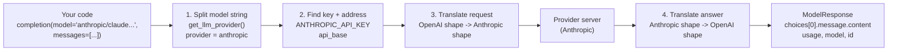
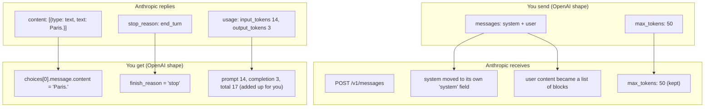

# 02 — One function, many AI providers: `completion()`

Project: S1 Model switcher CLI (ROADMAP.md) · Read: before you start building

Previous: [01 — LLM API basics](./01-llm-api-basics.md) · Next: [03 — Streaming and cost](./03-streaming-and-cost.md)

---

## The idea in plain words

Think of a travel power adapter. Every country has a different wall socket.
You do not buy a new laptop for each country. You carry one adapter, and your
laptop plug stays the same.

AI companies are like countries with different sockets:

- **OpenAI** wants requests in one shape.
- **Anthropic** (the company behind Claude) wants a different shape.
- **Google Gemini** wants yet another shape.
- **Ollama** (a free program that runs AI models on your own laptop) has its own shape too.

**LiteLLM** is the adapter. You always write your request in one shape (the
**OpenAI format**). LiteLLM converts it to whatever the provider wants, sends
it, and converts the answer back into the OpenAI format. So your code never changes.
Only one text string changes: the model name.

A **provider** is a company or program that runs AI models and lets you call them.
A **model** is one specific AI brain from that provider, like `gpt-4o-mini` or `llama3.2`.

---

## Jargon table

| Term | Full name | What it does | Tiny example |
|---|---|---|---|
| LLM | Large Language Model | AI that reads text and writes text | `gpt-4o-mini`, `llama3.2` |
| Provider | AI provider | Company/program that hosts models | `openai`, `anthropic`, `ollama` |
| Model string | — | Tells LiteLLM which provider and which model | `"ollama/llama3.2"` |
| `completion()` | chat completion | LiteLLM's main function: send messages, get an answer | `completion(model=..., messages=...)` |
| Messages | chat messages | A list of turns in the chat, each with a `role` and `content` | `{"role": "user", "content": "Hi"}` |
| Role | message role | Who is speaking: `system` (rules), `user` (you), `assistant` (AI) | `"system"` |
| `ModelResponse` | — | The answer object LiteLLM returns, OpenAI-shaped | `response.choices[0].message.content` |
| Token | — | A small piece of text (about 3/4 of a word). Providers count and charge by tokens | `"Hello there"` is about 2–3 tokens |
| `usage` | token usage | How many tokens went in and came out | `usage.total_tokens` |
| Env var | environment variable | A setting stored outside your code, read by programs | `OPENAI_API_KEY=sk-...` |
| API key | Application Programming Interface key | Secret password that proves who is paying | `sk-...` |
| `api_base` | API base URL | The web address LiteLLM sends the request to | `http://localhost:11434` |
| `temperature` | — | Randomness. 0 = same answer each time, 1+ = more creative | `temperature=0.2` |
| `max_tokens` | — | Hard limit on how long the answer can be | `max_tokens=60` |
| `drop_params` | — | Tell LiteLLM to silently remove settings a provider does not understand | `drop_params=True` |
| `mock_response` | — | A fake answer. LiteLLM skips the network and returns it | `mock_response="Paris."` |
| CLI | Command Line Interface | A program you run by typing in the terminal | `python ask.py "Hi"` |
| `argparse` | argument parser | Python's built-in tool to read CLI options | `--models a b c` |

---

## The big picture: what happens inside one call



You only ever touch the two ends: the left box and the right box.
Everything in the middle is LiteLLM's job.

---

## Part 1 — The smallest `completion()` call

`completion()` needs only two things: `model` and `messages`.
Here we add `mock_response` so it runs with no key and no internet.

```python
from litellm import completion

messages = [
    {"role": "system", "content": "You are a short, friendly helper."},
    {"role": "user", "content": "What is the capital of France?"},
]

response = completion(
    model="openai/gpt-4o-mini",
    messages=messages,
    mock_response="Paris.",  # fake answer, no network call, no key needed
)

print(response.choices[0].message.content)
```

Output (real, captured with litellm 1.104.0):

```text
Paris.
```

Real call (not run here): delete the `mock_response` line and put `OPENAI_API_KEY` in your `.env`.
For free local use, change `model` to `"ollama/llama3.2"` with Ollama running.

The signature has many optional parameters. The ones you need now:

| Parameter | Meaning |
|---|---|
| `model` (required) | `"provider/model"` string |
| `messages` (required) | list of `{"role": ..., "content": ...}` |
| `temperature`, `max_tokens` | answer style and length |
| `api_key`, `api_base` | override the key or address for this one call |
| `timeout` | give up after N seconds (chapter 04) |
| `stream` | get the answer word by word (chapter 03) |
| `drop_params` | remove unsupported settings (Part 6) |
| `mock_response` | fake answer for tests |

---

## Part 2 — How LiteLLM reads the model string

The model string is `provider/model`. The part before the first `/` is the provider.
LiteLLM has a function, `get_llm_provider()`, that does this split. `completion()` calls it for you.

```python
from litellm import get_llm_provider

model_strings = [
    "openai/gpt-4o-mini",
    "anthropic/claude-3-5-haiku-20241022",
    "gemini/gemini-2.0-flash",
    "ollama/llama3.2",
    "gpt-4o-mini",  # no prefix: LiteLLM knows this famous name
]

for model_string in model_strings:
    # returns 4 things: (model, provider, api_key, api_base)
    model, provider, api_key, api_base = get_llm_provider(model=model_string)
    print(f"{model_string:36} -> provider={provider:10} model={model}")
```

Output (real, captured with litellm 1.104.0):

```text
openai/gpt-4o-mini                   -> provider=openai     model=gpt-4o-mini
anthropic/claude-3-5-haiku-20241022  -> provider=anthropic  model=claude-3-5-haiku-20241022
gemini/gemini-2.0-flash              -> provider=gemini     model=gemini-2.0-flash
ollama/llama3.2                      -> provider=ollama     model=llama3.2
```

Notice: the provider prefix is removed before the name is sent to the provider.
Anthropic receives `claude-3-5-haiku-20241022`, not `anthropic/claude-...`.

What if you forget the prefix on a name LiteLLM does not know?

```python
from litellm import get_llm_provider

try:
    get_llm_provider(model="llama3.2")  # forgot the "ollama/" prefix
except Exception as error:
    print("Error type:", type(error).__name__)
    print(str(error)[:120])
```

Output (real, captured with litellm 1.104.0):

```text

Provider List: https://docs.litellm.ai/docs/providers

Error type: BadRequestError
litellm.BadRequestError: LLM Provider NOT provided. Pass in the LLM provider you are trying to call. You passed model=ll
```

The `Provider List:` line is printed by LiteLLM itself when it cannot find a provider. It is a hint, not your code.
Rule: **always write the prefix.** It is clearer and never guesses wrong.

---

## Part 3 — Where keys come from: environment variables

LiteLLM looks for each provider's key in a fixed environment variable name.

| Provider | Model string example | Env var LiteLLM reads |
|---|---|---|
| OpenAI | `openai/gpt-4o-mini` | `OPENAI_API_KEY` |
| Anthropic | `anthropic/claude-3-5-haiku-20241022` | `ANTHROPIC_API_KEY` |
| Google Gemini (AI Studio) | `gemini/gemini-2.0-flash` | `GEMINI_API_KEY` (or `GOOGLE_API_KEY`) |
| Ollama (local) | `ollama/llama3.2` | no key; address in `OLLAMA_API_BASE`, default `http://localhost:11434` |

`litellm.validate_environment()` checks this for you without calling anyone:

```python
import litellm

models = [
    "openai/gpt-4o-mini",
    "anthropic/claude-3-5-haiku-20241022",
    "gemini/gemini-2.0-flash",
    "ollama/llama3.2",
]

for model in models:
    # looks only at environment variables, makes no network call
    report = litellm.validate_environment(model=model)
    print(model)
    print("   keys ok?     ", report["keys_in_environment"])
    print("   missing keys:", report["missing_keys"])
```

Output (real, captured with litellm 1.104.0, on a machine with no keys set):

```text
openai/gpt-4o-mini
   keys ok?      False
   missing keys: ['OPENAI_API_KEY']
anthropic/claude-3-5-haiku-20241022
   keys ok?      False
   missing keys: ['ANTHROPIC_API_KEY']
gemini/gemini-2.0-flash
   keys ok?      False
   missing keys: ['GOOGLE_API_KEY', 'GEMINI_API_KEY']
ollama/llama3.2
   keys ok?      False
   missing keys: ['OLLAMA_API_BASE']
```

Two details from the LiteLLM source:

- Gemini: either `GEMINI_API_KEY` or `GOOGLE_API_KEY` is enough. The list shows both names as options.
- Ollama: the check says `OLLAMA_API_BASE` is missing, but the real call falls back to
  `http://localhost:11434` anyway. So for Ollama this "missing" is only a warning.

Keys never go in code. Put them in a `.env` file and load it with `python-dotenv`:

```python
import os
from dotenv import load_dotenv

load_dotenv()  # reads the .env file in the current folder into os.environ

key = os.environ.get("OPENAI_API_KEY")
if key is None:
    print("OPENAI_API_KEY is not set")
else:
    print("OPENAI_API_KEY loaded, starts with:", key[:5])
```

Output (real, captured with litellm 1.104.0; `.env` contained a fake key `sk-fake-for-demo-only`):

```text
OPENAI_API_KEY loaded, starts with: sk-fa
```

Print only the first few characters of a key, never the whole key.

---

## Part 4 — The response object (`ModelResponse`)

Every provider answers differently. LiteLLM always gives you back the same object,
shaped like OpenAI's answer.

```python
from litellm import completion

response = completion(
    model="anthropic/claude-3-5-haiku-20241022",
    messages=[{"role": "user", "content": "Say hi in 3 words."}],
    mock_response="Hello there, friend!",
)

print("type:          ", type(response).__name__)
print("id:            ", response.id)
print("model:         ", response.model)
print("object:        ", response.object)
print("content:       ", response.choices[0].message.content)
print("role:          ", response.choices[0].message.role)
print("finish_reason: ", response.choices[0].finish_reason)
print("usage:         ", response.usage)
print("total tokens:  ", response.usage.total_tokens)
```

Output (real, captured with litellm 1.104.0):

```text
type:           ModelResponse
id:             chatcmpl-560c46df-103c-4014-ab40-0ce711184f4d
model:          claude-3-5-haiku-20241022
object:         chat.completion
content:        Hello there, friend!
role:           assistant
finish_reason:  stop
usage:          Usage(completion_tokens=20, prompt_tokens=10, total_tokens=30, completion_tokens_details=None, prompt_tokens_details=None)
total tokens:   30
```

What each field means:

- `id`: a unique name for this one answer. Useful in logs. It changes every call.
- `model`: which model answered (without the provider prefix).
- `choices`: a list of answers. Normally just one, so you use `choices[0]`.
- `choices[0].message.content`: **the text you want.**
- `finish_reason`: why it stopped. `stop` = finished normally. `length` = hit `max_tokens`.
- `usage.prompt_tokens`: tokens you sent. `usage.completion_tokens`: tokens it wrote.

Note: with `mock_response`, the token numbers (10, 20, 30) are fixed fake values.
Real calls report real counts.

---

## Part 5 — Seeing the translation for real (a fake Anthropic server)

Words are cheap. Let's watch LiteLLM translate. We run a tiny fake "Anthropic" server
on our own laptop. It prints whatever it receives and replies in **Anthropic's** format.
Then we point LiteLLM at it with `api_base`.

The fake server (`fake_anthropic.py`). Start it in one terminal:

```python
import json
from http.server import BaseHTTPRequestHandler, HTTPServer


class FakeAnthropic(BaseHTTPRequestHandler):
    def do_POST(self):
        length = int(self.headers["Content-Length"])
        body = json.loads(self.rfile.read(length))
        print("SERVER GOT path:", self.path)
        print("SERVER GOT body:", json.dumps(body))

        # Reply in Anthropic's own format (not OpenAI's!)
        reply = {
            "id": "msg_fake123",
            "type": "message",
            "role": "assistant",
            "model": "claude-3-5-haiku-20241022",
            "content": [{"type": "text", "text": "Paris."}],
            "stop_reason": "end_turn",
            "usage": {"input_tokens": 14, "output_tokens": 3},
        }
        data = json.dumps(reply).encode()
        self.send_response(200)
        self.send_header("Content-Type", "application/json")
        self.send_header("Content-Length", str(len(data)))
        self.end_headers()
        self.wfile.write(data)

    def log_message(self, *args):
        pass  # keep the terminal quiet


HTTPServer(("127.0.0.1", 7002), FakeAnthropic).serve_forever()
```

The client, in a second terminal. It is normal OpenAI-style code:

```python
from litellm import completion

response = completion(
    model="anthropic/claude-3-5-haiku-20241022",
    messages=[
        {"role": "system", "content": "Answer in one word."},
        {"role": "user", "content": "Capital of France?"},
    ],
    max_tokens=50,
    api_base="http://127.0.0.1:7002",  # our fake server, not the real Anthropic
    api_key="fake-key",
)

print("CLIENT content:      ", response.choices[0].message.content)
print("CLIENT finish_reason:", response.choices[0].finish_reason)
print("CLIENT usage:        ", response.usage.prompt_tokens, response.usage.completion_tokens, response.usage.total_tokens)
```

Output (real, captured with litellm 1.104.0). Server terminal:

```text
SERVER GOT path: /v1/messages
SERVER GOT body: {"model": "claude-3-5-haiku-20241022", "messages": [{"role": "user", "content": [{"type": "text", "text": "Capital of France?"}]}], "max_tokens": 50, "system": [{"type": "text", "text": "Answer in one word."}]}
```

Client terminal:

```text

Provider List: https://docs.litellm.ai/docs/providers

CLIENT content:       Paris.
CLIENT finish_reason: stop
CLIENT usage:         14 3 17
```

Look at what LiteLLM changed, in both directions:



That is the whole value of LiteLLM in one picture. Ollama, Gemini, Bedrock and the
other providers each get their own translator inside LiteLLM. Your code stays the same.

---

## Part 6 — Common settings, and what happens when a provider does not support one

`temperature` and `max_tokens` work almost everywhere. Other settings do not.
LiteLLM can tell you which OpenAI-style settings each provider accepts:

```python
from litellm import get_supported_openai_params

checks = [
    ("anthropic", "claude-3-5-haiku-20241022"),
    ("ollama", "llama3.2"),
    ("gemini", "gemini-2.0-flash"),
]
wanted = ["temperature", "max_tokens", "seed", "frequency_penalty"]

for provider, model in checks:
    supported = get_supported_openai_params(model=model, custom_llm_provider=provider)
    line = provider.ljust(10)
    for param in wanted:
        if param in supported:
            line = line + " yes:" + param
        else:
            line = line + "  NO:" + param
    print(line)
```

Output (real, captured with litellm 1.104.0):

```text
anthropic  yes:temperature yes:max_tokens  NO:seed  NO:frequency_penalty
ollama     yes:temperature yes:max_tokens yes:seed yes:frequency_penalty
gemini     yes:temperature yes:max_tokens  NO:seed yes:frequency_penalty
```

So what happens if you send `frequency_penalty` to Anthropic? LiteLLM refuses, on purpose,
so you do not silently get a different behavior than you asked for.
If you are OK with losing that setting, pass `drop_params=True`:

```python
import litellm

messages = [{"role": "user", "content": "hi"}]

# 1. Without drop_params: Anthropic has no "frequency_penalty", so LiteLLM refuses.
try:
    litellm.completion(
        model="anthropic/claude-3-5-haiku-20241022",
        messages=messages,
        frequency_penalty=0.5,
        mock_response="ok",
    )
except litellm.UnsupportedParamsError as error:
    print("Refused:", str(error)[:95])

# 2. With drop_params=True on this one call: the param is silently removed.
response = litellm.completion(
    model="anthropic/claude-3-5-haiku-20241022",
    messages=messages,
    frequency_penalty=0.5,
    drop_params=True,
    mock_response="ok",
)
print("With drop_params=True:", response.choices[0].message.content)
```

Output (real, captured with litellm 1.104.0):

```text
Refused: litellm.UnsupportedParamsError: anthropic does not support parameters: ['frequency_penalty'], f
With drop_params=True: ok
```

Notice the check happens even with `mock_response`. That makes mocks good for testing your settings.
You can also switch it on for the whole program with `litellm.drop_params = True` (default is `False`).

---

## Part 7 — Same question, many models (the heart of S1)

Because every call has the same shape, comparing models is just a `for` loop.

```python
import time
from litellm import completion

question = "In one sentence, what is a black hole?"
messages = [{"role": "user", "content": question}]

models = [
    "openai/gpt-4o-mini",
    "anthropic/claude-3-5-haiku-20241022",
    "ollama/llama3.2",
]

# Pretend answers so this runs with no keys. Remove mock_response for real calls.
fake_answers = {
    "openai/gpt-4o-mini": "A place where gravity is so strong light cannot escape.",
    "anthropic/claude-3-5-haiku-20241022": "A region of collapsed matter that traps light.",
    "ollama/llama3.2": "A very dense star remnant that swallows everything nearby.",
}

for model in models:
    start = time.time()
    response = completion(
        model=model,
        messages=messages,  # same messages for every model
        temperature=0.2,
        max_tokens=60,
        mock_response=fake_answers[model],
    )
    seconds = time.time() - start
    answer = response.choices[0].message.content
    tokens = response.usage.total_tokens
    print(f"[{model}] ({seconds:.2f}s, {tokens} tokens)")
    print("   ", answer)
```

Output (real, captured with litellm 1.104.0):

```text
[openai/gpt-4o-mini] (0.01s, 30 tokens)
    A place where gravity is so strong light cannot escape.
[anthropic/claude-3-5-haiku-20241022] (0.01s, 30 tokens)
    A region of collapsed matter that traps light.
[ollama/llama3.2] (0.00s, 30 tokens)
    A very dense star remnant that swallows everything nearby.
```

Real run (not run here): remove `mock_response`, set the keys in `.env`, and start Ollama.
Real times will be around 0.5–10 seconds, and token counts will differ per model.

---

## Part 8 — One broken model must not stop the others

In real life one provider will fail: no key, rate limit, Ollama not running.
Wrap each call in `try/except` so the loop continues.
`mock_response="litellm.RateLimitError"` makes LiteLLM raise a fake rate-limit error.

```python
from litellm import completion

messages = [{"role": "user", "content": "Hello"}]

# The middle one pretends to be rate limited by its provider.
plan = [
    ("openai/gpt-4o-mini", "Hi from OpenAI!"),
    ("anthropic/claude-3-5-haiku-20241022", "litellm.RateLimitError"),
    ("ollama/llama3.2", "Hi from Llama!"),
]

for model, fake in plan:
    try:
        response = completion(model=model, messages=messages, mock_response=fake)
        print(f"OK   {model}: {response.choices[0].message.content}")
    except Exception as error:
        # one broken model must not stop the others
        print(f"FAIL {model}: {type(error).__name__}")
```

Output (real, captured with litellm 1.104.0):

```text
OK   openai/gpt-4o-mini: Hi from OpenAI!
FAIL anthropic/claude-3-5-haiku-20241022: RateLimitError
OK   ollama/llama3.2: Hi from Llama!
```

Chapter 04 covers the exact LiteLLM error types. For now, catching `Exception` per model is enough.

---

## Part 9 — `argparse`: turning a script into a CLI

Your project is a command you type in the terminal. Python's built-in `argparse` reads
what the user typed after the script name.

- A **positional argument** is required and has no `--name`: `python ask.py "Hi"`.
- An **option** starts with `--` and is usually optional: `--temperature 0.3`.
- `nargs="+"` means "one or more values".
- `action="store_true"` makes an on/off switch: present = `True`.

```python
import argparse

parser = argparse.ArgumentParser(description="Ask a question to AI models.")
parser.add_argument("question", help="the question to ask")  # positional: required
parser.add_argument(
    "--models",
    nargs="+",  # one or more values: --models a b c
    default=["ollama/llama3.2"],
    help="model strings like provider/model",
)
parser.add_argument("--temperature", type=float, default=0.7)
parser.add_argument("--mock", action="store_true", help="fake answers, no network")

args = parser.parse_args()

print("question:   ", args.question)
print("models:     ", args.models)
print("temperature:", args.temperature)
print("mock:       ", args.mock)
```

Run: `python p9.py "Why is the sky blue?" --models openai/gpt-4o-mini ollama/llama3.2 --mock`

Output (real, captured with litellm 1.104.0):

```text
question:    Why is the sky blue?
models:      ['openai/gpt-4o-mini', 'ollama/llama3.2']
temperature: 0.7
mock:        True
```

Run: `python p9.py` (forgot the question)

Output (real, captured with litellm 1.104.0):

```text
usage: p9.py [-h] [--models MODELS [MODELS ...]] [--temperature TEMPERATURE]
             [--mock]
             question
p9.py: error: the following arguments are required: question
```

You also get `--help` for free. `type=float` turns the text `"0.3"` into the number `0.3`.

---

## How big companies use this

The pattern: **app code talks to one interface; the model name is configuration.**

- Teams keep the model string in config or an env var (for example `MODEL=anthropic/claude-...`),
  never hard-coded in many files. Switching provider becomes a config change and a redeploy, not a rewrite.
- Before switching, they run the same set of test questions through several models
  (exactly your S1 loop, but with hundreds of questions) and compare quality, speed, tokens.
- Tests use fake responses (like `mock_response`) so CI runs offline, fast, and free.
- Later (chapter 08) the same idea moves into a central **gateway** server, so every team
  in the company calls one internal address instead of each provider.

Named examples (customer quotes published on LiteLLM's own site, so treat them as vendor marketing,
opened at [litellm.ai/ai-gateway](https://www.litellm.ai/ai-gateway)):

- Netflix: a staff engineer says LiteLLM lets them offer new models to users "usually within a day" of release.
- NVIDIA: "a single, consistent way to access more than 100 AI model endpoints."
- Okta: switching the backend model is "a simple configuration update in the gateway; no code changes."

---

## Traps

1. **Forgetting the provider prefix.** `model="llama3.2"` fails (Part 2). LiteLLM cannot guess
   it means Ollama. Always write `ollama/llama3.2`.
2. **Typing the key into code.** It ends up on GitHub and someone spends your money.
   Use `.env` and add `.env` to `.gitignore`.
3. **Using `drop_params=True` everywhere without thinking.** It hides problems. If you rely on
   `seed` for repeatable answers and the provider drops it, your answers silently stop being repeatable.
   Check with `get_supported_openai_params` first.
4. **Trusting mock token counts.** `mock_response` always reports 10/20/30 tokens.
   Never use mock numbers to estimate cost.
5. **Thinking `validate_environment` failing means Ollama is broken.** For Ollama it only means
   `OLLAMA_API_BASE` is not set; the call still uses `http://localhost:11434`. What matters is
   whether Ollama is actually running (`ollama serve`) and the model is pulled (`ollama pull llama3.2`).
6. **Letting one failure crash the whole comparison.** Without `try/except` per model, one missing
   key stops the loop and you see no answers at all.

---

## Project brief: S1 — Model switcher CLI

**Goal:** a terminal command that asks one question to several models with the same code,
and prints their answers side by side so you can compare them.

**Features**

- Take the question as a positional argument.
- `--models` option: one or more `provider/model` strings. A sensible default list
  (at least one Ollama model so it works for free).
- `--temperature` and `--max-tokens` options, passed to every model.
- `--mock` switch: uses `mock_response` so the whole tool runs with no keys and no internet.
- For each model print: model name, answer text, prompt/completion/total tokens, seconds taken.
- If a model fails, print a clear one-line error for that model and continue with the rest.
- Before calling, warn (do not crash) if a model's key looks missing.
- Print a short summary at the end: how many models succeeded, how many failed.

**Rules**

- No API keys in code. Load them from `.env` with `python-dotenv`. Commit a `.env.example` with empty values.
- `.env` is in `.gitignore`.
- Readable code: plain `for` loops, named variables, small functions.
- Pin `litellm==1.104.0` in `requirements.txt`.

**Done when**

- [ ] `python ask.py --help` shows all options with help text.
- [ ] `python ask.py "What is 2+2?" --mock --models openai/gpt-4o-mini anthropic/claude-3-5-haiku-20241022 ollama/llama3.2` prints 3 answers with no keys set.
- [ ] With Ollama running, `python ask.py "What is 2+2?" --models ollama/llama3.2` prints a real answer and real token counts.
- [ ] A model with a missing key prints one error line, and the other models still answer.
- [ ] `--temperature 0` and `--max-tokens 20` visibly change the answers (shorter answers with 20).
- [ ] Passing a typo model like `llama3.2` (no prefix) gives a friendly message, not a long traceback.
- [ ] `git grep sk-` finds no keys in your repo.

**Hints (questions to ask yourself)**

1. Which single line in your loop is the only thing that differs between providers?
2. Where should the mock answer text come from so each model's fake answer is different?
3. How will you measure "seconds taken" so it includes only the model call?
4. Which LiteLLM function from Part 3 can warn about missing keys before you call?
5. What should happen to `finish_reason` when `--max-tokens` is very small, and should you show it?

---

## Check yourself

1. In `"anthropic/claude-3-5-haiku-20241022"`, which part picks the provider, and what name does Anthropic actually receive?

<details><summary>Answer</summary>

The part before the first `/` (`anthropic`) picks the provider. LiteLLM strips it, so Anthropic receives `claude-3-5-haiku-20241022`. `get_llm_provider()` does this split.

</details>

2. Where is the answer text in a `ModelResponse`, and where are the token counts?

<details><summary>Answer</summary>

Text: `response.choices[0].message.content`. Tokens: `response.usage.prompt_tokens`, `response.usage.completion_tokens`, `response.usage.total_tokens`.

</details>

3. You call `completion(model="anthropic/...", frequency_penalty=0.5, ...)`. What happens, and what are two ways to make it work?

<details><summary>Answer</summary>

LiteLLM raises `UnsupportedParamsError` because Anthropic does not support `frequency_penalty`. Fix: remove the parameter, or pass `drop_params=True` (per call) / set `litellm.drop_params = True` (whole program) so LiteLLM silently removes it.

</details>

4. Which env var does LiteLLM read for Gemini, and what does Ollama need instead of a key?

<details><summary>Answer</summary>

Gemini: `GEMINI_API_KEY` (or `GOOGLE_API_KEY`). Ollama needs no key, only an address: `api_base` or `OLLAMA_API_BASE`, which defaults to `http://localhost:11434`.

</details>

5. In the fake Anthropic server demo, name two things LiteLLM changed in the request and two in the response.

<details><summary>Answer</summary>

Request: the `system` message was moved out of `messages` into a separate `system` field, and the user content was turned into a list of text blocks; it was sent to `/v1/messages`. Response: Anthropic's `content` list became `choices[0].message.content`, `stop_reason: end_turn` became `finish_reason: stop`, and `input_tokens`/`output_tokens` became `prompt_tokens`/`completion_tokens` with a computed `total_tokens`.

</details>

6. Why is `mock_response` useful, and what must you never use it for?

<details><summary>Answer</summary>

It returns a fake answer with no network or key, so you can build and test your program offline and for free. It still checks parameters (unsupported params still raise). Never use its token counts (always 10/20/30) for cost or length estimates.

</details>
