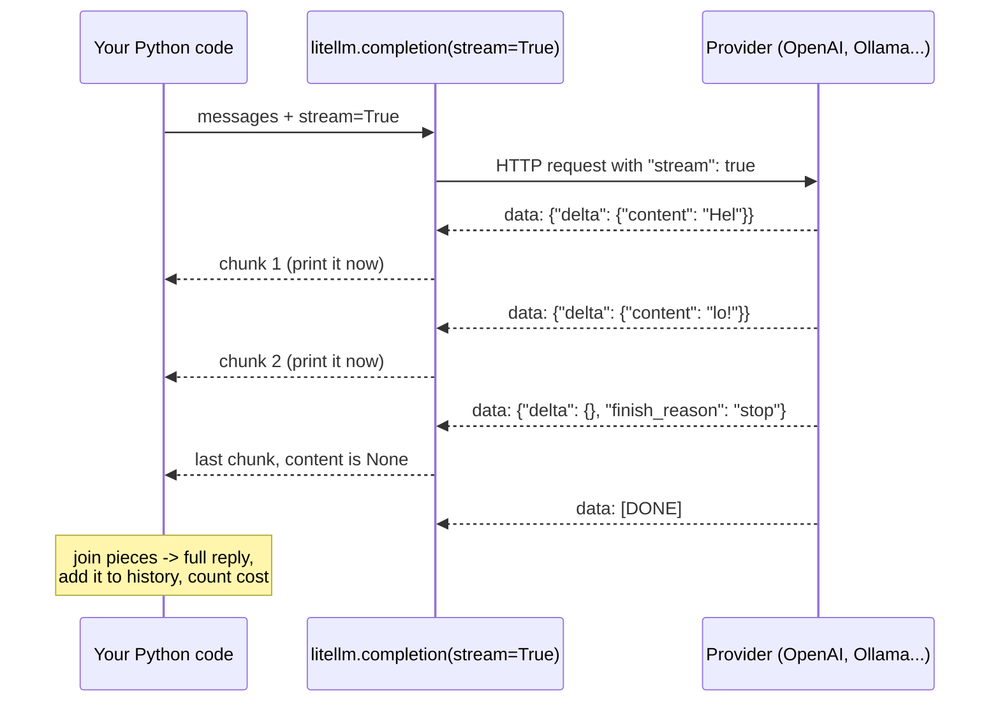
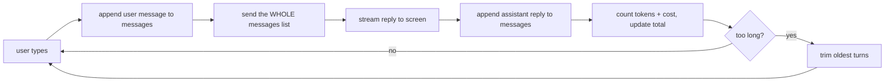

# 03 — Streaming answers and counting the cost

Project: S2 Streaming terminal chatbot with a cost meter (ROADMAP.md) · Read: before you start building

Previous: [02 — completion and providers](./02-completion-and-providers.md) · Next: [04 — reliability](./04-reliability.md)

---

## The idea in plain words

Think of ordering food at a restaurant.

- **Without streaming**, the waiter waits until all five dishes are cooked, then brings them together. You stare at an empty table for 20 minutes.
- **With streaming**, each dish comes out as soon as it is ready. Total time is the same, but you start eating after 2 minutes. It *feels* much faster.

An LLM writes its answer one small piece at a time. A **token** is one of those pieces, usually a short word or part of a word. With **streaming**, the server sends you each piece as soon as it is made. Your program prints it right away, so the user sees the answer "typing" live.

The second idea is the **bill**. The provider charges you per token: tokens you send (input) and tokens it writes (output). A chatbot has a hidden trap here. The model has no memory. To make it "remember" the chat, you send the **whole conversation again** every turn. So turn 10 costs much more than turn 1, even if your question is short. In this chapter you learn to count tokens, price them, and keep the conversation from growing forever.

---

## Jargon table

| Term | Full name | What it does | Tiny example |
|---|---|---|---|
| Token | Token | Smallest unit of text the model reads or writes. Billing is per token. | `"Hello there, friend!"` is 5 tokens for gpt-4o-mini |
| Streaming | Response streaming | Server sends the answer in many small pieces instead of one block | `stream=True` |
| Chunk | Stream chunk | One piece of a streamed answer | `chunk.choices[0].delta.content == "Hel"` |
| Delta | Delta (change) | The *new* part inside a chunk. Only what was added since the last chunk. | `{"content": "lo!"}` |
| SSE | Server-Sent Events | A simple web format for pushing many messages over one HTTP response. Each message is a line starting with `data:` | `data: {...}` then `data: [DONE]` |
| TTFT | Time To First Token | Time from sending the request to seeing the first piece of text | 0.4 s |
| finish_reason | Finish reason | Why the model stopped | `"stop"` (done), `"length"` (hit the output limit) |
| Usage | Token usage | Counts of input and output tokens for one request | `prompt_tokens=10, completion_tokens=8` |
| Context window | Context window | Max tokens the model can read in one request (history + question) | gpt-4o-mini: 128,000 |
| Max output tokens | Max output tokens | Max tokens the model can write in one reply | gpt-4o-mini: 16,384 |
| Model cost map | `litellm.model_cost` | A big dict shipped with LiteLLM: price and limits for each model | `model_cost["gpt-4o-mini"]["input_cost_per_token"]` |
| Trimming | History trimming | Removing old messages so the chat fits the context window and costs less | drop the oldest question + answer |

---

## How a streamed request flows



Here is what SSE looks like on the wire. I captured this with `curl` against a local LiteLLM proxy whose model was set to a mock answer `"Hi there!"` (you build a proxy yourself in chapter 08):

Output (real, captured with litellm 1.104.0):

```text
data: {"id":"chatcmpl-e14dddfd-...","object":"chat.completion.chunk","created":1791217197,"model":"gpt-4o-mini","choices":[{"index":0,"delta":{"role":"assistant","content":"Hi "}}]}

data: {"id":"chatcmpl-e14dddfd-...","object":"chat.completion.chunk","created":1791217197,"model":"gpt-4o-mini","choices":[{"index":0,"delta":{"content":"the"}}]}

data: {"id":"chatcmpl-e14dddfd-...","object":"chat.completion.chunk","created":1791217197,"model":"gpt-4o-mini","choices":[{"index":0,"delta":{"content":"re!"}}]}

data: {"id":"chatcmpl-e14dddfd-...","object":"chat.completion.chunk","created":1791217197,"model":"gpt-4o-mini","choices":[{"index":0,"delta":{},"finish_reason":"stop"}]}

data: [DONE]
```

(I shortened the long `id` values.) Each `data:` line is one chunk. `[DONE]` means the stream is over. LiteLLM reads these lines for you and hands you Python objects.

---

## About the demos

All demos use `mock_response="..."`. LiteLLM then returns that text as if a model wrote it. No key, no network call to a model. With `stream=True`, the mock answer is cut into 3-character chunks, so you can see streaming work.

To use a real model, remove `mock_response` and change `model`. For example `model="ollama/llama3.2"` (free, local) or `model="gpt-4o-mini"` with `OPENAI_API_KEY` in your `.env`. Not run here.

One more thing: mock responses report fake token counts (10 input tokens by default). Real providers report real counts. The pricing math is the same.

---

## Part 1: Turn on streaming and look at the chunks

```python
import litellm

messages = [{"role": "user", "content": "Say hello to a new learner."}]

# stream=True returns an iterator of chunks instead of one finished response
response = litellm.completion(
    model="gpt-4o-mini",
    messages=messages,
    stream=True,
    mock_response="Hello! Welcome to LiteLLM.",  # fake answer, no API key needed
)

chunk_number = 0
for chunk in response:
    chunk_number = chunk_number + 1
    piece = chunk.choices[0].delta.content
    print(chunk_number, repr(piece))
```

Output (real, captured with litellm 1.104.0):

```text
1 'Hel'
2 'lo!'
3 ' We'
4 'lco'
5 'me '
6 'to '
7 'Lit'
8 'eLL'
9 'M.'
10 None
```

Notice:

- Without streaming you read `response.choices[0].message.content`. With streaming you read `chunk.choices[0].delta.content`. `message` is the full answer; `delta` is only the new bit.
- The last chunk has `None` as content. It only says "I am finished".

## Part 2: Print live and handle `None`

```python
import litellm

messages = [{"role": "user", "content": "Say hello."}]
response = litellm.completion(
    model="gpt-4o-mini",
    messages=messages,
    stream=True,
    mock_response="Hello! Welcome to LiteLLM.",
)

full_text = ""
for chunk in response:
    piece = chunk.choices[0].delta.content
    if piece is None:
        # the last chunk carries no text, only finish_reason
        print("\n[end of stream, finish_reason =", chunk.choices[0].finish_reason, "]")
        continue
    print(piece, end="", flush=True)  # flush shows text right away
    full_text = full_text + piece

print("Saved reply:", full_text)
```

Output (real, captured with litellm 1.104.0):

```text
Hello! Welcome to LiteLLM.
[end of stream, finish_reason = stop ]
Saved reply: Hello! Welcome to LiteLLM.
```

Two small but important details:

- `end=""` stops `print` from adding a new line after each piece.
- `flush=True` pushes the text to the screen now. Without it, Python may hold text in a buffer and your "live" chatbot looks frozen.
- `full_text + None` would crash with `TypeError`. That is why we skip `None`.

## Part 3: Measure time to first token

TTFT is what the user *feels*. A 10-second answer that starts after 0.3 s feels fast. The same answer shown after 10 s of blank screen feels broken.

```python
import time
import litellm

messages = [{"role": "user", "content": "Explain streaming."}]

start = time.perf_counter()
response = litellm.completion(
    model="gpt-4o-mini",
    messages=messages,
    stream=True,
    mock_response="Streaming sends the answer in small pieces.",
    mock_delay=0.5,  # pretend the model needs 0.5 s to start answering
)

first_token_at = None
for chunk in response:
    piece = chunk.choices[0].delta.content
    if piece is not None and first_token_at is None:
        first_token_at = time.perf_counter()  # time of the FIRST visible text
end = time.perf_counter()

print("time to first token:", round(first_token_at - start, 2), "s")
print("total time:        ", round(end - start, 2), "s")
```

Output (real, captured with litellm 1.104.0):

```text
time to first token: 0.59 s
total time:         0.72 s
```

Your numbers will differ a little on each run. With a real model the gap between the two numbers is much bigger, because the model writes slowly. Streaming does not make the total shorter. It makes the *wait for something* shorter.

## Part 4: Count tokens before you send

`token_counter` counts tokens on your machine. No API call. You can use it to predict cost and to check if a chat still fits.

```python
import litellm

text = "Hello there, friend!"
messages = [{"role": "user", "content": text}]

text_tokens = litellm.token_counter(model="gpt-4o-mini", text=text)
message_tokens = litellm.token_counter(model="gpt-4o-mini", messages=messages)

print("tokens in the plain text:  ", text_tokens)
# messages add a few hidden tokens per message (role markers, separators)
print("tokens as a chat message:  ", message_tokens)
```

Output (real, captured with litellm 1.104.0):

```text
tokens in the plain text:   5
tokens as a chat message:   12
```

The same words cost more as a chat message. Each message carries extra format tokens. Always count `messages=`, not just the text, when you estimate a chat request.

## Part 5: Look up prices in `model_cost`

`litellm.model_cost` is a normal Python dict. LiteLLM ships it and (by default) refreshes it from the web at import. Set `LITELLM_LOCAL_MODEL_COST_MAP=True` to use only the copy inside the installed package ([docs](https://docs.litellm.ai/docs/completion/token_usage)).

```python
import litellm

info = litellm.model_cost["gpt-4o-mini"]  # a plain Python dict, shipped with litellm

input_price = info["input_cost_per_token"]
output_price = info["output_cost_per_token"]

print("input  $ per token:", input_price)
print("output $ per token:", output_price)
print("input  $ per 1M tokens:", round(input_price * 1_000_000, 2))
print("output $ per 1M tokens:", round(output_price * 1_000_000, 2))
print("context window (max_input_tokens):", info["max_input_tokens"])
```

Output (real, captured with litellm 1.104.0):

```text
input  $ per token: 1.5e-07
output $ per token: 6e-07
input  $ per 1M tokens: 0.15
output $ per 1M tokens: 0.6
context window (max_input_tokens): 128000
```

Prices are usually quoted "per 1 million tokens". Output tokens cost 4x more than input tokens for this model. That is common.

## Part 6: Price one request with `completion_cost`

```python
import litellm

messages = [{"role": "user", "content": "Say hello."}]
response = litellm.completion(
    model="gpt-4o-mini",
    messages=messages,
    mock_response="Hello! Welcome to LiteLLM.",
)

# completion_cost reads model + usage from the response and looks up prices
cost = litellm.completion_cost(completion_response=response)
print("usage:", response.usage.prompt_tokens, "in,", response.usage.completion_tokens, "out")
print("cost in dollars:", cost)
print("cost formatted: ", f"${cost:.6f}")

# the same math by hand, for a made-up request size
prompt_cost, reply_cost = litellm.cost_per_token(
    model="gpt-4o-mini", prompt_tokens=1000, completion_tokens=500
)
print("1000 in + 500 out costs:", prompt_cost + reply_cost)
```

Output (real, captured with litellm 1.104.0):

```text
usage: 10 in, 20 out
cost in dollars: 1.35e-05
cost formatted:  $0.000013
1000 in + 500 out costs: 0.00045
```

Check the math yourself: `10 x 0.00000015 + 20 x 0.0000006 = 0.0000015 + 0.000012 = 0.0000135`. (A non-streamed mock always reports 10 in / 20 out.)

## Part 7: Usage and cost of a streamed reply

A streamed reply has no single response object, so there is nothing to hand to `completion_cost` yet. Two tools fix that:

- `stream_options={"include_usage": True}` asks the provider to send one extra chunk at the end with token counts. For OpenAI this is off by default.
- `litellm.stream_chunk_builder(chunks, messages=messages)` glues all chunks back into one normal response (`full.choices[0].message.content`, `full.usage`, ...).

```python
import litellm

messages = [{"role": "user", "content": "Say hello."}]
response = litellm.completion(
    model="gpt-4o-mini",
    messages=messages,
    stream=True,
    stream_options={"include_usage": True},
    mock_response="Hello! Welcome to LiteLLM.",
)

all_chunks = []
for chunk in response:
    piece = chunk.choices[0].delta.content
    if piece is not None:
        print(piece, end="", flush=True)
    all_chunks.append(chunk)
print()

full = litellm.stream_chunk_builder(all_chunks, messages=messages)
cost = litellm.completion_cost(completion_response=full)
print("tokens:", full.usage.prompt_tokens, "in,", full.usage.completion_tokens, "out")
print(f"cost of this streamed reply: ${cost:.7f}")
```

Output (real, captured with litellm 1.104.0):

```text
Hello! Welcome to LiteLLM.
tokens: 10 in, 8 out
cost of this streamed reply: $0.0000063
```

`10 x 0.00000015 + 8 x 0.0000006 = 0.0000063`. Correct. (`10` is the mock's fixed fake prompt count. `8` is counted from the mock reply.)

A note on the raw OpenAI API: its usage chunk has an **empty** `choices` list (`choices: []`), as the [OpenAI streaming cookbook](https://developers.openai.com/cookbook/examples/how_to_stream_completions) explains. I tested LiteLLM 1.104.0 against a small local fake server that sends exactly that shape. LiteLLM still gave one choice with `delta.content = None` on that last chunk, so `chunk.choices[0]` did not crash. If you ever use the plain `openai` SDK, check `if chunk.choices:` first.

**Local models have no price.** `litellm.model_cost` lists Ollama models at `$0`. If you want an "internal" price (to compare with paid APIs), add one with `litellm.register_model({...})` ([docs](https://docs.litellm.ai/docs/completion/token_usage)). I tested it: after registering `ollama/llama3.2` at $0.0000001 in / $0.0000002 out, a mock call with 10 in / 20 out cost `4.9999999999999996e-06` (that is $0.000005 plus floating-point noise; format with `f"{cost:.6f}"`). LiteLLM also attaches the cost to each response as `response._hidden_params["response_cost"]`.

---

## Chat history: why every turn costs more

The model remembers nothing between calls. A chatbot keeps a Python list called `messages` and appends to it:



### Worked arithmetic

Say the system prompt is 20 tokens, every question is 30 tokens and every answer is 200 tokens. On turn `n` you send the system prompt, `n` questions and `n - 1` old answers:

- Turn 1 input: 20 + 30 = **50** tokens
- Turn 2 input: 20 + 2 x 30 + 1 x 200 = **280** tokens
- Turn 3 input: 20 + 3 x 30 + 2 x 200 = **510** tokens
- Turn 10 input: 20 + 10 x 30 + 9 x 200 = **2,120** tokens

Total input over 10 turns: 10 x 20 + 30 x (1+2+...+10) + 200 x (0+1+...+9) = 200 + 1,650 + 9,000 = **10,850** tokens.
You only *typed* 300 tokens of questions. You *paid* for 10,850 input tokens. The cost grows roughly with the square of the number of turns. At gpt-4o-mini prices: 10,850 x $0.00000015 = **$0.0016** input, plus 2,000 output tokens x $0.0000006 = **$0.0012**. Small for one chat; large for a million users.

## Part 8: Watch the history grow

```python
import litellm

MODEL = "gpt-4o-mini"
input_price = litellm.model_cost[MODEL]["input_cost_per_token"]

messages = [{"role": "system", "content": "You are a helpful tutor."}]
reply = "Sure. " * 40  # pretend every answer is about the same length
running_cost = 0.0

for turn in range(1, 6):
    messages.append({"role": "user", "content": "Tell me more about tokens, please."})
    # the WHOLE list is sent every turn, so input tokens keep growing
    sent_tokens = litellm.token_counter(model=MODEL, messages=messages)
    turn_input_cost = sent_tokens * input_price
    running_cost = running_cost + turn_input_cost
    print(f"turn {turn}: input tokens sent = {sent_tokens:4d}   total input cost so far = ${running_cost:.7f}")
    messages.append({"role": "assistant", "content": reply})
```

Output (real, captured with litellm 1.104.0):

```text
turn 1: input tokens sent =   25   total input cost so far = $0.0000037
turn 2: input tokens sent =  122   total input cost so far = $0.0000220
turn 3: input tokens sent =  219   total input cost so far = $0.0000549
turn 4: input tokens sent =  316   total input cost so far = $0.0001023
turn 5: input tokens sent =  413   total input cost so far = $0.0001643
```

Each turn adds 97 tokens to what you send. The running cost grows faster and faster.

---

## Part 9: Context window limits

Every model has two limits: how much it can read, and how much it can write. Do not mix them up.

```python
import litellm

info = litellm.get_model_info("gpt-4o-mini")
print("max_input_tokens  (context window):", info["max_input_tokens"])
print("max_output_tokens (longest reply): ", info["max_output_tokens"])

# careful: get_max_tokens returns the OUTPUT limit, not the context window
print("get_max_tokens():", litellm.get_max_tokens("gpt-4o-mini"))
```

Output (real, captured with litellm 1.104.0):

```text
max_input_tokens  (context window): 128000
max_output_tokens (longest reply):  16384
get_max_tokens(): 16384
```

If you go over `max_input_tokens`, the provider rejects the request. LiteLLM raises `litellm.ContextWindowExceededError` (you handle errors in chapter 04). Better to trim before that happens.

## Part 10: Trim the oldest turns yourself

```python
import litellm

MODEL = "gpt-4o-mini"
BUDGET = 60  # pretend our context window is tiny, to see trimming happen

messages = [{"role": "system", "content": "You are a helpful tutor."}]
for turn in range(1, 6):
    messages.append({"role": "user", "content": f"Question number {turn} about tokens?"})
    messages.append({"role": "assistant", "content": f"Answer number {turn}, short and clear."})

print("before:", len(messages), "messages,", litellm.token_counter(model=MODEL, messages=messages), "tokens")

# drop the OLDEST user/assistant pair until we fit; keep the system message (index 0)
while litellm.token_counter(model=MODEL, messages=messages) > BUDGET and len(messages) > 3:
    messages.pop(1)  # oldest user message
    messages.pop(1)  # its assistant reply

print("after: ", len(messages), "messages,", litellm.token_counter(model=MODEL, messages=messages), "tokens")
for message in messages:
    print(" ", message["role"], "->", message["content"])
```

Output (real, captured with litellm 1.104.0):

```text
before: 11 messages, 133 tokens
after:  3 messages, 37 tokens
  system -> You are a helpful tutor.
  user -> Question number 5 about tokens?
  assistant -> Answer number 5, short and clear.
```

Rules this follows: keep the system message, remove in pairs, never remove the newest question.

There is also a built-in `litellm.utils.trim_messages(messages, model=..., max_tokens=...)`. I ran it on the same 11 messages with `max_tokens=60`. It kept the system message and fit the budget, but it returned `assistant: Answer number 4` without `user: Question number 4`. It cuts message by message, not pair by pair. Know what your trimming does.

---

## How big companies use this

- **Stream to users, keep the full reply on the server.** Chat products show text live, then save the rebuilt full answer for logs, billing and evaluation. Anthropic's SDK documents exactly this: stream, then get the final message, and it notes the SDK *requires* streaming for very large `max_tokens` to avoid HTTP timeouts ([Anthropic streaming docs](https://platform.claude.com/docs/en/build-with-claude/streaming)).
- **Usage on streams is opt-in.** OpenAI added `stream_options={"include_usage": true}` so streamed calls can be billed and logged correctly ([OpenAI cookbook](https://developers.openai.com/cookbook/examples/how_to_stream_completions)). Typical platform teams turn it on everywhere, so no streamed request is "free" in their reports.
- **Streaming makes moderation harder.** The same OpenAI cookbook warns that partial answers are harder to check for bad content. Typical pattern: check the user input before the call, and check the full reply after the stream ends (guardrails, chapter 11).
- **Cost per request as a number on every log line.** A typical gateway (LiteLLM's proxy, chapter 08–09) stores the cost of each call next to the user and team, so finance can see who spends what. Your S2 cost meter is the tiny version of that.
- **Internal prices for self-hosted models.** Typical teams register a price for local or self-hosted models (`register_model`, Part 7) so dashboards compare them fairly with paid APIs.
- **History control.** Typical chat products cap history by tokens, drop the oldest turns, or replace old turns with a short summary. This keeps cost flat and avoids context-window errors.

---

## Traps

1. **Printing without `flush=True`.** Text sits in a buffer and appears all at once. Your streaming looks broken even though it works.
2. **Adding `None` to a string.** The last chunk (and the usage chunk) has `content = None`. `text + None` raises `TypeError`. Always check `if piece is not None`.
3. **Forgetting to save the assistant reply into `messages`.** With streaming you never get one `message` object. If you do not join the pieces and append them, the bot "forgets" its own last answer.
4. **Thinking streamed calls are free.** Without `include_usage` (or rebuilding and counting), you may log 0 tokens for streamed calls. The provider still bills you.
5. **Using `get_max_tokens` as the context window.** It returns the *output* limit (16,384 for gpt-4o-mini), not the input limit (128,000). Use `get_model_info(model)["max_input_tokens"]`.
6. **Trimming away the system message or the newest question.** Then the bot loses its instructions, or answers an old question. Trim from the oldest user/assistant turns only.

---

## Project brief: S2

**Goal:** A terminal chatbot that streams answers live and shows what each turn and the whole session cost.

**Features**

- A loop: read a line from the user, stream the answer, repeat. Commands: `/quit` exits, `/reset` clears history (keep the system prompt), `/cost` prints the session totals.
- The model name comes from `.env` (for example `CHAT_MODEL=ollama/llama3.2` or `CHAT_MODEL=gpt-4o-mini`). A `--mock` flag makes every call use `mock_response`, so you can test with no model at all.
- Streams with `stream=True` and `stream_options={"include_usage": True}`; prints pieces as they arrive.
- After each answer, print one meter line: input tokens, output tokens, cost of this turn, total session cost, and TTFT.
- Keeps full chat history in a `messages` list, including the assistant replies.
- Before each call, counts the tokens of `messages`. If over a budget you set in `.env` (for example `MAX_HISTORY_TOKENS=3000`), trims the oldest turns, never the system prompt or the newest question, and prints a note that it trimmed.
- If the model has no price (local Ollama), shows `$0.000000` instead of crashing, or uses a price you register.

**Rules**

- No API keys in code. Load them from `.env` (use `python-dotenv`). Add `.env` to `.gitignore`.
- You write all the code. Use the small demos above only as reference.
- Readable code: small functions, plain loops, named variables.

**Done when**

- [ ] `python chat.py --mock` starts, and a reply appears in several pieces (you can see it build up).
- [ ] After every reply, a meter line shows tokens in/out, turn cost, session total and TTFT.
- [ ] Turn 3's input token count is larger than turn 1's, and you can explain why.
- [ ] The session total equals the sum of the per-turn costs (check by hand for 3 turns).
- [ ] Setting `MAX_HISTORY_TOKENS` very low causes a "trimmed" note, and the bot keeps working.
- [ ] `/reset` makes the next turn's input tokens drop back to about turn 1's size.
- [ ] `/quit` prints a final summary: number of turns, total tokens, total cost.
- [ ] Grepping the project for `sk-` finds nothing.
- [ ] With Ollama running (optional), `CHAT_MODEL=ollama/llama3.2` works with no code change.

**Hints**

1. Where in your loop do you add the assistant's reply to `messages`, and what string do you add?
2. Which chunk carries the usage numbers, and what does its `delta.content` look like?
3. If the provider does not send usage, how could `stream_chunk_builder` or `token_counter` give you a fallback count?
4. How do you make trimming remove a user message and its answer together?
5. How will you measure TTFT if the first chunk has no text?

---

## Check yourself

**1. What is the difference between `choices[0].message.content` and `choices[0].delta.content`?**

<details><summary>Answer</summary>

`message.content` is the full answer in a normal (non-streamed) response. `delta.content` is only the new piece in one streamed chunk. You join all deltas to get the full answer.

</details>

**2. Why does the last chunk of a stream often have `content = None`?**

<details><summary>Answer</summary>

It carries no new text. Its job is to say the stream is finished (`finish_reason="stop"` or `"length"`), and, with `include_usage`, to carry token counts. Your code must skip `None` before joining strings.

</details>

**3. Streaming does not make the full answer arrive sooner. So why use it?**

<details><summary>Answer</summary>

It cuts the time to first token (TTFT). The user sees text start almost at once instead of a blank screen. The answer feels faster and the user can stop reading or cancel early.

</details>

**4. A chat has a 20-token system prompt, 30-token questions and 200-token answers. How many input tokens does turn 4 send?**

<details><summary>Answer</summary>

20 + 4 x 30 + 3 x 200 = 20 + 120 + 600 = **740** tokens. You send all 4 questions and the 3 earlier answers.

</details>

**5. `get_max_tokens("gpt-4o-mini")` returns 16384. Is that how much history you can send?**

<details><summary>Answer</summary>

No. That is the maximum *output* (reply) length. The context window is `get_model_info("gpt-4o-mini")["max_input_tokens"]`, which is 128,000.

</details>

**6. You stream a reply and want its cost. List the steps.**

<details><summary>Answer</summary>

Call with `stream=True` and `stream_options={"include_usage": True}`. Keep every chunk in a list while printing. After the loop, call `litellm.stream_chunk_builder(chunks, messages=messages)` to get one full response. Pass it to `litellm.completion_cost(completion_response=full)`.

</details>
