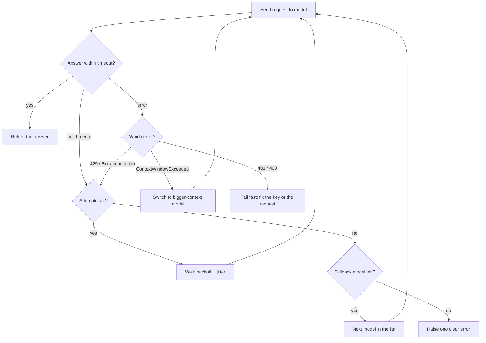

# 04 — When calls fail: errors, retries, timeouts, fallbacks

Project: S3 Unbreakable caller (ROADMAP.md) · Read: before you start building

Previous: [03 — Streaming and cost](./03-streaming-and-cost.md) · Next: [05 — Tools and structured output](./05-tools-and-structured-output.md)

---

## The idea in plain words

Think of calling a pizza shop.

- Sometimes the line is busy. You wait a bit and call again.
- Sometimes nobody picks up for a long time. You hang up after a while instead of waiting forever.
- Sometimes the shop is closed. Calling again in 2 seconds will not help. You call a different pizza shop.
- Sometimes you dialed the wrong number, or your order makes no sense ("one pizza, size purple"). Calling again with the same order will fail again. You must fix the order first.

Calling an AI model over the internet is the same. Your program sends a request to a provider's server (OpenAI, Anthropic, a local Ollama). Many things can go wrong on the way. A program that crashes on the first problem is fragile. A program that knows *which* problems are worth another try, *how long* to wait, *when* to give up, and *who else* to call is reliable.

LiteLLM helps in three ways:

1. It turns every provider's error into **one shared set of Python exception types**. A rate limit from OpenAI and a rate limit from Anthropic both become `litellm.RateLimitError`. Your code checks one type, not ten.
2. It can **retry** for you (`num_retries`) and **stop waiting** for you (`timeout`).
3. It can **switch to a backup model** for you (`fallbacks`, `context_window_fallback_dict`).

An **exception** is Python's way of saying "something went wrong, stop here unless someone handles it". You handle it with `try:` / `except SomeError:`.

## Jargon table

| Term | Full name | What it does | Tiny example |
|---|---|---|---|
| HTTP status code | Hypertext Transfer Protocol status code | A 3-digit number the server sends back to say how the request went | `200` ok, `429` slow down, `500` server broke |
| 429 | "Too Many Requests" | You sent too much too fast (or ran out of quota) | 100 calls in one second |
| 5xx | Server error family (500–599) | The provider's side failed, not yours | `500`, `503 Service Unavailable`, Anthropic's `529 overloaded` |
| 4xx | Client error family (400–499) | Your request is wrong | `400` bad input, `401` bad key |
| Timeout | — | Stop waiting after N seconds | `timeout=10` |
| Retry | — | Send the same request again | try 3 times total |
| Transient error | — | An error that may vanish on its own | a 503 during a deploy |
| Exponential backoff | — | Wait longer after each failure, doubling each time | 0.5s, 1s, 2s, 4s |
| Jitter | — | Add randomness to each wait | wait 0.32s instead of exactly 0.5s |
| Fallback | — | Use a different model when the first one fails | GPT down → use Claude |
| Context window | — | The most tokens a model can read plus write in one call | 8,192 tokens |
| Exception mapping | — | LiteLLM converting each provider's error into its own types | Anthropic 529 → `litellm.InternalServerError` |
| Thundering herd | — | Many clients retrying at the same instant and knocking a server down again | 1,000 apps retry at exactly t=1.0s |

## Why calls fail

| What happened | Status | LiteLLM exception | Retry? |
|---|---|---|---|
| Too many requests / quota | 429 | `litellm.RateLimitError` | Yes, with backoff |
| Took too long | — | `litellm.Timeout` | Yes, maybe 1–2 times |
| Could not reach server | — | `litellm.APIConnectionError` (some providers: `InternalServerError`) | Yes |
| Provider crashed | 500 / 529 | `litellm.InternalServerError` | Yes |
| Provider temporarily down | 503 | `litellm.ServiceUnavailableError` | Yes |
| Wrong or missing API key | 401 | `litellm.AuthenticationError` | No. Fix the key |
| Bad input (wrong param value) | 400 | `litellm.BadRequestError` | No. Fix the request |
| Prompt too long for the model | 400 | `litellm.ContextWindowExceededError` | No. Use a bigger model or a shorter prompt |

Two facts from the installed source (`litellm/exceptions.py`, version 1.104.0):

- `ContextWindowExceededError` is a **child class** of `BadRequestError`. So `except litellm.BadRequestError` also catches it. Put the more specific `except` first.
- Every LiteLLM exception has `.status_code`, `.message`, `.llm_provider` and `.model`.

## The big picture: one reliable call



Read it as: **retry the same model a few times, then move to the next model, then give up loudly.** Never retry a mistake that is yours (bad key, bad input).

---

## Part 1 — Making errors happen on purpose (no network)

You cannot test error handling if errors only happen by luck. LiteLLM's `mock_response` accepts three special strings that raise a real exception instead of returning text. They are hard-coded in `litellm/main.py` (`_handle_mock_potential_exceptions`): `"litellm.RateLimitError"`, `"litellm.ContextWindowExceededError"`, `"litellm.InternalServerError"`. You can also pass an exception object, for example `mock_response=litellm.Timeout(message="x", llm_provider="openai", model="m")`.

```python
import litellm

# The three string forms that litellm turns into real exceptions
error_names = [
    "litellm.RateLimitError",
    "litellm.ContextWindowExceededError",
    "litellm.InternalServerError",
]

for name in error_names:
    try:
        litellm.completion(
            model="openai/gpt-4o-mini",
            messages=[{"role": "user", "content": "hi"}],
            mock_response=name,  # no network call, just raise
        )
    except Exception as error:
        print(type(error).__name__, "| status:", error.status_code)
        print("   message:", error.message)
```

Output (real, captured with litellm 1.104.0):

```text
RateLimitError | status: 429
   message: litellm.RateLimitError: this is a mock rate limit error
ContextWindowExceededError | status: 400
   message: litellm.ContextWindowExceededError: litellm.BadRequestError: this is a mock context window exceeded error
InternalServerError | status: 500
   message: litellm.InternalServerError: this is a mock internal server error
```

Note the second message: the context error says `BadRequestError` inside it. That is the parent class showing through.

## Part 2 — A fake provider that fails on purpose

Mocks skip the network. To see LiteLLM translate **real HTTP errors**, the rest of this chapter uses a tiny local server that speaks the OpenAI format. The model name you send decides how it misbehaves. It runs on port 7004. You point LiteLLM at it with `model="openai/<name>"` and `api_base="http://127.0.0.1:7004/v1"`.

<details><summary>fake_provider.py (helper, not a demo — copy it, run <code>python fake_provider.py</code> in a second terminal)</summary>

```python
# fake_provider.py - a pretend LLM provider that fails on purpose.
# The model name you send decides what goes wrong.
import json
import time
from http.server import BaseHTTPRequestHandler, ThreadingHTTPServer

PORT = 7004
hit_counts = {}  # model name -> how many requests it received

# model name -> (HTTP status, error message)
FAILURES = {
    "always-429": (429, "Rate limit reached for requests"),
    "always-500": (500, "The server had an error"),
    "always-503": (503, "Service unavailable"),
    "bad-key": (401, "Incorrect API key provided"),
    "bad-request": (400, "Invalid value for 'temperature'"),
    "too-long": (400, "This model's maximum context length is 8192 tokens. "
                      "However, your messages resulted in 9000 tokens."),
}


def success_body(model):
    message = {"role": "assistant", "content": "hello from " + model}
    choice = {"index": 0, "finish_reason": "stop", "message": message}
    usage = {"prompt_tokens": 5, "completion_tokens": 3, "total_tokens": 8}
    return {"id": "fake-1", "object": "chat.completion", "created": 0,
            "model": model, "choices": [choice], "usage": usage}


class FakeProvider(BaseHTTPRequestHandler):
    def log_message(self, *args):
        pass  # keep the terminal quiet

    def reply(self, status, body):
        data = json.dumps(body).encode()
        self.send_response(status)
        self.send_header("content-type", "application/json")
        self.send_header("content-length", str(len(data)))
        self.end_headers()
        self.wfile.write(data)

    def do_GET(self):  # GET /hits shows counts, GET /reset clears them
        if self.path == "/reset":
            hit_counts.clear()
        self.reply(200, hit_counts)

    def do_POST(self):
        length = int(self.headers.get("content-length", 0))
        request = json.loads(self.rfile.read(length))
        model = request["model"]
        hit_counts[model] = hit_counts.get(model, 0) + 1

        if model in FAILURES:
            status, text = FAILURES[model]
            self.reply(status, {"error": {"message": text, "type": "error"}})
        elif model == "slow":
            time.sleep(5)  # longer than any sane timeout
            self.reply(200, success_body(model))
        elif model == "flaky" and hit_counts[model] <= 2:
            self.reply(503, {"error": {"message": "try again", "type": "error"}})
        else:
            self.reply(200, success_body(model))


print("fake provider on http://127.0.0.1:" + str(PORT))
ThreadingHTTPServer(("127.0.0.1", PORT), FakeProvider).serve_forever()
```

</details>

Now send one request to each broken model and see which LiteLLM exception comes out:

```python
import litellm

litellm.suppress_debug_info = True  # hide the "Give Feedback" banner
FAKE = "http://127.0.0.1:7004/v1"  # our fake provider

# each fake model fails in a different way
fake_models = ["always-429", "always-500", "always-503", "bad-key", "bad-request", "too-long"]

for name in fake_models:
    try:
        litellm.completion(
            model="openai/" + name,
            api_base=FAKE,
            api_key="fake-key",
            messages=[{"role": "user", "content": "hi"}],
            max_retries=0,  # turn off the SDK's own retries for this demo
        )
    except Exception as error:
        print(f"{name:12} -> {type(error).__name__} (status {error.status_code})")
```

Output (real, captured with litellm 1.104.0):

```text
always-429   -> RateLimitError (status 429)
always-500   -> InternalServerError (status 500)
always-503   -> ServiceUnavailableError (status 503)
bad-key      -> AuthenticationError (status 401)
bad-request  -> BadRequestError (status 400)
too-long     -> ContextWindowExceededError (status 400)
```

Look at the last line. The server only sent status 400 with a message. LiteLLM read the words "maximum context length" and picked the more specific type. That is exception mapping at work.

## Part 3 — Timeouts: stop waiting

`timeout=` is in seconds. Without it, a hung server can freeze your program for minutes. `mock_timeout=True` is the offline version: it sleeps `timeout` seconds and then raises `litellm.Timeout`.

```python
import time
import litellm

litellm.suppress_debug_info = True
FAKE = "http://127.0.0.1:7004/v1"

start = time.time()
try:
    litellm.completion(
        model="openai/slow",  # the fake server waits 5 seconds
        api_base=FAKE,
        api_key="fake-key",
        messages=[{"role": "user", "content": "hi"}],
        timeout=1,  # give up after 1 second
        max_retries=0,  # no retries, so we see one clean timeout
    )
except litellm.Timeout as error:
    seconds = round(time.time() - start, 1)
    print("Real HTTP:", type(error).__name__, "after about", seconds, "s")

# Offline version: mock_timeout=True waits `timeout` seconds, then raises
try:
    litellm.completion(
        model="openai/gpt-4o-mini",
        messages=[{"role": "user", "content": "hi"}],
        mock_timeout=True,
        timeout=0.5,
    )
except litellm.Timeout as error:
    print("Mock:", type(error).__name__, "-", error.message)
```

Output (real, captured with litellm 1.104.0):

```text
Real HTTP: Timeout after about 1.2 s
Mock: Timeout - litellm.Timeout: This is a mock timeout error
```

## Part 4 — "Nobody home" looks different per provider

What if the server is not running at all? Here three providers point at an empty port:

```python
import litellm

litellm.suppress_debug_info = True
NOBODY_HOME = "http://127.0.0.1:7999"  # nothing listens on this port

models = ["openai/gpt-4o-mini", "anthropic/claude-3-5-haiku-latest", "ollama/llama3.2"]

for model in models:
    try:
        litellm.completion(
            model=model,
            api_base=NOBODY_HOME,
            api_key="fake-key",
            messages=[{"role": "user", "content": "hi"}],
            max_retries=0,
        )
    except Exception as error:
        print(f"{model:35} -> {type(error).__name__}")
```

Output (real, captured with litellm 1.104.0):

```text
openai/gpt-4o-mini                  -> InternalServerError
anthropic/claude-3-5-haiku-latest   -> InternalServerError
ollama/llama3.2                     -> APIConnectionError
```

Same problem, two different types. Lesson: when you decide "is this worth retrying?", check a **group** of types, not one.

## Part 5 — Deciding what is retryable

This is the rule from the table, written as code. Exceptions can be built by hand for testing; every one needs `message`, `llm_provider` and `model`.

```python
import litellm

# Errors that may go away if we wait and try again
RETRYABLE = (
    litellm.RateLimitError,  # 429: slow down
    litellm.Timeout,  # took too long
    litellm.APIConnectionError,  # could not reach the server
    litellm.InternalServerError,  # 500
    litellm.ServiceUnavailableError,  # 503
)


def is_retryable(error):
    # ContextWindowExceededError is a BadRequestError: retrying never helps
    return isinstance(error, RETRYABLE)


samples = [
    litellm.RateLimitError(message="slow down", llm_provider="openai", model="m"),
    litellm.Timeout(message="too slow", llm_provider="openai", model="m"),
    litellm.ServiceUnavailableError(message="down", llm_provider="openai", model="m"),
    litellm.AuthenticationError(message="bad key", llm_provider="openai", model="m"),
    litellm.BadRequestError(message="bad input", llm_provider="openai", model="m"),
    litellm.ContextWindowExceededError(message="too long", llm_provider="openai", model="m"),
]

for error in samples:
    print(f"{type(error).__name__:28} retry? {is_retryable(error)}")
```

Output (real, captured with litellm 1.104.0):

```text
RateLimitError               retry? True
Timeout                      retry? True
ServiceUnavailableError      retry? True
AuthenticationError          retry? False
BadRequestError              retry? False
ContextWindowExceededError   retry? False
```

## Part 6 — How many times does LiteLLM actually retry?

There are **two retry layers**, and beginners rarely know about the first one.

1. **The provider SDK.** For OpenAI-style providers, LiteLLM uses the official `openai` Python package. It retries 429, 408, 409 and 5xx by itself, **2 times by default** (`DEFAULT_MAX_RETRIES = 2` in `openai/_constants.py`). You control it with `max_retries=`.
2. **LiteLLM's wrapper.** `num_retries=N` does two things (`litellm/main.py` and `litellm/utils.py`): it sets the SDK's `max_retries` to N, **and** if the call still fails with any `openai.APIError`, it calls `completion_with_retries`, which tries N more times with **no wait** between tries. That second layer needs the `tenacity` package.

The fake server counts requests, so we can see this:

```python
import json
import urllib.request
import litellm

litellm.suppress_debug_info = True
FAKE = "http://127.0.0.1:7004"


def call_and_count(model, **extra):
    urllib.request.urlopen(FAKE + "/reset")  # zero the server's counters
    try:
        response = litellm.completion(
            model="openai/" + model,
            api_base=FAKE + "/v1",
            api_key="fake-key",
            messages=[{"role": "user", "content": "hi"}],
            **extra,
        )
        result = "OK: " + response.choices[0].message.content
    except Exception as error:
        result = type(error).__name__
    counts = json.loads(urllib.request.urlopen(FAKE + "/hits").read())
    print(f"{model:11} {str(extra):20} -> {result:30} requests sent: {counts[model]}")


call_and_count("flaky", max_retries=0)  # no retries at all
call_and_count("flaky")  # defaults
call_and_count("always-500", max_retries=0)
call_and_count("always-500")  # defaults
call_and_count("always-500", num_retries=2)
call_and_count("bad-key", num_retries=2)  # a wrong key is retried too!
```

This run used a venv with `tenacity` 9.1.4 installed (see Trap 1).

Output (real, captured with litellm 1.104.0):

```text
flaky       {'max_retries': 0}   -> ServiceUnavailableError        requests sent: 1
flaky       {}                   -> OK: hello from flaky           requests sent: 3
always-500  {'max_retries': 0}   -> InternalServerError            requests sent: 1
always-500  {}                   -> InternalServerError            requests sent: 3
always-500  {'num_retries': 2}   -> InternalServerError            requests sent: 5
bad-key     {'num_retries': 2}   -> AuthenticationError            requests sent: 3
```

What this tells you:

- Line 2: with **no settings at all**, the flaky server was hit 3 times and the call worked. The SDK retried silently.
- Line 5: `num_retries=2` gave **5** requests, not 3: SDK layer (1 + 2) plus wrapper layer (2 more).
- Line 6: a **wrong API key** was sent 3 times. The wrapper retries *any* API error. That wastes time and can look like an attack to the provider.

So for the project: if you write your own retry loop, set `max_retries=0` and do not pass `num_retries`, so you know exactly how many requests go out. Chapter 07 shows the `Router`, which has a smarter retry policy per error type.

## Part 7 — Exponential backoff with jitter, in numbers

Retrying instantly is rude. If the server said "too many requests", hitting it again 1 millisecond later makes things worse. **Exponential backoff** waits longer each time: `wait = base × 2^attempt`. A **cap** stops it growing forever.

```python
import random

BASE = 0.5  # first wait, in seconds
CAP = 8.0  # never wait longer than this

random.seed(42)  # same "random" numbers every run, so you can compare

for attempt in range(6):
    plain = BASE * (2 ** attempt)  # 0.5, 1, 2, 4, 8, 16 ...
    capped = min(plain, CAP)  # ... but stop growing at 8
    jittered = random.uniform(0, capped)  # "full jitter": anywhere in [0, capped]
    print(f"retry {attempt + 1}: plain {plain:5.1f}s  capped {capped:4.1f}s  with jitter {jittered:4.2f}s")
```

Output (real, captured with litellm 1.104.0):

```text
retry 1: plain   0.5s  capped  0.5s  with jitter 0.32s
retry 2: plain   1.0s  capped  1.0s  with jitter 0.03s
retry 3: plain   2.0s  capped  2.0s  with jitter 0.55s
retry 4: plain   4.0s  capped  4.0s  with jitter 0.89s
retry 5: plain   8.0s  capped  8.0s  with jitter 5.89s
retry 6: plain  16.0s  capped  8.0s  with jitter 5.41s
```

Why the randomness? Picture five programs that all got a 429 at the same moment:

```python
import random

random.seed(7)
CLIENTS = 5  # five programs all got a 429 at the same moment

for client in range(CLIENTS):
    no_jitter = 1.0  # everyone waits exactly 1 second
    with_jitter = random.uniform(0, 1.0)
    print(f"client {client + 1}: no jitter retries at {no_jitter:.2f}s, with jitter at {with_jitter:.2f}s")
```

Output (real, captured with litellm 1.104.0):

```text
client 1: no jitter retries at 1.00s, with jitter at 0.32s
client 2: no jitter retries at 1.00s, with jitter at 0.15s
client 3: no jitter retries at 1.00s, with jitter at 0.65s
client 4: no jitter retries at 1.00s, with jitter at 0.07s
client 5: no jitter retries at 1.00s, with jitter at 0.54s
```

Without jitter, all five hit the server again at the same instant, get 429 again, and wait the same 2 seconds, forever in lockstep (the thundering herd). With jitter, they spread out.

For reference, the `openai` SDK (2.54.0, `_base_client.py`) uses `min(0.5 × 2^n, 8.0)` and multiplies it by a random number between 0.75 and 1.0. It also obeys a `retry-after` header if the server sends one. If a server tells you how long to wait, believe it.

## Part 8 — Fallbacks: call a different shop

`fallbacks=[...]` is a list of models to try, in order, after the main model fails. It lives in `litellm/litellm_core_utils/fallback_utils.py`.

```python
import litellm

litellm.suppress_debug_info = True
FAKE = "http://127.0.0.1:7004/v1"

response = litellm.completion(
    model="openai/always-503",  # primary: always broken
    fallbacks=["openai/backup-model"],  # tried in order if the primary fails
    api_base=FAKE,
    api_key="fake-key",
    messages=[{"role": "user", "content": "hi"}],
    max_retries=0,
)
print("Answer:", response.choices[0].message.content)
headers = response._hidden_params["additional_headers"]
print("Fallbacks used:", headers["x-litellm-attempted-fallbacks"])
```

Output (real, captured with litellm 1.104.0):

```text
Answer: hello from backup-model
Fallbacks used: 1
```

LiteLLM also logs the failed primary attempt, with a traceback, to stderr (`LiteLLM:ERROR: fallback_utils.py:75 - Fallback attempt failed for model openai/always-503 ...`). That is expected, not a crash.

A fallback can also be a **dict**. Every key in it overrides that argument for that one attempt. This is how you test fallbacks fully offline:

```python
import litellm

# Primary "fails" with a mock rate limit. The backup gets its own mock answer.
response = litellm.completion(
    model="openai/gpt-4o-mini",
    mock_response="litellm.RateLimitError",
    fallbacks=[
        # a dict fallback can override any argument for that one attempt
        {"model": "anthropic/claude-3-5-haiku-latest", "mock_response": "Backup says hi"},
    ],
    messages=[{"role": "user", "content": "hi"}],
)
print("Answer:", response.choices[0].message.content)
print("Model:", response.model)
```

Output (real, captured with litellm 1.104.0):

```text
Answer: Backup says hi
Model: claude-3-5-haiku-latest
```

With real keys (not run here): delete both `mock_response` entries and put `OPENAI_API_KEY` and `ANTHROPIC_API_KEY` in `.env`. A dict fallback is also how you give the backup its own `api_base` or `api_key`, for example `{"model": "ollama/llama3.2", "api_base": "http://localhost:11434"}`.

What if every model fails?

```python
import litellm

litellm.suppress_debug_info = True
FAKE = "http://127.0.0.1:7004/v1"

try:
    litellm.completion(
        model="openai/always-503",
        fallbacks=["openai/always-429"],  # the backup is broken too
        api_base=FAKE,
        api_key="fake-key",
        messages=[{"role": "user", "content": "hi"}],
        max_retries=0,
    )
except Exception as error:
    print("Type:", type(error).__name__)
    print("Is RateLimitError?", isinstance(error, litellm.RateLimitError))
    print("Says all failed?", "All fallback attempts failed" in str(error))
```

Output (real, captured with litellm 1.104.0):

```text
Type: APIConnectionError
Is RateLimitError? False
Says all failed? True
```

The last model failed with a 429, but you receive an `APIConnectionError`. The original type is lost; only the text keeps it. If your code needs to know *why* everything failed, track it yourself.

## Part 9 — Context window fallback: a bigger plate

`context_window_fallback_dict` maps "model that is too small" → "model with a bigger context window". It only fires on `ContextWindowExceededError`.

```python
import litellm

litellm.suppress_debug_info = True
FAKE = "http://127.0.0.1:7004/v1"

# "if this model says the prompt is too long, use that bigger model instead"
bigger_model = {"openai/too-long": "openai/big-context-model"}

response = litellm.completion(
    model="openai/too-long",  # fake server says: max context length exceeded
    context_window_fallback_dict=bigger_model,
    api_base=FAKE,
    api_key="fake-key",
    messages=[{"role": "user", "content": "a very long document..."}],
)
print("Answer:", response.choices[0].message.content)
```

Output (real, captured with litellm 1.104.0):

```text
Answer: hello from big-context-model
```

With real keys (not run here): something like `{"gpt-4o-mini": "gpt-4.1-mini"}`; check sizes first with `litellm.model_cost["gpt-4o-mini"]["max_input_tokens"]`. The key must match the `model` string you pass exactly.

---

## How big companies use this

- **Backoff with jitter is the standard.** AWS published the "full jitter" analysis in 2015 and later noted it "continues to serve as a pillar for how Amazon builds remote client libraries", and that most AWS SDKs now include exponential backoff and jitter in their retry modes ([AWS Architecture Blog](https://aws.amazon.com/blogs/architecture/exponential-backoff-and-jitter/)).
- **Providers tell you which errors to retry.** Anthropic's error page lists 429, 500, 504 and 529 (`overloaded_error`). It says to retry 500s with exponential backoff, and its SDK retries transient failures twice by default, honoring `retry-after` ([Claude API errors](https://platform.claude.com/docs/en/api/errors)). LiteLLM maps Anthropic's 529 to `litellm.InternalServerError` (`exception_mapping_utils.py`).
- **Typical patterns (not tied to a named company):**
  - A fallback chain that crosses providers (OpenAI → Anthropic → self-hosted), so one provider's outage is not your outage.
  - A total time budget per user request (for example "answer within 20 s or show a friendly message"), not only a per-attempt timeout.
  - Fail fast on 401/400 and page a human. A bad key does not fix itself.
  - Logging every attempt (model, error type, wait time) so on-call engineers can see a provider degrading before it fully breaks.
  - Moving retries and fallbacks out of each app and into a shared gateway (the LiteLLM Proxy, chapter 08), so every team gets the same policy.

## Traps

1. **`num_retries` without `tenacity` crashes.** LiteLLM 1.104.0 does not install `tenacity`. In a venv without it, Part 6's `num_retries=2` call against `always-500` ended like this (real, captured with litellm 1.104.0):

   ```text
   Exception - tenacity import failed please run `pip install tenacity`. ErrorNo module named 'tenacity'
   ```

   Your nice `except litellm.InternalServerError` does not catch that plain `Exception`. Install `tenacity` or write your own loop.
2. **Hidden retries you did not ask for.** The OpenAI SDK retries twice by default (Part 6, line 2: 3 requests with no settings). Your own loop of 3 on top becomes 9 requests. Set `max_retries=0` when you own the loop.
3. **Retrying your own mistakes.** `num_retries` retried a wrong key 3 times (Part 6). A 401 or 400 will fail every time. Check the type and stop.
4. **No timeout.** A hung provider holds your program (and your user) for minutes. Always pass `timeout=`. Remember the total time is roughly attempts × timeout + waits.
5. **`except BadRequestError` before `except ContextWindowExceededError`.** The parent catches the child first, so your context-window branch never runs. Put the specific class first.
6. **Trusting the error type after fallbacks.** When all fallbacks fail you get `APIConnectionError` even if the real cause was a 429 (Part 8). Keep your own record of what each attempt returned.

## Project brief: S3 — Unbreakable caller

**Goal:** a small Python module plus a CLI that asks an AI model a question and *keeps working* when providers are slow, rate-limited, down, or the prompt is too long. It must also *fail fast* on mistakes that retrying cannot fix.

**Features**

- A function you can import, for example `ask(prompt) -> answer`, used by the CLI.
- An ordered model chain from config (`.env` or a small YAML/TOML), for example primary OpenAI, backup Anthropic, last resort `ollama/llama3.2`.
- Your **own** retry loop per model: retry only retryable errors, exponential backoff with full jitter, a cap, and a max attempt count.
- A per-attempt `timeout` and a **total** time budget for the whole `ask()` call.
- Context window handling: on `ContextWindowExceededError`, jump to a model with a bigger window (look sizes up in `litellm.model_cost`), without retrying the small one.
- One log line per attempt: attempt number, model, outcome (ok / error type), wait before next try.
- A **chaos mode** (flag or env var) that makes chosen models fail on purpose using `mock_response`, `mock_timeout`, or a fake local server, so every path can be tested without keys.
- When everything fails: raise **your own** exception that lists each model and the error it gave.

**Rules**

- No API keys in code. Read them from `.env` (`python-dotenv`); commit a `.env.example` only.
- Set `max_retries=0` on calls inside your loop, so your loop is the only retry layer.
- No list/dict comprehensions or clever one-liners; plain loops with named variables.

**Done when**

- [ ] Chaos 429 on the primary: the log shows several attempts with growing, non-identical waits, then the backup answers.
- [ ] Chaos 401 on the primary: exactly **one** attempt on that model, then it moves on (or stops, by your design) without waiting.
- [ ] Chaos timeout on the primary: each attempt stops near your `timeout`, and the whole call ends within the total budget.
- [ ] Chaos context-window error: no retry on that model; the bigger model answers.
- [ ] All models in chaos: your custom error is raised and its message names every model and its error type.
- [ ] A test (pytest or a plain script) covers each chaos case above and runs with no network and no keys.
- [ ] Running twice with the same random seed prints the same waits.

**Hints (questions to ask yourself)**

1. Where does the "is this retryable?" decision live, and how would you test it alone, without calling any model?
2. If attempt 3 would sleep 4 s but only 2 s remain in the total budget, what should happen?
3. How will your log show the difference between "the SDK retried" and "my loop retried"? (What does `max_retries=0` change?)
4. Which is better for a `ContextWindowExceededError`: the next model in the chain, or a model chosen by context size? Why?
5. How can you pass a different `mock_response` to each model in the chain from one chaos setting?

## Check yourself

1. Your app gets a `litellm.AuthenticationError`. Should it retry? What should it do?
<details><summary>Answer</summary>No. A 401 means the key is wrong, missing, or revoked. It will fail the same way every time. Fail fast, log clearly which provider/key failed, and either move to a fallback that uses a different provider or stop and alert a human.</details>

2. Why does `except litellm.BadRequestError:` placed first stop a later `except litellm.ContextWindowExceededError:` from ever running?
<details><summary>Answer</summary><code>ContextWindowExceededError</code> is a subclass of <code>BadRequestError</code>. Python checks <code>except</code> blocks top to bottom and uses the first that matches. The parent matches the child, so the child's block is never reached. Put the specific class first.</details>

3. With base 0.5 s, cap 8 s and no jitter, what are the waits before retries 1 to 6? What does full jitter change?
<details><summary>Answer</summary>0.5, 1, 2, 4, 8, 8 seconds (16 is capped to 8). Full jitter picks a random wait between 0 and that number each time, so many clients that failed together retry at different moments instead of all at once.</details>

4. In Part 6, `num_retries=2` against an always-500 server sent 5 requests. Where did they come from?
<details><summary>Answer</summary><code>num_retries=2</code> set the OpenAI SDK's <code>max_retries</code> to 2, so the SDK sent 1 + 2 = 3 requests (with backoff). The call still failed, so LiteLLM's wrapper ran <code>completion_with_retries</code>, which made 2 more attempts with SDK retries turned off. 3 + 2 = 5.</details>

5. All models in your `fallbacks` list failed and the last one returned a 429. What exception type do you catch, and how would you find out it was a rate limit?
<details><summary>Answer</summary>In litellm 1.104.0 you get <code>litellm.APIConnectionError</code>; its message contains the last error text and "All fallback attempts failed". The 429 type is not preserved. To know reliably, record each attempt's exception yourself (for example by running your own loop over models) instead of parsing the message.</details>

6. How do you test that your fallback works without any API key or network?
<details><summary>Answer</summary>Make the primary fail on purpose with <code>mock_response="litellm.RateLimitError"</code> (or <code>"litellm.InternalServerError"</code>, <code>"litellm.ContextWindowExceededError"</code>, an exception object, or <code>mock_timeout=True</code> with a <code>timeout</code>), and give the fallback its own answer with a dict fallback such as <code>{"model": "anthropic/claude-3-5-haiku-latest", "mock_response": "Backup says hi"}</code>. Or point <code>api_base</code> at a local fake server that returns the status codes you want.</details>
