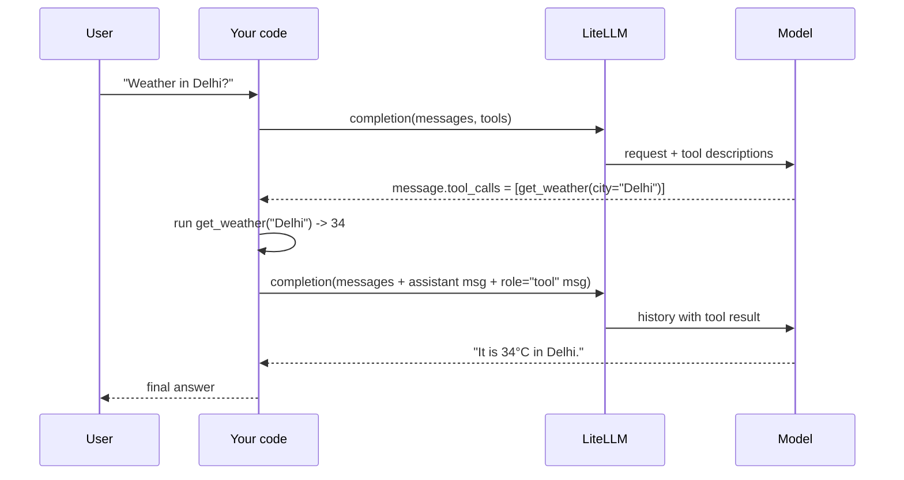

# 05 — Letting the model use tools and return clean data

Project: S4 Tool-calling assistant + JSON extractor (ROADMAP.md) · Read: before you start building

Previous: [04 — Reliability](./04-reliability.md) · Next: [06 — Async, batch, embeddings](./06-async-batch-embeddings.md)

---

## The idea in plain words

A language model can only produce text. It cannot check the weather, read your database or do exact maths. It can only guess.

**Tool calling** (also called **function calling**) fixes this with a simple deal.

Think of a manager and an assistant on the phone.

1. You tell the manager (the model) which helpers exist: "I can look up the weather. I can add numbers."
2. The user asks: "What's the weather in Delhi?"
3. The manager does not answer. It says: "Please run *get_weather* with city = Delhi."
4. **You** (your Python code) run the real function and get `34°C`.
5. You phone the manager back: "get_weather said 34°C."
6. The manager now writes the final answer: "It is 34°C in Delhi."

The model never runs anything. It only *asks*. Your code does the work and reports back.

The second half of this chapter is **structured output**. Sometimes you do not want a chatty answer. You want data your program can use, like `{"vendor": "Acme", "total": 1499.5}`. You can ask the model to reply only in JSON, and even give it the exact shape. Then you check the reply before trusting it.

Some words you will see:

- **JSON** (JavaScript Object Notation): a text format for data, like a Python dict written as a string: `{"city": "Delhi"}`.
- **JSON Schema**: a JSON document that *describes* the shape of other JSON: which keys, which types, which are required.
- **Schema**: short for "description of the shape of data".
- **Pydantic**: a Python library. You write a class with typed fields; Pydantic checks that data fits it.
- **Validate**: check data against a schema and reject it if it does not fit.

## Jargon table

| Term | Full name | What it does | Tiny example |
|---|---|---|---|
| tool | tool / function definition | Describes one function the model may ask for | `{"type": "function", "function": {"name": "get_weather", ...}}` |
| `tools` | tools parameter | The list of tools you send with the request | `tools=[weather_tool]` |
| `tool_choice` | tool choice | Says if the model may, must, or must not call tools | `tool_choice="auto"` |
| `tool_calls` | tool calls | The model's requests, found on the reply message | `message.tool_calls[0].function.name` |
| `arguments` | function arguments | The inputs the model chose, as a JSON **string** | `'{"city": "Delhi"}'` |
| `tool_call_id` | tool call id | Links your result to the model's request | `"call_abc123"` |
| role `tool` | tool message | The message you send back with a tool's result | `{"role": "tool", "tool_call_id": "call_abc123", "content": "34"}` |
| `response_format` | response format | Asks the model to reply as JSON, maybe of a set shape | `{"type": "json_object"}` |
| JSON mode | `json_object` format | Reply must be valid JSON; keys are not promised | `response_format={"type": "json_object"}` |
| structured output | `json_schema` format | Reply must match your JSON Schema | `response_format=Invoice` |
| `strict` | strict schema mode | Asks the provider to follow the schema exactly | `"strict": True` |
| parallel tool calls | parallel function calling | Model asks for several tools in one reply | weather + add in one turn |

## The tool-calling loop



Notice: two calls to the model for one question. If the model asks for another tool in the second reply, you go around again. That is why it is a **loop**.

## How to test without an API key

There are no keys in this chapter. LiteLLM has two test switches built into `completion()`:

- `mock_response="some text"` returns that text as the model's reply.
- `mock_tool_calls=[...]` puts fake tool calls on the reply message.

Both skip the network. Your request is still checked and translated, so your code paths are real. With a real key you just remove the two `mock_` arguments.

One honest difference: a real model sets `finish_reason` to `"tool_calls"` when it asks for a tool. The mock always says `"stop"`. So check `message.tool_calls`, not `finish_reason`, in your loop.

---

## Part 1 — Describe a tool and read the model's request

A tool description has a `name`, a `description` (the model reads this to decide when to use it) and `parameters` written in JSON Schema.

```python
import litellm

# 1. Describe the tool in JSON Schema. The model only sees this description.
weather_tool = {
    "type": "function",
    "function": {
        "name": "get_weather",
        "description": "Get the current weather for a city.",
        "parameters": {
            "type": "object",
            "properties": {
                "city": {"type": "string", "description": "City name, e.g. Delhi"},
                "unit": {"type": "string", "enum": ["celsius", "fahrenheit"]},
            },
            "required": ["city"],
        },
    },
}

# 2. A fake "the model wants to call get_weather" answer, so we need no API key.
fake_call = {
    "id": "call_abc123",
    "type": "function",
    "function": {"name": "get_weather", "arguments": '{"city": "Delhi", "unit": "celsius"}'},
}

response = litellm.completion(
    model="gpt-4o-mini",
    messages=[{"role": "user", "content": "What's the weather in Delhi?"}],
    tools=[weather_tool],
    mock_response="",           # no text, only a tool call
    mock_tool_calls=[fake_call],
)

message = response.choices[0].message
print("content:", repr(message.content))
print("number of tool calls:", len(message.tool_calls))
for call in message.tool_calls:
    print("id:", call.id)
    print("name:", call.function.name)
    print("arguments (a STRING):", call.function.arguments)
    print("type of arguments:", type(call.function.arguments).__name__)
```

Output (real, captured with litellm 1.104.0):

```text
content: ''
number of tool calls: 1
id: call_abc123
name: get_weather
arguments (a STRING): {"city": "Delhi", "unit": "celsius"}
type of arguments: str
```

The key lesson: `arguments` is a **string** of JSON, not a dict. You must `json.loads` it. A real model often returns `content=None` here instead of `''`.

Not run here: with a real key, delete `mock_response` and `mock_tool_calls`. The model fills `tool_calls` itself.

## Part 2 — Run the requested tools with a lookup table

The model gives you a tool **name** as a string. You map that name to a real Python function. Never run code the model wrote; only run functions you chose.

```python
import json
import litellm

# Your real Python functions. The model never runs these; YOUR code does.
def get_weather(city, unit="celsius"):
    fake_temps = {"Delhi": 34, "Oslo": 8}
    temp = fake_temps.get(city, 20)
    return {"city": city, "temperature": temp, "unit": unit}

def add_numbers(a, b):
    return {"result": a + b}

# Map tool name (a string from the model) -> real function.
TOOLS_BY_NAME = {"get_weather": get_weather, "add_numbers": add_numbers}

def run_tool_call(call):
    name = call.function.name
    args = json.loads(call.function.arguments)  # arguments arrive as a JSON string
    func = TOOLS_BY_NAME.get(name)
    if func is None:
        return {"error": "unknown tool " + name}
    return func(**args)

response = litellm.completion(
    model="gpt-4o-mini",
    messages=[{"role": "user", "content": "Weather in Oslo, and what is 12 + 7?"}],
    mock_response="",
    mock_tool_calls=[
        {"id": "call_1", "type": "function",
         "function": {"name": "get_weather", "arguments": '{"city": "Oslo"}'}},
        {"id": "call_2", "type": "function",
         "function": {"name": "add_numbers", "arguments": '{"a": 12, "b": 7}'}},
    ],
)

for call in response.choices[0].message.tool_calls:
    result = run_tool_call(call)
    print(call.id, call.function.name, "->", result)
```

Output (real, captured with litellm 1.104.0):

```text
call_1 get_weather -> {'city': 'Oslo', 'temperature': 8, 'unit': 'celsius'}
call_2 add_numbers -> {'result': 19}
```

Two tool calls arrived in one reply. That is a **parallel tool call**. Run every one of them; the model expects an answer for each id.

## Part 3 — Send the result back with `role="tool"`

To finish, you add two things to the history: the model's own message (with its `tool_calls`), then one `role="tool"` message per call. Then you call the model again.

```python
import json
import litellm

def get_weather(city):
    return {"city": city, "temperature": 34, "unit": "celsius"}

messages = [{"role": "user", "content": "What's the weather in Delhi?"}]

# Round 1: the model asks for a tool (mocked).
first = litellm.completion(
    model="gpt-4o-mini",
    messages=messages,
    mock_response="",
    mock_tool_calls=[{"id": "call_abc123", "type": "function",
                      "function": {"name": "get_weather", "arguments": '{"city": "Delhi"}'}}],
)
assistant_message = first.choices[0].message
messages.append(assistant_message.model_dump())  # keep the model's request in history

# Your code runs the tool and sends the result back as a role="tool" message.
for call in assistant_message.tool_calls:
    args = json.loads(call.function.arguments)
    result = get_weather(**args)
    messages.append({
        "role": "tool",
        "tool_call_id": call.id,          # must match the id the model gave
        "content": json.dumps(result),    # content must be a string
    })

# Round 2: the model reads the tool result and writes the final answer (mocked).
second = litellm.completion(
    model="gpt-4o-mini",
    messages=messages,
    mock_response="It is 34°C in Delhi right now.",
)

for m in messages:
    print(m["role"], "|", m.get("tool_call_id"), "|", m.get("content"))
print("final answer:", second.choices[0].message.content)
```

Output (real, captured with litellm 1.104.0):

```text
user | None | What's the weather in Delhi?
assistant | None | 
tool | call_abc123 | {"city": "Delhi", "temperature": 34, "unit": "celsius"}
final answer: It is 34°C in Delhi right now.
```

The order matters: `user`, then `assistant` (with `tool_calls`), then `tool`. If you skip the assistant message, real providers reject the request because the `tool` message points at a call they never saw.

## Part 4 — `tool_choice`: may, must, or must not

`tool_choice` controls whether the model calls a tool.

| Value | Meaning |
|---|---|
| `"auto"` | Model decides (the usual default when tools are sent) |
| `"none"` | Do not call tools; answer in text |
| `"required"` | Must call at least one tool |
| `{"type": "function", "function": {"name": "get_weather"}}` | Must call this exact tool |

You always write the OpenAI style. LiteLLM translates it for each provider. This demo peeks at the translation for Anthropic. `AnthropicConfig` is an internal class; we use it only to look.

```python
import litellm

weather_tool = {
    "type": "function",
    "function": {
        "name": "get_weather",
        "description": "Get the current weather for a city.",
        "parameters": {"type": "object",
                       "properties": {"city": {"type": "string"}},
                       "required": ["city"]},
    },
}

choices = [
    "auto",       # model decides: text or tool
    "none",       # never call a tool
    "required",   # must call at least one tool
    {"type": "function", "function": {"name": "get_weather"}},  # must call THIS tool
]

# Peek at how LiteLLM rewrites the OpenAI-style value for Anthropic.
# (Internal class; we use it only to look, not in real code.)
config = litellm.AnthropicConfig()
for choice in choices:
    mapped = config.map_openai_params(
        non_default_params={"tools": [weather_tool], "tool_choice": choice},
        optional_params={},
        model="claude-haiku-4-5",
        drop_params=False,
    )
    print(choice, "->", mapped.get("tool_choice"))
```

Output (real, captured with litellm 1.104.0):

```text
auto -> {'type': 'auto'}
none -> {'type': 'none'}
required -> {'type': 'any'}
{'type': 'function', 'function': {'name': 'get_weather'}} -> {'type': 'tool', 'name': 'get_weather'}
```

Anthropic calls "required" `any`. You never need to know that. That is the point of LiteLLM.

## Part 5 — Check support before you rely on it

Not every model can call tools or follow a schema. LiteLLM keeps a model list (the same one used for prices) with flags. Ask it first.

```python
import litellm

models = [
    "gpt-4o-mini",
    "anthropic/claude-haiku-4-5",
    "gemini/gemini-2.5-flash",
    "ollama/llama3.2",
    "my-made-up-model",
]

for model in models:
    tools_ok = litellm.supports_function_calling(model=model)
    schema_ok = litellm.supports_response_schema(model=model)
    print(model)
    print("   supports_function_calling:", tools_ok)
    print("   supports_response_schema: ", schema_ok)
```

Output (real, captured with litellm 1.104.0; two "Provider List" lines that LiteLLM prints for the unknown model are removed):

```text
gpt-4o-mini
   supports_function_calling: True
   supports_response_schema:  True
anthropic/claude-haiku-4-5
   supports_function_calling: True
   supports_response_schema:  True
gemini/gemini-2.5-flash
   supports_function_calling: True
   supports_response_schema:  True
ollama/llama3.2
   supports_function_calling: False
   supports_response_schema:  False
my-made-up-model
   supports_function_calling: False
   supports_response_schema:  False
```

`False` can mean "no" or "LiteLLM does not know this model". Local models like Ollama are not in the list. So also ask which parameters LiteLLM can *send* to that provider:

```python
import litellm

# Which OpenAI-style params does LiteLLM know how to send to each provider?
models = ["gpt-4o-mini", "anthropic/claude-haiku-4-5", "ollama/llama3.2", "ollama_chat/llama3.2"]
wanted = ["tools", "tool_choice", "parallel_tool_calls", "response_format"]

for model in models:
    supported = litellm.get_supported_openai_params(model=model)
    print(model)
    for param in wanted:
        print("   ", param, "->", param in supported)
```

Output (real, captured with litellm 1.104.0):

```text
gpt-4o-mini
    tools -> True
    tool_choice -> True
    parallel_tool_calls -> True
    response_format -> True
anthropic/claude-haiku-4-5
    tools -> True
    tool_choice -> True
    parallel_tool_calls -> True
    response_format -> True
ollama/llama3.2
    tools -> False
    tool_choice -> False
    parallel_tool_calls -> False
    response_format -> True
ollama_chat/llama3.2
    tools -> True
    tool_choice -> True
    parallel_tool_calls -> False
    response_format -> True
```

Useful finding: for tools with Ollama, use the `ollama_chat/` prefix, not `ollama/`. Whether the local model is *good* at tools is a separate question you must test.

## Part 6 — JSON mode (`json_object`)

JSON mode says "reply with valid JSON". It does not promise which keys you get, so you name the keys in the prompt.

```python
import json
import litellm

# JSON mode: "reply with valid JSON". It does NOT promise which keys you get.
response = litellm.completion(
    model="gpt-4o-mini",
    messages=[
        {"role": "system", "content": "Reply in JSON with keys name and city."},
        {"role": "user", "content": "Hi, I'm Asha and I live in Pune."},
    ],
    response_format={"type": "json_object"},
    mock_response='{"name": "Asha", "city": "Pune"}',  # what a model would return
)

text = response.choices[0].message.content
print("raw text:", text)
print("type of raw text:", type(text).__name__)

data = json.loads(text)          # turn the string into a Python dict
print("name:", data["name"])
print("city:", data["city"])
```

Output (real, captured with litellm 1.104.0):

```text
raw text: {"name": "Asha", "city": "Pune"}
type of raw text: str
name: Asha
city: Pune
```

The reply is still a string. `json.loads` turns it into a dict.

## Part 7 — JSON Schema mode (`json_schema`)

Here you give the exact shape. `"additionalProperties": False` means "no extra keys". `"strict": True` asks providers that support it to follow the schema exactly.

```python
import json
import litellm

contact_format = {
    "type": "json_schema",
    "json_schema": {
        "name": "contact",
        "strict": True,
        "schema": {
            "type": "object",
            "properties": {
                "name": {"type": "string"},
                "email": {"type": "string"},
                "age": {"type": "integer"},
            },
            "required": ["name", "email", "age"],
            "additionalProperties": False,
        },
    },
}

response = litellm.completion(
    model="gpt-4o-mini",
    messages=[{"role": "user", "content": "Ravi, 29, ravi@example.com"}],
    response_format=contact_format,
    mock_response='{"name": "Ravi", "email": "ravi@example.com", "age": 29}',
)

contact = json.loads(response.choices[0].message.content)
print(contact)
print("age + 1 =", contact["age"] + 1)
```

Output (real, captured with litellm 1.104.0):

```text
{'name': 'Ravi', 'email': 'ravi@example.com', 'age': 29}
age + 1 = 30
```

## Part 8 — A Pydantic class as `response_format`, then validate

Writing JSON Schema by hand is tiring. Write a Pydantic class instead and pass the class itself. LiteLLM converts it.

```python
import json
from pydantic import BaseModel
from litellm.utils import type_to_response_format_param

class Invoice(BaseModel):
    vendor: str
    total: float
    currency: str

# This is what LiteLLM sends when you pass response_format=Invoice.
sent = type_to_response_format_param(response_format=Invoice)
print(json.dumps(sent, indent=2))
```

Output (real, captured with litellm 1.104.0):

```text
{
  "type": "json_schema",
  "json_schema": {
    "schema": {
      "properties": {
        "vendor": {
          "title": "Vendor",
          "type": "string"
        },
        "total": {
          "title": "Total",
          "type": "number"
        },
        "currency": {
          "title": "Currency",
          "type": "string"
        }
      },
      "required": [
        "vendor",
        "total",
        "currency"
      ],
      "title": "Invoice",
      "type": "object",
      "additionalProperties": false
    },
    "name": "Invoice",
    "strict": true
  }
}
```

Now use it, and use the same class to check the reply. A good reply passes. A broken reply raises `ValidationError` with the exact fields that are wrong.

```python
import litellm
from pydantic import BaseModel, ValidationError

class Invoice(BaseModel):
    vendor: str
    total: float
    currency: str

response = litellm.completion(
    model="gpt-4o-mini",
    messages=[{"role": "user", "content": "Bill from Acme Corp, total 1499.50 INR"}],
    response_format=Invoice,
    mock_response='{"vendor": "Acme Corp", "total": 1499.5, "currency": "INR"}',
)

text = response.choices[0].message.content
invoice = Invoice.model_validate_json(text)   # parse + check types in one step
print("vendor:", invoice.vendor)
print("total + 10% tax:", round(invoice.total * 1.1, 2))

# Now pretend the model returned something broken.
bad_text = '{"vendor": "Acme Corp", "total": "about fifteen hundred"}'
try:
    Invoice.model_validate_json(bad_text)
except ValidationError as error:
    print("validation failed with", error.error_count(), "errors:")
    for problem in error.errors():
        print("  field:", problem["loc"], "| problem:", problem["msg"])
```

Output (real, captured with litellm 1.104.0):

```text
vendor: Acme Corp
total + 10% tax: 1649.45
validation failed with 2 errors:
  field: ('total',) | problem: Input should be a valid number, unable to parse string as a number
  field: ('currency',) | problem: Field required
```

Note: `message.content` is still a string. LiteLLM does not hand you an `Invoice` object. You validate it yourself.

## Part 9 — Let LiteLLM validate for you

Set `litellm.enable_json_schema_validation = True`. LiteLLM then checks every schema reply and raises `JSONSchemaValidationError` when it does not fit.

```python
import litellm
from pydantic import BaseModel

class Invoice(BaseModel):
    vendor: str
    total: float
    currency: str

# Ask LiteLLM to check every JSON-schema reply against the schema for you.
litellm.enable_json_schema_validation = True

try:
    litellm.completion(
        model="gpt-4o-mini",
        messages=[{"role": "user", "content": "Bill from Acme Corp"}],
        response_format=Invoice,
        mock_response='{"vendor": "Acme Corp"}',   # missing total and currency
    )
except litellm.JSONSchemaValidationError as error:
    print("caught:", type(error).__name__)
    print("raw reply was:", error.raw_response)
```

Output (real, captured with litellm 1.104.0):

```text
caught: JSONSchemaValidationError
raw reply was: {"vendor": "Acme Corp"}
```

`error.raw_response` keeps the bad text, so you can log it or retry with a hint like "your last answer was missing currency".

Not run here: with a real key, the same code works with `model="gpt-4o-mini"` and no `mock_response`. With Ollama, use `model="ollama_chat/llama3.2"` and `api_base="http://localhost:11434"`.

Docs: [LiteLLM function calling](https://docs.litellm.ai/docs/completion/function_call), [LiteLLM JSON mode / structured output](https://docs.litellm.ai/docs/completion/json_mode).

---

## How big companies use this

- **OpenAI built schema-following into the model server.** In its [Structured Outputs announcement](https://openai.com/index/introducing-structured-outputs-in-the-api/) (August 2024), OpenAI says JSON mode alone "does not guarantee that the model's response will conform to a particular schema". With `strict: true` they use *constrained decoding*: at each step the model may only pick tokens that keep the JSON valid for your schema. They report 100% schema match in their evals for `gpt-4o-2024-08-06`, versus under 40% for `gpt-4-0613` with prompting alone. The same post warns it can still fail on refusals or when `max_tokens` cuts the reply short. So even with strict mode, you validate.
- **Typical pattern: extraction pipelines.** Teams turn invoices, emails, support tickets or meeting notes into rows in a database. One Pydantic class per document type. Every reply is validated. Failures go to a retry with the error text, then to a "needs human" queue.
- **Typical pattern: allow-listed tools.** Production assistants map tool names to a fixed set of functions. Each function checks its own inputs (the model can pass nonsense), has a timeout, and has a permission check ("can this user see this order?"). Tools that change things (refunds, deletes) often need a human to confirm.
- **Typical pattern: a step limit.** Agent loops stop after a fixed number of rounds (for example 5–10) so a confused model cannot loop forever and burn money.
- **Typical pattern: capability checks at startup.** Platforms that let users pick a model check `supports_function_calling` before showing tool features, so a model without tools never gets a tools request.

## Traps

1. **Treating `arguments` as a dict.** It is a JSON string. `call.function.arguments["city"]` fails. Always `json.loads` it, and catch `json.JSONDecodeError`: models sometimes send broken JSON.
2. **Forgetting the assistant message before the tool message.** The `tool` message must follow the assistant message that holds the matching `tool_calls`. Without it, providers reject the request.
3. **Answering only the first tool call.** With parallel calls, every `tool_call_id` needs its own `role="tool"` reply. Missing one is an error on most providers.
4. **Running what the model says.** Never `eval()` model text or build shell commands from it. The model can be tricked by user input (prompt injection). Map names to your own functions and check every argument.
5. **Trusting JSON mode to give your keys.** `json_object` only promises valid JSON. Use `json_schema` or a Pydantic class for a fixed shape, and validate anyway.
6. **Looping forever.** A model can keep asking for tools. Without a maximum number of rounds, one question can cost a lot.

---

## Project brief: S4

**Goal.** Build two small command-line programs in one project:

- `assistant.py`: a chat assistant with two tools, weather and calculator. It runs the tool-calling loop until the model gives a final text answer.
- `extractor.py`: reads messy text (for example a pasted invoice or email) and prints clean, validated JSON.

**Features.**

- Tool definitions for `get_weather(city, unit)` and `calculate(...)` written as JSON Schema with good descriptions.
- Weather can come from a free no-key API (for example Open-Meteo) or a fake dict. Your choice; say which in the README.
- The calculator must be safe: no `eval()` on model text.
- A loop that handles zero, one, or several tool calls per reply, and stops after a maximum number of rounds.
- Print each step: which tool, which arguments, what result.
- `extractor.py` uses a Pydantic class as `response_format`, validates the reply, and on failure retries once with the validation error in the prompt.
- A capability check at start: if the chosen model does not support tools or schemas, print a clear message and exit.
- The model name comes from `.env` or a command-line flag, so you can switch between a cloud model and `ollama_chat/...`.

**Rules.**

- No API keys in code. Use a `.env` file (and add it to `.gitignore`).
- You write all the code. Use the demos above only as reference.
- Tests must run offline using `mock_response` and `mock_tool_calls`.

**Done when.**

- [ ] `python assistant.py "weather in Delhi and 15% of 2400"` prints two tool calls and one final answer.
- [ ] Asking "hello" (no tool needed) gives a text answer with zero tool calls.
- [ ] An unknown tool name or broken `arguments` JSON does not crash the program; the error is sent back to the model as a tool result.
- [ ] The loop stops at your maximum rounds and says so.
- [ ] `python extractor.py sample_invoice.txt` prints JSON that passes your Pydantic class.
- [ ] A test feeds a broken mock reply to the extractor and shows the retry happens.
- [ ] Choosing a model that fails the capability check exits with a clear message.
- [ ] `grep -r "sk-" .` finds no keys in your code.

**Hints (questions to think about).**

1. After the model asks for tools, what exactly must you append to `messages`, and in what order?
2. How will your calculator turn a string like `"2400 * 0.15"` into a number without `eval()`? Would it be simpler to give the model a tool with structured inputs (two numbers and an operator)?
3. Where in your loop do you decide "the model is done"? What field tells you?
4. When validation fails, what text would help the model fix its answer on the second try?
5. How can one mocked test check a *two-round* conversation, when each `completion()` call needs its own mock?

---

## Check yourself

1. Who runs the tool: the model, LiteLLM, or your code?

<details><summary>Answer</summary>

Your code. The model only returns a request in `message.tool_calls`. LiteLLM only carries messages. You look up the function, run it, and send the result back.

</details>

2. What type is `call.function.arguments`, and what do you do with it?

<details><summary>Answer</summary>

A string containing JSON. Parse it with `json.loads(...)` to get a dict, and handle the case where the JSON is broken.

</details>

3. What three keys does a tool result message need?

<details><summary>Answer</summary>

`"role": "tool"`, `"tool_call_id"` (the same id the model gave), and `"content"` (a string, often `json.dumps(result)`).

</details>

4. What is the difference between `{"type": "json_object"}` and `{"type": "json_schema", ...}`?

<details><summary>Answer</summary>

`json_object` only promises valid JSON; the keys can be anything. `json_schema` gives the exact shape (keys, types, required fields), and with `strict: true` supporting providers enforce it.

</details>

5. `supports_function_calling("ollama/llama3.2")` returns `False`. Does that mean you cannot use tools with Ollama?

<details><summary>Answer</summary>

No. `False` can also mean LiteLLM's model list does not know that model. `get_supported_openai_params` shows the `ollama_chat/` route can send `tools` and `tool_choice`; the plain `ollama/` route cannot. You still need to test how well the local model uses tools.

</details>

6. You passed `response_format=Invoice`. Is `message.content` an `Invoice` object? How do you make sure the data is right?

<details><summary>Answer</summary>

No, it is a JSON string. Validate it with `Invoice.model_validate_json(text)` (catch `ValidationError`), or set `litellm.enable_json_schema_validation = True` and catch `litellm.JSONSchemaValidationError`. Even strict mode can fail on refusals or cut-off replies, so always validate.

</details>
