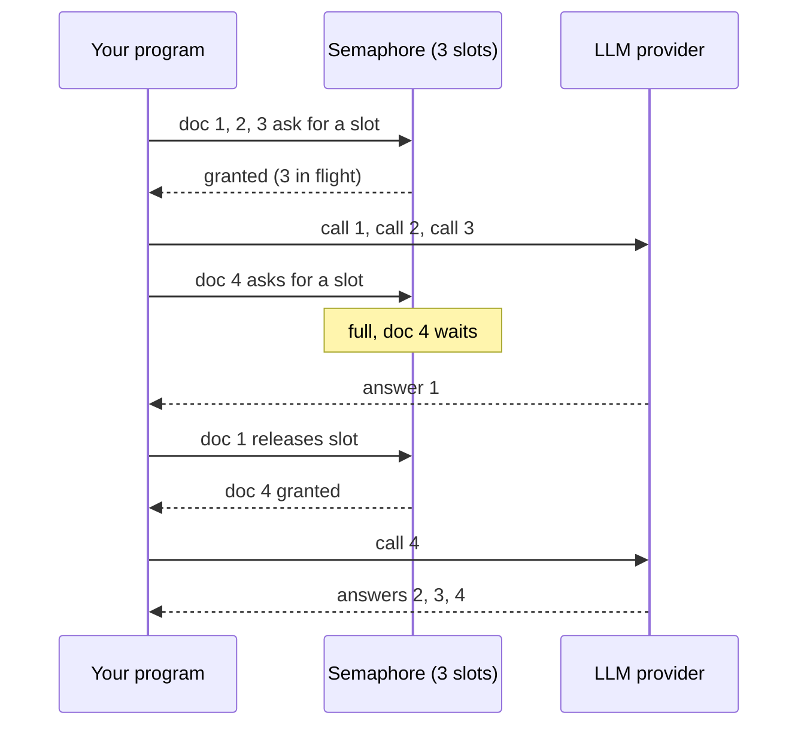
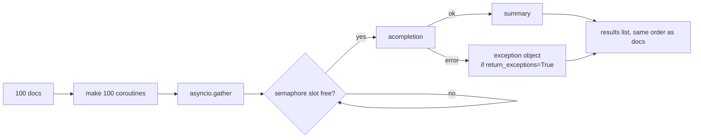

# 06 — Doing many calls at once: async, batches, and embeddings

Project: S5 Async batch summarizer (ROADMAP.md) · Read: before you start building

Previous: [05 — Tools and structured output](./05-tools-and-structured-output.md) · Next: [07 — Router](./07-router.md)

---

## The idea in plain words

Picture a restaurant with one waiter.

**Sync waiter.** He takes table 1's order, walks to the kitchen, and stands
there until the food is ready. Only then does he go to table 2. Ten tables,
each meal takes 5 minutes to cook: the last table eats after 50 minutes.
The waiter was "busy" the whole time, but almost all of it was standing and
waiting.

**Async waiter.** He takes table 1's order, gives it to the kitchen, and
right away goes to table 2, then table 3. When a dish is ready, the kitchen
rings a bell and he brings it out. All ten meals cook at the same time.
Everyone eats after about 5 minutes. Same waiter, same kitchen. He just
stopped standing around.

An LLM call is like the kitchen. Your program sends a request, and then
waits 1–10 seconds for the model to answer. During that wait your computer
does nothing. "Sync" (synchronous) code waits for each call before starting
the next. "Async" (asynchronous) code starts the next call while the first
is still waiting.

There is one catch. A real kitchen has a limited number of stoves. If the
waiter sends 500 orders at once, the kitchen says "too many, slow down".
LLM providers do the same: they have **rate limits**. So a good async
program also sets a **limit** on how many calls run at the same time.

The last part of this chapter is about **embeddings**. An embedding turns a
piece of text into a list of numbers. Texts with similar meaning get
similar numbers. That lets a computer find "documents like this one"
without reading words, just by comparing numbers. You will use this a lot
in RAG (chapter 11).

## Jargon table

| Term | Full name | What it does | Tiny example |
|---|---|---|---|
| sync | synchronous | Runs one step, waits for it to finish, then the next | `completion(...)` then `completion(...)` |
| async | asynchronous | Lets other work run while one step is waiting | `await acompletion(...)` |
| I/O-bound | input/output-bound | Work that is mostly waiting on network or disk, not on the CPU | An HTTP call to an LLM |
| coroutine | — | The thing an `async def` function returns. A paused job that has not run yet | `summarize(3)` before you `await` it |
| `await` | — | "Run this and pause me until it is done. Others may run meanwhile." | `text = await summarize(3)` |
| event loop | — | The manager inside asyncio that switches between waiting jobs | Started by `asyncio.run(main())` |
| `asyncio.gather` | — | Runs many coroutines at the same time, returns all results in order | `await asyncio.gather(a(), b())` |
| semaphore | — | A counter that lets only N jobs into a section at once | `asyncio.Semaphore(5)` |
| concurrency | — | How many jobs are in progress at the same moment | 5 calls in flight |
| rate limit | — | Provider rule like "max 500 requests per minute" | Error 429 `RateLimitError` |
| RPM / TPM | requests per minute / tokens per minute | The two common rate limit units | 500 RPM, 200k TPM |
| `acompletion` | async completion | The async version of `litellm.completion` | `await litellm.acompletion(...)` |
| `batch_completion` | — | LiteLLM helper: send a list of conversations using threads | `batch_completion(model, messages=[[...],[...]])` |
| embedding | — | A list of numbers that represents the meaning of a text | `"cat"` → `[0.12, -0.4, ...]` |
| vector | — | Just a list of numbers | `[0.9, 0.1, 0.0]` |
| cosine similarity | — | A score from -1 to 1 for how much two vectors point the same way | 0.99 = very similar |
| `mock_delay` | — | LiteLLM test param: wait this many seconds before returning a mock answer | `mock_delay=0.5` |

## The picture

Sequential vs concurrent with a limit of 3:



Where `gather` and errors fit:



---

## Part 1: asyncio without any LLM

First learn the four words: `async def`, `await`, `asyncio.run`, `gather`.
`asyncio.sleep` stands in for "waiting on the kitchen".

```python
import asyncio
import time


async def cook(dish, seconds):
    print(f"start {dish}")
    await asyncio.sleep(seconds)  # waiting: the loop can run other work now
    print(f"done  {dish}")
    return dish


async def main():
    start = time.perf_counter()
    first = await cook("soup", 1)
    second = await cook("salad", 1)
    print("one by one:", first, second, f"{time.perf_counter() - start:.1f}s")

    start = time.perf_counter()
    results = await asyncio.gather(cook("soup", 1), cook("salad", 1))
    print("together:", results, f"{time.perf_counter() - start:.1f}s")


asyncio.run(main())
```

Output (real, captured with litellm 1.104.0):

```
start soup
done  soup
start salad
done  salad
one by one: soup salad 2.0s
start soup
start salad
done  soup
done  salad
together: ['soup', 'salad'] 1.0s
```

What to notice:

- `async def` makes a function that returns a coroutine. Calling `cook("soup", 1)` alone does nothing yet.
- `await` runs it. Two `await`s in a row still run one after the other: 2 seconds.
- `asyncio.gather` starts both, so both "start" lines print before any "done": 1 second.
- `asyncio.run(main())` starts the event loop. You call it once, at the very top of the program.

## Part 2: `litellm.acompletion`

`acompletion` takes the same arguments as `completion`. You must `await` it,
and you can only `await` inside an `async def`.

```python
import asyncio
import litellm


async def main():
    response = await litellm.acompletion(
        model="gpt-4o-mini",
        messages=[{"role": "user", "content": "Say hi in 3 words"}],
        mock_response="Hello there, friend!",  # no network call, no key needed
    )
    print(type(response).__name__)
    print(response.choices[0].message.content)


asyncio.run(main())
```

Output (real, captured with litellm 1.104.0):

```
ModelResponse
Hello there, friend!
```

With a real key (not run here): remove `mock_response`, put
`OPENAI_API_KEY` in `.env`. With Ollama: `model="ollama/llama3.2"`. The
response object is the same `ModelResponse` you met in chapter 2.

## Part 3: 20 calls, sequential vs concurrent (measured)

LiteLLM has a test parameter `mock_delay`. In the installed source
(`litellm/main.py`, inside `acompletion`), when a mock response is used it
does `await asyncio.sleep(mock_delay)` before answering. That makes a mock
call behave like a slow real call, so we can time it honestly.

```python
import asyncio
import time
import litellm

MODEL = "gpt-4o-mini"
DELAY = 0.5  # each fake call "takes" half a second


async def summarize(doc_id):
    response = await litellm.acompletion(
        model=MODEL,
        messages=[{"role": "user", "content": f"Summarize doc {doc_id}"}],
        mock_response=f"Summary of doc {doc_id}",
        mock_delay=DELAY,  # litellm sleeps this long before answering
    )
    return response.choices[0].message.content


async def main():
    doc_ids = list(range(20))

    start = time.perf_counter()
    sequential = []
    for doc_id in doc_ids:
        summary = await summarize(doc_id)  # wait for each one before the next
        sequential.append(summary)
    print(f"sequential: {len(sequential)} calls in {time.perf_counter() - start:.2f}s")

    start = time.perf_counter()
    tasks = []
    for doc_id in doc_ids:
        tasks.append(summarize(doc_id))  # build the coroutines, nothing runs yet
    concurrent = await asyncio.gather(*tasks)  # run them all at once
    print(f"concurrent: {len(concurrent)} calls in {time.perf_counter() - start:.2f}s")
    print("first two:", concurrent[0], "|", concurrent[1])


asyncio.run(main())
```

Output (real, captured with litellm 1.104.0):

```
sequential: 20 calls in 10.05s
concurrent: 20 calls in 0.51s
first two: Summary of doc 0 | Summary of doc 1
```

20 × 0.5 s = 10 s one by one. All at once: about 0.5 s, the time of the
slowest single call. Also note `gather` returns results **in the same order
you passed them in**, not in the order they finished. That is why
`concurrent[0]` is doc 0.

## Part 4: limit concurrency with `asyncio.Semaphore`

"All at once" is fine for 20 mock calls. For 1,000 real calls it is not.
Providers count requests per minute (RPM) and tokens per minute (TPM). Go
over and you get HTTP 429, which LiteLLM raises as `litellm.RateLimitError`.
A semaphore is a ticket box with N tickets. A job takes a ticket to enter,
and gives it back when it leaves. No ticket left? It waits.

```python
import asyncio
import time
import litellm

limit = asyncio.Semaphore(5)  # at most 5 calls in flight
in_flight = 0
peak = 0


async def summarize(doc_id):
    global in_flight, peak
    async with limit:  # waits here if 5 calls are already running
        in_flight = in_flight + 1
        peak = max(peak, in_flight)
        response = await litellm.acompletion(
            model="gpt-4o-mini",
            messages=[{"role": "user", "content": f"Summarize doc {doc_id}"}],
            mock_response=f"Summary {doc_id}",
            mock_delay=0.5,
        )
        in_flight = in_flight - 1
    return response.choices[0].message.content


async def main():
    start = time.perf_counter()
    tasks = []
    for doc_id in range(20):
        tasks.append(summarize(doc_id))
    results = await asyncio.gather(*tasks)
    print(f"{len(results)} calls in {time.perf_counter() - start:.2f}s, peak in flight = {peak}")


asyncio.run(main())
```

Output (real, captured with litellm 1.104.0):

```
20 calls in 2.02s, peak in flight = 5
```

20 calls / 5 at a time = 4 rounds × 0.5 s = 2 s. Slower than "all at once",
but the provider never sees more than 5 open requests. Pick N from your
provider's limits: if a call takes ~2 s and your limit is 300 RPM, then
about 300 / 30 = 10 calls in flight is the ceiling (30 calls per minute per
slot). Start lower than that.

The `global` and counter lines are only there to prove the limit works.
Your project does not need them.

## Part 5: errors inside `gather`

If you pass `mock_response="litellm.RateLimitError"`, LiteLLM raises a real
`RateLimitError` (see `_handle_mock_potential_exceptions` in
`litellm/main.py`). We use it to fail doc 2 on purpose.

First, the default behaviour: one failure, and you lose everything. This
`main()` uses the same `summarize()` shown in the full script just below.

```python
async def main():
    tasks = []
    for doc_id in range(4):
        tasks.append(summarize(doc_id))  # doc 2 uses mock_response="litellm.RateLimitError"
    try:
        results = await asyncio.gather(*tasks)  # no return_exceptions
        print(results)
    except Exception as error:
        print("whole gather failed with:", type(error).__name__)
        print("results from docs 0, 1, 3 are lost")
```

Output (real, captured with litellm 1.104.0):

```
whole gather failed with: RateLimitError
results from docs 0, 1, 3 are lost
```

Now with `return_exceptions=True`. Errors come back *as values* in the
result list, in the right slot, and every other result survives.

```python
import asyncio
import litellm


async def summarize(doc_id):
    fake_answer = f"Summary {doc_id}"
    if doc_id == 2:
        fake_answer = "litellm.RateLimitError"  # this magic string makes the mock raise
    response = await litellm.acompletion(
        model="gpt-4o-mini",
        messages=[{"role": "user", "content": f"Summarize doc {doc_id}"}],
        mock_response=fake_answer,
    )
    return response.choices[0].message.content


async def main():
    tasks = []
    for doc_id in range(4):
        tasks.append(summarize(doc_id))
    results = await asyncio.gather(*tasks, return_exceptions=True)  # errors come back as values

    for doc_id, result in zip(range(4), results):
        if isinstance(result, Exception):
            print(doc_id, "FAILED:", type(result).__name__)
        else:
            print(doc_id, "ok:", result)


asyncio.run(main())
```

Output (real, captured with litellm 1.104.0):

```
0 ok: Summary 0
1 ok: Summary 1
2 FAILED: RateLimitError
3 ok: Summary 3
```

Always check each result with `isinstance(result, Exception)`. Then you can
log the failed ids and retry only those (chapter 4 covered retries).

## Part 6: `litellm.batch_completion`

Not using async at all? LiteLLM has `batch_completion`. You give it a list
of conversations (a list of message lists). In the installed source
(`litellm/batch_completion/main.py`) it runs `litellm.completion` for each
one in a `ThreadPoolExecutor` (a pool of threads, default `max_workers=100`)
and returns results in input order. Failed items come back as exception
objects, like `return_exceptions=True`.

```python
import time
import litellm

questions = ["What is 2+2?", "Capital of France?", "Color of the sky?"]

all_messages = []
for question in questions:
    all_messages.append([{"role": "user", "content": question}])  # one conversation per item

start = time.perf_counter()
responses = litellm.batch_completion(
    model="gpt-4o-mini",
    messages=all_messages,  # a LIST of message lists
    mock_response="mock answer",
    mock_delay=0.5,  # sync path: each call sleeps 0.5s inside a thread
)
print(f"{len(responses)} responses in {time.perf_counter() - start:.2f}s")
for question, response in zip(questions, responses):
    print(question, "->", response.choices[0].message.content)
```

Output (real, captured with litellm 1.104.0):

```
3 responses in 0.52s
What is 2+2? -> mock answer
Capital of France? -> mock answer
Color of the sky? -> mock answer
```

Three 0.5 s calls in 0.52 s: they ran in parallel threads. When to use
which:

- `batch_completion`: quick scripts, sync code, small lists. Limit with `max_workers`.
- `acompletion` + `gather` + `Semaphore`: real services, big jobs, when you want full control over errors and progress.
- Provider **Batch APIs** (a different thing): you upload a file of requests and collect results hours later. OpenAI's Batch API gives a 50% discount and finishes within 24 hours ([OpenAI docs](https://developers.openai.com/api/docs/guides/batch)). LiteLLM wraps these as `litellm.create_batch` / `litellm.retrieve_batch`. Good for nightly jobs that nobody is waiting on.

## Part 7: embeddings with `litellm.embedding`

An embedding model reads text and returns a vector, often 1,536 numbers or
more. You do not read these numbers. You compare them.

`litellm.embedding` supports `mock_response`. In the installed source
(`litellm/litellm_core_utils/mock_functions.py`, `mock_embedding`), the
mock returns **your list as one vector**, with a fixed fake usage of 10
prompt tokens.

```python
import litellm

response = litellm.embedding(
    model="text-embedding-3-small",
    input=["cats are cute"],
    mock_response=[0.1, 0.2, 0.3],  # fake vector, no network call
)
vector = response.data[0]["embedding"]
print(type(response).__name__)
print("length:", len(vector))
print("vector:", vector)
print("usage:", response.usage.prompt_tokens, "prompt tokens (fixed fake number)")

two = litellm.embedding(
    model="text-embedding-3-small",
    input=["cats", "dogs"],
    mock_response=[0.5, 0.5],
)
print("vectors returned for 2 inputs:", len(two.data))  # mock always returns one
```

Output (real, captured with litellm 1.104.0):

```
EmbeddingResponse
length: 3
vector: [0.1, 0.2, 0.3]
usage: 10 prompt tokens (fixed fake number)
vectors returned for 2 inputs: 1
```

Watch the last line. A **real** embedding call returns one vector per
input (`len(response.data) == len(input)`). The mock returns one no matter
what. So the mock is fine for testing your plumbing, but useless for
testing "does similar text get similar vectors".

With a real key (not run here): drop `mock_response`, keep
`model="text-embedding-3-small"` and `OPENAI_API_KEY` in `.env`. With
Ollama: `model="ollama/nomic-embed-text"` after `ollama pull nomic-embed-text`.

There is also an async version, `litellm.aembedding`, which works with
`gather` exactly like `acompletion`:

```python
async def embed(text):
    response = await litellm.aembedding(
        model="text-embedding-3-small",
        input=[text],
        mock_response=[0.1, 0.2, 0.3],
    )
    return response.data[0]["embedding"]
# main() gathers embed("doc one"), embed("doc two"), embed("doc three")
```

Output (real, captured with litellm 1.104.0):

```
doc one -> [0.1, 0.2, 0.3]
doc two -> [0.1, 0.2, 0.3]
doc three -> [0.1, 0.2, 0.3]
```

## Part 8: what "similar" means — cosine similarity by hand

Since mock vectors cannot show meaning, here are tiny hand-made vectors.
Each has 3 numbers: how much it is about animals, food, vehicles. Real
embeddings have hundreds of numbers that nobody labels, but the math is
the same.

```python
import math

# hand-made 3-number "meanings": [animal-ness, food-ness, vehicle-ness]
vectors = {
    "kitten": [0.9, 0.1, 0.0],
    "puppy": [0.8, 0.2, 0.0],
    "pizza": [0.1, 0.9, 0.0],
    "truck": [0.0, 0.1, 0.9],
}


def length(v):
    total = 0.0
    for x in v:
        total = total + x * x
    return math.sqrt(total)


def cosine(a, b):
    dot = 0.0
    for x, y in zip(a, b):
        dot = dot + x * y  # big when both point the same way
    return dot / (length(a) * length(b))  # divide out the lengths: keep only direction


query = vectors["kitten"]
for word, vector in vectors.items():
    print(f"kitten vs {word:7s} {cosine(query, vector):.3f}")
```

Output (real, captured with litellm 1.104.0):

```
kitten vs kitten  1.000
kitten vs puppy   0.991
kitten vs pizza   0.220
kitten vs truck   0.012
```

Kitten is closest to puppy, far from truck. Search with embeddings is
exactly this: embed the question, compute cosine against every document
vector, keep the top few. In chapter 11 a vector database does the loop
for you.

---

## How big companies use this

Typical patterns (no specific company named unless linked):

- **Nightly pipelines.** A job runs at night over the day's tickets, reviews, or logs. It summarizes or classifies each one with async calls and a fixed concurrency limit, writes results to a database, and records failed ids for a retry pass.
- **Provider batch APIs for non-urgent work.** When nobody waits for the answer, teams upload a file of requests and collect results later. OpenAI documents a 50% cost discount and a 24-hour completion window for its Batch API, and lists evaluations, dataset classification, and embedding content as use cases ([OpenAI Batch API guide](https://developers.openai.com/api/docs/guides/batch)).
- **Embed once, search many times.** Documents are embedded when they are added or changed, and the vectors are stored. Only the user's question is embedded at query time. Re-embedding everything is a planned migration, because changing the embedding model changes every vector.
- **Concurrency set from rate limits, not guesses.** The limit is a config value per model and per environment, tuned from the provider's RPM/TPM. In a shared setup it is usually enforced centrally by a gateway (chapters 7–9) rather than in each script.
- **Partial success is normal.** In a job of 100,000 items some calls will fail. Jobs collect errors per item, keep successes, and re-run only the failures.

## Traps

1. **Forgetting `await`.** `summary = litellm.acompletion(...)` gives you a coroutine, not a response. Python warns "coroutine was never awaited" and your code crashes later on `.choices`. Every `acompletion` needs `await`.
2. **Using sync `completion` inside `async def`.** It still blocks. The event loop cannot switch while it waits, so your "async" code runs one call at a time. Inside async code, use `acompletion` / `aembedding`.
3. **No concurrency limit.** `gather` over 1,000 docs fires 1,000 requests at once. You get a wall of `RateLimitError`s, and maybe a ban or a large bill spike. Always wrap the call in a `Semaphore`.
4. **`gather` without `return_exceptions=True`.** One failed doc throws away the other 99 results (Part 5). For batch jobs, collect errors as values and handle them per item.
5. **Trusting the embedding mock too much.** The mock returns one fixed vector for any input. Similarity tests on mock vectors are meaningless. Use hand vectors (Part 8) or a real model.
6. **Calling `asyncio.run` inside something already async.** `asyncio.run` starts a new event loop. Calling it from inside a running loop (for example in a Jupyter notebook) raises an error. In a notebook, just `await main()` directly.

---

## Project brief: S5

**Goal.** Build an async batch summarizer: given a folder of 100 text
documents, produce a one-paragraph summary of each, fast, without tripping
rate limits, and without losing work when some calls fail.

**Features**

- Reads every `.txt` file from an input folder (create 100 small sample docs yourself, or generate them).
- Summarizes each document with `litellm.acompletion`.
- Runs calls concurrently with `asyncio.gather` and an `asyncio.Semaphore`. The limit comes from a CLI flag or `.env` (e.g. `MAX_CONCURRENCY=5`).
- Uses `return_exceptions=True`. Writes successes to `summaries.jsonl` (one JSON line per doc: file name, summary, tokens, cost) and failures to `failures.jsonl` (file name, error type, message).
- A `--retry-failures` mode that re-runs only the docs listed in `failures.jsonl`.
- Prints a final report: total docs, ok, failed, wall time, total cost (use `completion_cost` from chapter 3).
- A `--mock` flag that passes `mock_response` and `mock_delay` so the whole thing runs with no key. Make a few docs fail on purpose in mock mode (for example with `mock_response="litellm.RateLimitError"`).
- Embeddings step: embed each summary with `litellm.aembedding` (same semaphore), save the vectors, and add a `search "<question>"` command that prints the top 3 closest docs by cosine similarity. In mock mode, document clearly that search results are not meaningful.

**Rules**

- No API keys in code. Read them from `.env` (e.g. with `python-dotenv`). `.env` is in `.gitignore`.
- Model names come from config, not hard-coded deep inside functions.
- Readable code: plain loops, named variables, no comprehension tricks.
- Must work with at least two backends by changing only config: mock, and one real one (OpenAI key or `ollama/llama3.2`).

**Done when**

- [ ] `python summarize.py --mock --docs ./docs --concurrency 5` finishes 100 docs and prints a report.
- [ ] In mock mode with `mock_delay=0.5`, the wall time printed is close to `100 / concurrency × 0.5` s (about 10 s at concurrency 5), not 50 s.
- [ ] Changing concurrency from 5 to 20 visibly changes the wall time.
- [ ] Forced failures appear in `failures.jsonl`, and all other docs are in `summaries.jsonl`.
- [ ] `--retry-failures` processes only the failed docs.
- [ ] `search "..."` prints 3 file names with similarity scores.
- [ ] Running against a real model (key or Ollama) works with no code change, only `.env`/flags.
- [ ] `grep -r "sk-" .` finds no keys in your code.

**Hints (questions to ask yourself)**

1. Where does the semaphore get created, and does every task share the *same* one?
2. When `gather` returns a list mixing responses and exceptions, how do you know which file each item belongs to?
3. If a doc is longer than the model's context window, what should happen: cut it, split it, or record a failure?
4. How would you show progress (e.g. "37/100 done") without waiting for `gather` to finish? Look up `asyncio.as_completed`.
5. Your embedding and your summary calls share one rate limit budget. Should they share one semaphore or have two?

---

## Check yourself

1. In plain words, why is async faster for LLM calls even though your computer has the same CPU?

<details><summary>Answer</summary>
LLM calls are I/O-bound: most of the time is spent waiting on the network and the model. Async lets the program start other calls during that wait, so many waits overlap. The CPU work is tiny either way.
</details>

2. What does `summarize(3)` return if `summarize` is an `async def` and you do not `await` it?

<details><summary>Answer</summary>
A coroutine object. Nothing has run yet. It only runs when you `await` it or pass it to something like `asyncio.gather`.
</details>

3. 20 calls, each 0.5 s, with `Semaphore(5)`. About how long does it take, and why?

<details><summary>Answer</summary>
About 2 s. Only 5 run at once, so there are 20 / 5 = 4 rounds of 0.5 s each. Part 4 measured 2.02 s.
</details>

4. What goes wrong if you call `asyncio.gather(*tasks)` without `return_exceptions=True` and one call raises?

<details><summary>Answer</summary>
The `await` raises the first exception, and you do not get the result list at all, so the successful results are lost to your code. With `return_exceptions=True`, the exception is placed in that item's slot and the rest of the results are returned.
</details>

5. How is `litellm.batch_completion` different from a provider Batch API like OpenAI's?

<details><summary>Answer</summary>
`batch_completion` is client-side: it runs normal `completion` calls in parallel threads right now and returns when they finish, at normal price. A provider Batch API is server-side: you upload a file of requests, the provider processes it within a window (24 h for OpenAI), at a discount (50% for OpenAI).
</details>

6. Two texts have embeddings with cosine similarity 0.98. A third has 0.05 with the first. What does that tell you, and why can't you test this with `mock_response` in `litellm.embedding`?

<details><summary>Answer</summary>
The first two are very close in meaning; the third is about something unrelated. The embedding mock returns the same fixed vector you pass in (and only one vector, whatever the input), so every text gets the same numbers and similarity tells you nothing. You need hand-made vectors or a real embedding model.
</details>
