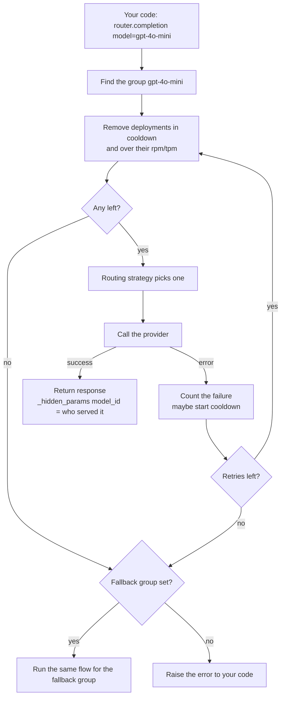
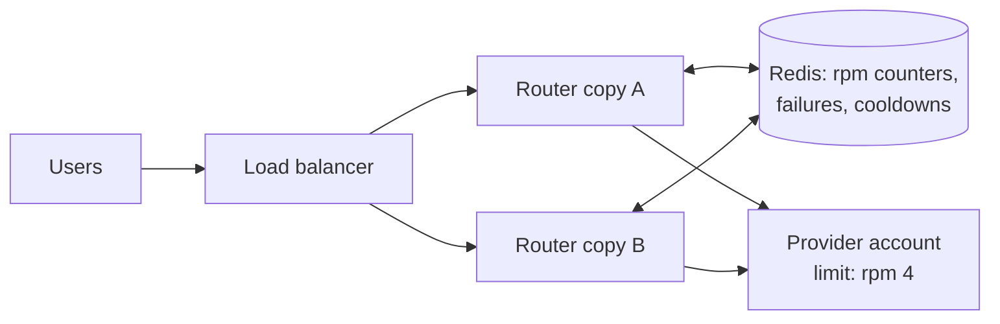

# 07 — The Router: one name, many deployments

Project: M1 Load balancer (ROADMAP.md) · Read: before you start building

Previous: [06 — Async, batch, embeddings](./06-async-batch-embeddings.md) · Next: [08 — The proxy gateway](./08-proxy-gateway.md)

---

## The idea in plain words

Think of a busy bank. If there is only one cashier, the line grows. When that cashier goes on a break, nobody gets served.
So the bank opens several counters. A floor manager stands at the door and sends each customer to a counter.
If one counter is closed, the manager stops sending people there for a while. If every counter is closed, the manager sends people to the bank next door.

An LLM provider works the same way:

- One API key (one "account") at one provider in one region is **one counter**. We call it a **deployment**.
- Every account has a **rate limit**: a maximum number of requests per minute. Go over it and you get an error with HTTP status **429** ("Too Many Requests").
- Providers also have outages. One region can fail while another region still works.

So one deployment is not enough for real traffic. You want several deployments of the *same* model (two OpenAI accounts, an Azure deployment in Sweden, another in the US...) and a floor manager in front of them.

`litellm.Router` is that floor manager. Your code asks for a name like `"gpt-4o-mini"`. The Router picks one real deployment behind that name, calls it, and handles failures:

- **Routing strategy**: the rule it uses to pick a counter (random, least busy, fastest, cheapest...).
- **Cooldown**: a counter that keeps failing is benched for some seconds.
- **Retry**: try the request again, often on another deployment.
- **Fallback**: if the whole group fails, switch to a different group (the bank next door).

## Jargon table

| Term | Full name | What it does | Tiny example |
|------|-----------|--------------|--------------|
| deployment | model deployment | One real place you can send a request: provider + model + key (+ region) | `openai/gpt-4o-mini` with key A |
| model group | model group (alias) | All deployments that share the same `model_name` | `"gpt-4o-mini"` → 3 deployments |
| `model_list` | model list | The list of deployments you give the Router | `Router(model_list=[...])` |
| `litellm_params` | LiteLLM call parameters | What is passed to `litellm.completion()` for that deployment | `{"model": "azure/my-dep", "api_key": ...}` |
| `model_info.id` | deployment id | A unique label for one deployment; shows up in responses | `"azure-sweden"` |
| rate limit / 429 | HTTP 429 Too Many Requests | Provider refuses because you sent too much | "limit 500 requests/minute" |
| RPM | requests per minute | Request limit of a deployment | `"rpm": 500` |
| TPM | tokens per minute | Token limit of a deployment | `"tpm": 200000` |
| routing strategy | — | Rule that picks the deployment | `"simple-shuffle"` |
| weight | — | Relative share of traffic for simple-shuffle | weights 8/1/1 → ~80/10/10 % |
| cooldown | — | Deployment is skipped for a while after failures | benched for `cooldown_time=30` s |
| `allowed_fails` | allowed failures | Failures allowed before cooldown starts | `allowed_fails=3` |
| retry | — | Try the same request again | `num_retries=2` |
| fallback | — | Use another model group when one group fails | `[{"gpt-4o": ["claude-backup"]}]` |
| Redis | Remote Dictionary Server | Fast shared in-memory store; lets many Router copies share counters | `redis_host="localhost"` |

## How one request flows through the Router



## Routing strategies in litellm 1.104.0

These are the exact names accepted by `Router(routing_strategy=...)` (checked in `litellm/types/litellm_params.py`):

| Name | Picks... | Good for |
|------|----------|----------|
| `simple-shuffle` (default) | Randomly. Uses `weight`, else `rpm`, else `tpm` as weights if set | Most cases. The docs recommend it for best performance |
| `least-busy` | The deployment with the fewest requests in flight right now | Long requests of very different lengths |
| `usage-based-routing-v2` | The deployment with the lowest token use this minute, and skips any deployment over its `rpm`/`tpm` | Staying under hard provider limits |
| `usage-based-routing` | Older version of the one above | Avoid; use v2 |
| `latency-based-routing` | The deployment that answered fastest recently | Mixed regions, user-facing chat |
| `cost-based-routing` | The cheapest deployment (from LiteLLM's price table) | Same model sold at different prices |
| `lar1` | Uses an agent "confidence" value sent in metadata | Special case; you will not need it here |

## Code demos

All demos use `mock_response=`. LiteLLM then returns a fake answer (or raises a fake error) without calling any provider. The Router logic around it is the real code.

### Part 1: the shape of `model_list`

The important idea: **`model_name` is the group name your code uses. `litellm_params.model` is the real provider/model.** Many deployments can share one `model_name`.

```python
from litellm import Router

model_list = [
    {
        "model_name": "gpt-4o-mini",  # group alias: the name your code asks for
        "litellm_params": {
            "model": "openai/gpt-4o-mini",  # the real provider/model behind it
            "api_key": "fake-key-account-1",
            "mock_response": "hi from account 1",  # fake answer, no network call
        },
        "model_info": {"id": "openai-account-1"},  # your own label for this deployment
    },
    {
        "model_name": "gpt-4o-mini",  # SAME alias -> same group
        "litellm_params": {
            "model": "azure/my-gpt4o-mini-deployment",  # different provider, same model
            "api_key": "fake-azure-key",
            "api_base": "https://my-company-sweden.openai.azure.com",
            "api_version": "2024-10-21",
            "mock_response": "hi from azure sweden",
        },
        "model_info": {"id": "azure-sweden", "base_model": "azure/gpt-4o-mini"},  # base_model: for cost lookup
    },
]
router = Router(model_list=model_list)

response = router.completion(model="gpt-4o-mini", messages=[{"role": "user", "content": "hi"}])
print("answer :", response.choices[0].message.content)
print("served by:", response._hidden_params["model_id"])
print("group size:", len(router.get_model_list(model_name="gpt-4o-mini")))
```

Output (real, captured with litellm 1.104.0):

```
answer : hi from azure sweden
served by: azure-sweden
group size: 2
```

`response._hidden_params["model_id"]` is the `model_info.id` of the deployment that answered. If you do not set an `id`, LiteLLM generates a long hash for you. Set your own; it makes logs readable.

Why `base_model`? Your Azure deployment name (`my-gpt4o-mini-deployment`) is your own invention. LiteLLM cannot look up its price. Without `base_model` the Router prints an error-level log line saying so.

With real keys (not run here): remove `mock_response` and read keys from the environment, e.g. `"api_key": os.environ["AZURE_API_KEY_SWEDEN"]`. For a free local model: `"model": "ollama/llama3.2", "api_base": "http://localhost:11434"`.

### Part 2: two small helpers

The rest of the demos build many deployments. These helpers keep each demo short. Save as `lab.py`.

```python
# lab.py - tiny helpers shared by the demos in this chapter


def make_deployment(deployment_id, mock_response="ok", extra_params=None, group="gpt-4o-mini"):
    litellm_params = {
        "model": "openai/gpt-4o-mini",
        "api_key": "fake-key",
        "mock_response": mock_response,  # fake answer, or an error name
    }
    if extra_params is not None:
        for key in extra_params:
            litellm_params[key] = extra_params[key]  # add rpm, weight, ...
    return {
        "model_name": group,
        "litellm_params": litellm_params,
        "model_info": {"id": deployment_id},
    }


def count_served(router, how_many):
    counts = {}
    for i in range(how_many):
        response = router.completion(model="gpt-4o-mini", messages=[{"role": "user", "content": "hi"}])
        deployment_id = response._hidden_params["model_id"]
        counts[deployment_id] = counts.get(deployment_id, 0) + 1
    for deployment_id in sorted(counts):
        print(deployment_id, counts[deployment_id])
```

Note: `mock_response="litellm.InternalServerError"` (or `"litellm.RateLimitError"`) makes LiteLLM raise that error instead of answering. That is how we fake a broken deployment.

### Part 3: 30 requests over 3 deployments

```python
from litellm import Router

from lab import count_served, make_deployment

model_list = [
    make_deployment("us-east"),
    make_deployment("eu-west"),
    make_deployment("asia-south"),
]
router = Router(model_list=model_list)  # default routing_strategy = "simple-shuffle"
count_served(router, 30)
```

Output (real, captured with litellm 1.104.0):

```
asia-south 9
eu-west 8
us-east 13
```

It is random, so your numbers will differ. Over many requests each deployment gets about one third.

### Part 4: weights

```python
from litellm import Router

from lab import count_served, make_deployment

model_list = [
    make_deployment("big-account", extra_params={"weight": 8}),  # 8 parts
    make_deployment("small-account-1", extra_params={"weight": 1}),  # 1 part
    make_deployment("small-account-2", extra_params={"weight": 1}),  # 1 part
]
router = Router(model_list=model_list, routing_strategy="simple-shuffle")
count_served(router, 100)
```

Output (real, captured with litellm 1.104.0):

```
big-account 78
small-account-1 12
small-account-2 10
```

`simple-shuffle` looks for `weight` first. If no deployment has a `weight`, it uses `rpm`, then `tpm`, as weights. So a deployment with `rpm: 900` gets about three times the traffic of one with `rpm: 300`, even without `weight`.

### Part 5: rpm limits with `usage-based-routing-v2`

With `simple-shuffle`, `rpm` is only a weight. To make the Router *refuse* to go over a limit, use `usage-based-routing-v2`.

```python
import asyncio

from litellm import Router

from lab import make_deployment

model_list = [
    make_deployment("account-a", extra_params={"rpm": 3}),  # 3 requests/minute
    make_deployment("account-b", extra_params={"rpm": 2}),  # 2 requests/minute
]


async def main():
    router = Router(
        model_list=model_list,
        routing_strategy="usage-based-routing-v2",  # respects rpm/tpm limits
        num_retries=0,  # fail fast so the demo is quick
    )
    for i in range(7):
        try:
            response = await router.acompletion(model="gpt-4o-mini", messages=[{"role": "user", "content": "hi"}])
            print("request", i + 1, "->", response._hidden_params["model_id"])
        except Exception as error:
            print("request", i + 1, "->", type(error).__name__)


asyncio.run(main())
```

Output (real, captured with litellm 1.104.0):

```
request 1 -> account-a
request 2 -> account-b
request 3 -> account-a
request 4 -> RateLimitError
request 5 -> RateLimitError
request 6 -> RateLimitError
request 7 -> RateLimitError
```

Look closely: limits 3 + 2 = 5, but only 3 requests got through. In 1.104.0 the selector skips a deployment once `current_rpm + 1 >= rpm` (see `_return_potential_deployments` in `router_strategy/lowest_tpm_rpm_v2.py`). So in practice each deployment serves `rpm - 1` per minute. The error raised is LiteLLM's own `RateLimitError`; no provider was called. Counters reset each minute.

### Part 6: failure and cooldown

One deployment always fails with HTTP 500. We allow 1 failure, then bench it for 3 seconds.

```python
import time

from litellm import Router
from litellm.router_utils.cooldown_handlers import _get_cooldown_deployments

from lab import make_deployment

model_list = [
    make_deployment("broken", mock_response="litellm.InternalServerError"),  # always HTTP 500
    make_deployment("healthy"),
]
router = Router(
    model_list=model_list,
    allowed_fails=1,  # more than 1 failure -> cooldown
    cooldown_time=3,  # seconds to bench the deployment
    num_retries=0,  # no retries, so we see every failure
)

for i in range(6):
    try:
        response = router.completion(model="gpt-4o-mini", messages=[{"role": "user", "content": "hi"}])
        print("request", i + 1, "served by", response._hidden_params["model_id"])
    except Exception as error:
        print("request", i + 1, "FAILED:", type(error).__name__)
    print("   cooling down:", _get_cooldown_deployments(router, None))  # internal helper, fine for learning

time.sleep(3.5)  # wait longer than cooldown_time
print("after 3.5s, cooling down:", _get_cooldown_deployments(router, None))
```

Output (real, captured with litellm 1.104.0):

```
request 1 FAILED: InternalServerError
   cooling down: []
request 2 FAILED: InternalServerError
   cooling down: ['broken']
request 3 served by healthy
   cooling down: ['broken']
request 4 served by healthy
   cooling down: ['broken']
request 5 served by healthy
   cooling down: ['broken']
request 6 served by healthy
   cooling down: ['broken']
after 3.5s, cooling down: []
```

After the 2nd failure (more than `allowed_fails=1`), `broken` is benched. Every request then goes to `healthy`. After 3 seconds `broken` is allowed back. If it still fails, it gets benched again.

Two more rules from the source (`router_utils/cooldown_handlers.py`):

- If you do **not** set `allowed_fails`, the Router uses its own rule: a 429 cools a deployment down at once (when the group has others), and so does a high failure rate within the minute.
- A group with only **one** deployment is normally not cooled down. Benching the only counter would just turn every request into an error.

### Part 7: retries inside a group

Same broken + healthy pair, but now with `num_retries=2` and no `allowed_fails`.

```python
from litellm import Router

from lab import make_deployment

model_list = [
    make_deployment("broken", mock_response="litellm.InternalServerError"),
    make_deployment("healthy"),
]
router = Router(model_list=model_list, num_retries=2)  # 1 try + up to 2 retries

served = 0
for i in range(10):
    try:
        router.completion(model="gpt-4o-mini", messages=[{"role": "user", "content": "hi"}])
        served = served + 1  # the caller never saw a failure
    except Exception as error:
        print("request", i + 1, "failed after", error.num_retries, "retries")
print("served", served, "of 10")
```

Output (real, captured with litellm 1.104.0):

```
request 5 failed after 2 retries
served 9 of 10
```

Most failures were hidden: the retry landed on `healthy`. But one request picked `broken` three times in a row. A retry is a **new random pick**, not "try the other one". (When other healthy deployments exist, the Router retries at once with no waiting.) Cooldowns (Part 6) or a fallback (Part 9) close this gap.

### Part 8: retries with only one deployment wait longer

```python
import time

from litellm import Router

from lab import make_deployment

# Only ONE deployment in the group, and it is down.
model_list = [make_deployment("only-one", mock_response="litellm.InternalServerError")]
router = Router(model_list=model_list, num_retries=2)

start = time.time()
try:
    router.completion(model="gpt-4o-mini", messages=[{"role": "user", "content": "hi"}])
except Exception as error:
    print("final error:", type(error).__name__)
    print("num_retries:", error.num_retries)
print("took about", round(time.time() - start, 1), "seconds")  # waiting between retries
```

Output (real, captured with litellm 1.104.0):

```
final error: InternalServerError
num_retries: 2
took about 4.5 seconds
```

With no other deployment to try, the Router waits between retries (exponential backoff: the wait grows each time). This is `_time_to_sleep_before_retry` in `router.py`. Retries cost time; your user is waiting.

### Part 9: fallback to another group

```python
from litellm import Router

from lab import make_deployment

backup_params = {"model": "anthropic/claude-3-5-haiku-20241022"}  # a different provider
model_list = [
    make_deployment("openai-primary", mock_response="litellm.InternalServerError"),
    make_deployment("anthropic-backup", "answer from backup", backup_params, group="claude-backup"),
]
router = Router(
    model_list=model_list,
    num_retries=2,  # first: retry inside the "gpt-4o-mini" group
    fallbacks=[{"gpt-4o-mini": ["claude-backup"]}],  # then: switch to another group
)

response = router.completion(model="gpt-4o-mini", messages=[{"role": "user", "content": "hi"}])
print("content :", response.choices[0].message.content)
print("model_id:", response._hidden_params["model_id"])
headers = response._hidden_params["additional_headers"]
print("attempted fallbacks:", headers.get("x-litellm-attempted-fallbacks"))
```

Output (real, captured with litellm 1.104.0):

```
content : answer from backup
model_id: anthropic-backup
attempted fallbacks: 1
```

The caller asked for `gpt-4o-mini` and got an answer, from a different provider. Order matters: retries inside the group first, then fallbacks. Related options exist for special errors: `context_window_fallbacks` (prompt too long) and `content_policy_fallbacks` (provider refused the content). You can also set `"order": 1` / `"order": 2` in `litellm_params` to make some deployments "primary" and others "only if the primary fails".

### Part 10: latency-based routing

`mock_delay` makes each fake deployment slow by a fixed number of seconds.

```python
import asyncio

from litellm import Router

from lab import make_deployment

model_list = [
    make_deployment("fast-region", extra_params={"mock_delay": 0.05}),  # fake 50 ms
    make_deployment("medium-region", extra_params={"mock_delay": 0.3}),
    make_deployment("slow-region", extra_params={"mock_delay": 0.6}),
]


async def main():
    router = Router(model_list=model_list, routing_strategy="latency-based-routing")
    for i in range(12):
        response = await router.acompletion(model="gpt-4o-mini", messages=[{"role": "user", "content": "hi"}])
        print("request", i + 1, "->", response._hidden_params["model_id"])


asyncio.run(main())
```

Output (real, captured with litellm 1.104.0):

```
request 1 -> slow-region
request 2 -> slow-region
request 3 -> fast-region
request 4 -> fast-region
request 5 -> medium-region
request 6 -> medium-region
request 7 -> fast-region
request 8 -> fast-region
request 9 -> fast-region
request 10 -> fast-region
request 11 -> fast-region
request 12 -> fast-region
```

At the start it knows nothing, so it tries deployments. Once it has measured them, it sticks to the fastest. Note the risk: the fastest one now gets *all* traffic and can hit its rate limit. That is why latency routing is usually combined with `rpm`/`tpm` limits.

### Part 11: many Router copies need Redis

In production you run the Router (or the proxy, chapter 08) as several copies, called **pods** or workers. Each copy keeps its counters (rpm used, failures, cooldowns) **in its own memory**. Copy A does not know what copy B did. Two copies with "rpm 4" can together send 8.



Start Redis on this chapter's port:

```bash
docker run -d --name lm-ch07-redis -p 6307:6379 redis:7-alpine
```

```python
import asyncio
import sys

from litellm import Router

from lab import make_deployment

pod_name = sys.argv[1]  # run this file twice at once = two servers
use_redis = sys.argv[2] == "redis"
model_list = [make_deployment("only-account", extra_params={"rpm": 4})]  # 4 requests/minute in total


async def main():
    settings = {"model_list": model_list, "routing_strategy": "usage-based-routing-v2", "num_retries": 0}
    if use_redis:
        settings["redis_host"] = "localhost"  # shared counters live here
        settings["redis_port"] = 6307
    router = Router(**settings)  # create it INSIDE the event loop (see Traps)

    served = 0
    for i in range(4):
        try:
            await router.acompletion(model="gpt-4o-mini", messages=[{"role": "user", "content": "hi"}])
            served = served + 1
        except Exception:
            pass  # blocked by the router's rpm check
        await asyncio.sleep(1.5)  # time for the background Redis sync
    print(pod_name, "redis" if use_redis else "local", "served", served, "of 4")


asyncio.run(main())
```

Run two copies at the same time, first without Redis, then with it (Redis emptied with `docker exec lm-ch07-redis redis-cli FLUSHALL` before each run):

```bash
(python part11_redis.py pod-a local > a.log & python part11_redis.py pod-b local > b.log & wait); cat a.log b.log
(python part11_redis.py pod-a redis > a.log & python part11_redis.py pod-b redis > b.log & wait); cat a.log b.log
```

Output (real, captured with litellm 1.104.0):

```
pod-a local served 3 of 4
pod-b local served 3 of 4
pod-a redis served 2 of 4
pod-b redis served 2 of 4
```

Without Redis the two copies served 6 together: each one thought it had the whole budget. With Redis they served 4 together. (3 per copy, not 4, is the `rpm - 1` behavior from Part 5.)

How it works: the Router counts in memory first (fast), and a background task pushes the counts to Redis and pulls the shared totals back about every 0.1 s. So the shared limit is *close*, not exact, under heavy bursts. Cooldowns and `allowed_fails` counters also go through the same shared cache when Redis is set.

Clean up: `docker rm -f lm-ch07-redis`.

## How big companies use this

LiteLLM's README lists open-source adopters such as Stripe and Netflix ([README, "OSS Adopters"](https://github.com/BerriAI/litellm/blob/main/README.md)). It does not say which features each uses, so the patterns below are described as typical patterns, not as claims about any one company.

- **Many accounts and regions behind one name.** Teams create the same model in several Azure regions and several provider accounts, and put all of them under one `model_name`. App code never changes when a region is added. The LiteLLM docs show exactly this shape and note that for Azure "RPM = TPM/6" when you derive limits ([Router docs](https://docs.litellm.ai/docs/routing)).
- **Declared limits per deployment.** Each deployment gets the `rpm`/`tpm` its provider quota allows, so the Router spreads load before the provider starts sending 429s.
- **Redis whenever there is more than one copy.** Any gateway with several pods shares rate-limit counters and cooldowns through Redis ([Router docs](https://docs.litellm.ai/docs/routing) show `redis_host`/`redis_password` for this).
- **Priority tiers.** "Use the committed-capacity deployment first, pay-as-you-go only on overflow or failure", using `order` or weights.
- **Cross-provider fallback.** A primary group (e.g. OpenAI/Azure) and a fallback group at another provider, so one provider's outage does not become your outage.

## Traps

1. **Using the deployment name in your code.** Your app should call `model="gpt-4o-mini"` (the group). If it calls `"azure/my-gpt4o-mini-deployment"` directly, the Router cannot balance or fail over.
2. **Thinking `rpm` is a hard limit with `simple-shuffle`.** With the default strategy, `rpm` is only a weight. Only `usage-based-routing-v2` blocks requests over the limit. And even then it lets through `rpm - 1` per minute (Part 5), and is approximate across copies (Part 11).
3. **One Router per process, no Redis.** Five pods with "rpm 100" each think they own the full 100. You get 429s from the provider and do not understand why. Add Redis.
4. **Creating the Router outside the event loop in async code.** The Redis sync task is started when the Router is created. If you build the Router at import time and then call `asyncio.run(...)`, that task sits on a loop that never runs. Our first try of Part 11 did exactly this: both copies served 3 even with Redis. Build the Router inside your async startup code (the proxy does this for you).
5. **Retries without anything else.** Retries are random re-picks (Part 7) and on a one-deployment group they add seconds of waiting (Part 8). Pair them with cooldowns and a fallback group, and keep `num_retries` small.
6. **Same `id` for two deployments, or none at all.** Two deployments with the same `model_info.id` collide. No id at all gives you unreadable hashes in logs. Give each one a unique, human id like `azure-sweden`.

## Project brief: M1

**Goal.** Build a small load-balancing service in Python: one model name in front, at least three deployments behind it, with proof that traffic is shared, limits are respected, and failures are survived.

**Features**

- A config file (YAML or JSON) that lists deployments: group name, provider model, key name, `rpm`/`tpm`, weight, id. Your script loads it and builds the `Router`.
- At least 3 deployments in one group. Mock ones are fine; add a real one if you have a key or Ollama.
- A command-line flag to choose the routing strategy (`simple-shuffle`, `least-busy`, `usage-based-routing-v2`, `latency-based-routing`).
- A load test: send N requests (sync or async), then print a table: deployment id, requests served, failures, average latency.
- A chaos switch: mark one deployment as broken (for example `mock_response="litellm.RateLimitError"`) and show cooldown kick in.
- A fallback group at a different provider, used when the whole main group fails.
- Optional: a `--redis` flag; run two copies at once and show that the shared rpm limit holds.

**Rules**

- No API keys in code or in the config file. Keys come from `.env` (loaded with `python-dotenv`) and the config names the variable, e.g. `api_key: os.environ/OPENAI_API_KEY_1`.
- `.env` is in `.gitignore`. Commit a `.env.example` with empty values.
- Use `model_info.id` for every deployment; never rely on generated hashes.
- Docker containers use your M1 ports (Redis on 6307) and are removed after.

**Done when**

- [ ] `python m1.py --requests 30` prints counts for 3+ deployments, and the counts add up to 30.
- [ ] Setting weights 8/1/1 visibly changes the counts (run 100+ requests).
- [ ] With `usage-based-routing-v2` and small `rpm` values, extra requests get `RateLimitError` from the Router, and your table shows how many.
- [ ] With one deployment broken, the output shows it entering cooldown and the others serving the traffic.
- [ ] With the whole main group broken, answers still arrive, and your table shows they came from the fallback group.
- [ ] `grep -ri "sk-" .` (or similar) finds no keys in your repo.
- [ ] (Optional) Two copies with `--redis` together stay at or under the shared rpm limit.

**Hints**

- Where in the response can you find which deployment answered, and which field of your config ends up there?
- Which strategy treats `rpm` as a limit, and which only as a weight?
- How can you make a deployment fail on purpose without a network?
- Where should the `Router` be created if your load test uses `asyncio`?
- How will you tell a Router-made `RateLimitError` apart from a real provider 429 in your table?

## Check yourself

1. What is the difference between `model_name` and `litellm_params.model`?

<details><summary>Answer</summary>

`model_name` is the group alias your code asks for; many deployments can share it. `litellm_params.model` is the real provider/model one deployment calls, such as `azure/my-dep` or `openai/gpt-4o-mini`.
</details>

2. How do you find out which deployment served a response?

<details><summary>Answer</summary>

`response._hidden_params["model_id"]`. It holds the `model_info.id` of the deployment that answered (or a generated hash if you set no id).
</details>

3. You set `rpm: 600` and `rpm: 200` on two deployments and keep the default strategy. What happens?

<details><summary>Answer</summary>

`simple-shuffle` uses the `rpm` values as weights (when no `weight` is set), so traffic splits about 3:1. Nothing blocks requests over 600 or 200 per minute. For that you need `usage-based-routing-v2`.
</details>

4. With `allowed_fails=1` and `cooldown_time=30`, what happens on the 2nd failure of a deployment within the window?

<details><summary>Answer</summary>

The fail count goes above `allowed_fails`, so the deployment enters cooldown. For 30 seconds the Router skips it and sends traffic to the other deployments in the group. After that it is tried again.
</details>

5. What is the order of retries and fallbacks, and how are they different?

<details><summary>Answer</summary>

Retries come first: the Router tries the same group again (up to `num_retries`), picking a deployment each time. If the group still fails, fallbacks switch to a different group from the `fallbacks` list, such as another provider.
</details>

6. You run 4 pods, each with a Router and `rpm: 100` for one deployment, and no Redis. What can go wrong, and what fixes it?

<details><summary>Answer</summary>

Each pod counts only its own requests, so together they can send up to about 4 × 100 per minute. The provider then returns 429s. Setting `redis_host`/`redis_port` (and password) lets all pods share counters, failures and cooldowns, so the total stays near 100.
</details>
