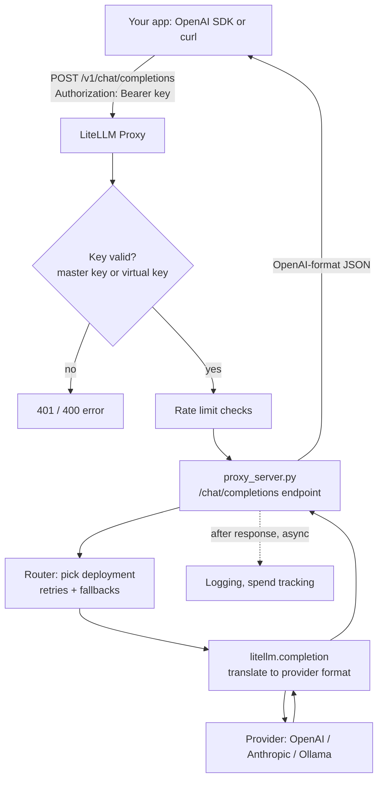

# 08 — The Proxy: your own AI gateway server

Project: M2 Self-hosted AI gateway in Docker (ROADMAP.md) · Read: before you start building

Previous: [07 — Router](./07-router.md) · Next: [09 — Keys, teams, budgets](./09-keys-teams-budgets.md)

---

## The idea in plain words

Think of a hotel reception desk.
Guests do not walk into the kitchen, the laundry, or the taxi company.
They go to one desk. The desk checks who they are, then calls the right service for them.

Up to now, every Python program you wrote was its own reception desk.
Each program held the provider keys, the retry rules, and the model list.
That is fine for one app. It is a mess for ten apps and five teams.

The **LiteLLM Proxy** is one shared reception desk for AI.
It is a **server**: a program that runs all the time and waits for requests over the network.
Apps send it normal OpenAI-style requests. The proxy:

1. checks the caller's key,
2. picks the real model (using the Router from chapter 07),
3. calls the provider with the real provider key,
4. sends the answer back.

The apps never see the provider keys. You change providers in one file, not in ten apps.
People call this an **AI gateway**: one door that all AI traffic goes through.

Library vs proxy, side by side:

| | Library (`litellm.completion`) | Proxy (`litellm --config ...`) |
|---|---|---|
| Where the provider call happens | Inside your app | Inside the gateway server |
| Who holds provider keys | Every app | Only the gateway |
| Language | Python only | Any language that speaks HTTP |
| Change a model | Edit and redeploy every app | Edit `config.yaml`, restart gateway |
| Good for | Scripts, one service | Many apps, many teams, a company |

## Jargon table

| Term | Full name | What it does | Tiny example |
|---|---|---|---|
| Server | — | A program that keeps running and answers network requests | The proxy listening on port 4008 |
| Port | — | A numbered "door" on a machine; one program per port | `localhost:4008` |
| Endpoint | — | One URL path the server answers | `/v1/chat/completions` |
| HTTP | HyperText Transfer Protocol | The language of web requests: method + path + headers + body | `POST /v1/chat/completions` |
| Header | — | Extra labeled info sent with a request | `Authorization: Bearer sk-...` |
| Bearer token | — | A secret string in the `Authorization` header that proves who you are | `Bearer sk-lab-8f3c...` |
| Proxy / gateway | — | A server that sits between apps and providers and forwards requests | LiteLLM Proxy |
| `config.yaml` | YAML config file | The one file that tells the proxy which models exist and how to behave | `model_list:` ... |
| YAML | YAML Ain't Markup Language | A text format for settings using indentation | `port: 4008` |
| Master key | — | The admin password of the proxy; it can do everything | `LITELLM_MASTER_KEY=sk-...` |
| Model group | — | All deployments that share one `model_name` | `fast-chat` |
| Docker image | — | A packaged, ready-to-run copy of a program and its dependencies | `ghcr.io/berriai/litellm:v1.104.0` |
| Container | — | A running instance of an image | `lm-ch08-proxy` |
| `.env` file | environment file | A text file of `NAME=value` secrets kept out of git | `OPENAI_API_KEY=sk-...` |
| Health check | — | A small endpoint that says "I am alive / ready" | `/health/liveliness` |
| SDK | Software Development Kit | A client library for an API | the `openai` Python package |
| `base_url` | — | The address an SDK sends requests to | `http://localhost:4008` |

## Life of a request

The official docs describe this flow on the [Life of a Request](https://docs.litellm.ai/docs/proxy/architecture) page.
Simplified:



Notice two things:

- Steps F and G are exactly the Router (chapter 07) and `completion()` (chapter 02). The proxy is a web server wrapped around things you already know.
- Logging and spend tracking happen **after** the answer is sent. They do not slow down the caller.

## The `config.yaml` file

The proxy reads one YAML file. It has four main sections:

| Section | What goes in it | You already met it as... |
|---|---|---|
| `model_list` | Public model names and the real models behind them | `Router(model_list=...)` |
| `litellm_settings` | Settings for the litellm library (`drop_params`, `num_retries`, callbacks) | `litellm.drop_params = True` |
| `router_settings` | Settings for the Router (`routing_strategy`, cooldowns) | `Router(routing_strategy=...)` |
| `general_settings` | Settings for the server itself (`master_key`, database, health checks) | new in this chapter |

Here is the config used for every demo below:

```yaml
model_list:
  - model_name: fast-chat                  # the name callers use
    litellm_params:
      model: openai/gpt-4o-mini            # the real provider/model behind it
      api_key: os.environ/OPENAI_API_KEY   # read from the environment, never pasted here
      mock_response: "Hello from the fast-chat mock!"   # lab only: no real call is made
  - model_name: smart-chat
    litellm_params:
      model: anthropic/claude-3-5-sonnet-20240620
      api_key: os.environ/ANTHROPIC_API_KEY
      mock_response: "Hello from the smart-chat mock!"

litellm_settings:
  drop_params: true          # silently drop params a provider does not support
  num_retries: 2             # retry a failed call up to 2 times

router_settings:
  routing_strategy: simple-shuffle

general_settings:
  master_key: os.environ/LITELLM_MASTER_KEY   # the admin password for the proxy
```

### `os.environ/` references

`api_key: os.environ/OPENAI_API_KEY` means: "at startup, read the environment variable `OPENAI_API_KEY` and use its value".
The secret never sits in the YAML file. So the YAML file can live in git, and the secrets live in `.env` (which must be in `.gitignore`).

The matching `.env` file for the lab (fake values, nothing real):

```
LITELLM_MASTER_KEY=sk-lab-8f3c2d9a71b44e0e
OPENAI_API_KEY=sk-fake-openai-not-real
ANTHROPIC_API_KEY=sk-fake-anthropic-not-real
```

### The master key

The master key is the admin password. Anyone holding it can call every model and every admin endpoint.
In litellm 1.104.0 the proxy **refuses to start** without one, and it also refuses the well-known example key `sk-1234`
(source: `litellm/proxy/auth/master_key_boot_check.py`, `PUBLICLY_KNOWN_MASTER_KEYS = frozenset({"sk-1234"})`).

## Part 1 — The library way (what you did before)

```python
import litellm

# Library style: the provider call happens INSIDE this Python process.
# This app needs the provider key, the retry rules, the model list... all of it.
response = litellm.completion(
    model="openai/gpt-4o-mini",
    messages=[{"role": "user", "content": "Say hi"}],
    mock_response="Hello from inside my own process!",  # lab only: no network call
)

print("answer:", response.choices[0].message.content)
```

Output (real, captured with litellm 1.104.0):

```
answer: Hello from inside my own process!
```

Every app that does this carries its own keys and settings. The next parts move all of that into one server.

## Part 2 — Start the proxy from the venv

The `litellm` command comes with `pip install 'litellm[proxy]'`.

```bash
cd /tmp/litellm-lab/ch08
set -a; . ./.env; set +a          # export every line of .env into this shell
litellm --config config.yaml --port 4008
```

Output (real, captured with litellm 1.104.0, banner and one warning trimmed):

```
INFO:     Started server process [42234]
INFO:     Waiting for application startup.
INFO:     Application startup complete.
INFO:     Uvicorn running on http://0.0.0.0:4008 (Press CTRL+C to quit)
LiteLLM: Proxy initialized with Config, Set models:
    fast-chat
    smart-chat
```

Why `set -a; . ./.env; set +a`? Because the `litellm` CLI did **not** pick up the `.env` file from my current folder.
I tested it: starting without exporting gave the refusal message from Part 3.
(The library calls `load_dotenv()` with no path, which searches from the library's own folder, not yours.)

## Part 3 — What happens with no master key

Same config, but `LITELLM_MASTER_KEY` is not set:

```bash
env -u LITELLM_MASTER_KEY litellm --config config.yaml --port 7008
```

Output (real, captured with litellm 1.104.0, traceback trimmed; exit code 3):

```
ERROR:    Application startup failed. Exiting.
LiteLLM proxy refused to start: no master key is set, so every request would be accepted without authentication.
general_settings.master_key in config.yaml is blank, or points at an environment variable that is not set.

1. Make sure config.yaml reads the key from the environment:
     general_settings:
       master_key: os.environ/LITELLM_MASTER_KEY
2. Generate a key and save it to .env:
     echo "LITELLM_MASTER_KEY=sk-$(openssl rand -hex 32)" | tee -a .env
   Not using a .env file (docker run, Kubernetes, pip install)? Pass the same value as the
   LITELLM_MASTER_KEY environment variable instead.

Local development only: set LITELLM_DANGEROUSLY_PERMIT_WEAK_OR_UNSET_MASTER_KEY=true, or
general_settings.dangerously_permit_weak_or_unset_master_key: true, to start anyway.
```

Read error messages like this one fully. It tells you the cause and the fix.
Use the `openssl rand` command it prints to make your real master key.

## Part 4 — Run the official Docker image

Docker runs the proxy in a sealed box, with the exact dependencies LiteLLM tested.
The docs recommend `ghcr.io/berriai/litellm` and say to pin a version tag, not `latest`
([deploy docs](https://docs.litellm.ai/docs/proxy/deploy)). The tag `v1.104.0` exists; I pulled it.

```bash
cd /tmp/litellm-lab/ch08
docker run -d --name lm-ch08-proxy \
  -v "$PWD/config.yaml:/app/config.yaml:ro" \
  --env-file .env \
  -p 4008:4000 \
  ghcr.io/berriai/litellm:v1.104.0 \
  --config /app/config.yaml --port 4000
```

Line by line:

- `-d` runs it in the background. `--name` gives it a name you can stop later.
- `-v host_path:container_path:ro` lets the container read your `config.yaml` (read-only).
- `--env-file .env` passes your secrets as environment variables. Docker reads `.env` here, so no `set -a` needed.
- `-p 4008:4000` means "port 4008 on my laptop goes to port 4000 inside the container".
- Everything after the image name is passed to `litellm`.

Output of `docker ps` and `docker logs` (real, captured with litellm 1.104.0):

```
lm-ch08-proxy ghcr.io/berriai/litellm:v1.104.0 0.0.0.0:4008->4000/tcp, [::]:4008->4000/tcp Up 7 seconds
INFO:     Uvicorn running on http://0.0.0.0:4000 (Press CTRL+C to quit)
LiteLLM: Proxy initialized with Config, Set models:
    fast-chat
    smart-chat
```

The proxy answered its first health check about 8 seconds after `docker run`.
Stop and remove it with `docker rm -f lm-ch08-proxy`.

Not run here: with Ollama on your laptop, a model entry from inside Docker looks like
`model: ollama/llama3.2` plus `api_base: http://host.docker.internal:11434`, and no `mock_response`.
With a real OpenAI key, you just delete `mock_response` and put the real key in `.env`.

## Part 5 — Health endpoints

```bash
curl -s localhost:4008/health/liveliness
curl -s localhost:4008/health/readiness
curl -s localhost:4008/health -H "Authorization: Bearer $LITELLM_MASTER_KEY"
```

Output (real, captured with litellm 1.104.0, Docker image):

```
"I'm alive!"
{"status":"healthy","db":"Not connected"}
{"healthy_endpoints":[{"model":"openai/gpt-4o-mini","model_id":"af5961b5...3b1a"},{"model":"anthropic/claude-3-5-sonnet-20240620","model_id":"ceceed8c...6bed"}],"unhealthy_endpoints":[],"healthy_count":2,"unhealthy_count":0}
```

(The long `model_id` hashes are shortened with `...` here.)

| Endpoint | Needs a key? | What it checks |
|---|---|---|
| `/health/liveliness` | no | The process is up. Nothing else. |
| `/health/readiness` | no | Ready to serve. `db` says if a database is connected. |
| `/health` | yes | Sends a **real test call** to every model. |

The [health docs](https://docs.litellm.ai/docs/proxy/health) warn that `/health` "runs a real test request against every configured model, so it costs a few tokens per model".
Point Docker or Kubernetes probes at `liveliness` and `readiness`, never at `/health`.

## Part 6 — Talk to the proxy with curl

List the models this gateway offers:

```bash
curl -s localhost:4008/v1/models -H "Authorization: Bearer $LITELLM_MASTER_KEY"
```

Output (real, captured with litellm 1.104.0):

```
{"data":[{"id":"fast-chat","object":"model","created":1677610602,"owned_by":"openai","mode":"chat","max_input_tokens":128000,"max_output_tokens":16384},{"id":"smart-chat","object":"model","created":1677610602,"owned_by":"openai"}],"object":"list"}
```

Callers see only the public names (`fast-chat`, `smart-chat`), not the provider models behind them.

Send a chat request:

```bash
curl -s localhost:4008/v1/chat/completions \
  -H "Authorization: Bearer $LITELLM_MASTER_KEY" \
  -H "Content-Type: application/json" \
  -d '{"model":"fast-chat","messages":[{"role":"user","content":"Say hi"}]}'
```

Output (real, captured with litellm 1.104.0):

```
{"id":"chatcmpl-ebab4dbe-72e2-490a-bd0b-5c44af548688","created":1791217185,"model":"fast-chat","object":"chat.completion","choices":[{"finish_reason":"stop","index":0,"message":{"content":"Hello from the fast-chat mock!","role":"assistant"}}],"usage":{"completion_tokens":20,"prompt_tokens":10,"total_tokens":30}}
```

The proxy also adds `x-litellm-*` response headers. A few of them, from `curl -si` (real, captured with litellm 1.104.0):

```
x-litellm-model-name: openai/gpt-4o-mini
x-litellm-version: 1.104.0
x-litellm-response-cost: 1.35e-05
x-litellm-model-group: fast-chat
x-litellm-attempted-retries: 0
```

These are gold for debugging: which real model answered, what it cost, how many retries happened.

## Part 7 — What bad requests look like

```bash
# 1. no Authorization header
curl -s localhost:4008/v1/chat/completions -H "Content-Type: application/json" \
  -d '{"model":"fast-chat","messages":[{"role":"user","content":"Say hi"}]}'
# 2. a made-up key
curl -s localhost:4008/v1/chat/completions -H "Authorization: Bearer sk-wrong-key-123" ...
# 3. a model name not in config.yaml
curl -s localhost:4008/v1/chat/completions -H "Authorization: Bearer $LITELLM_MASTER_KEY" ... '"model":"gpt-5"'
```

Output (real, captured with litellm 1.104.0, Docker image):

```
{"error":{"message":"Authentication Error, No api key passed in.","type":"auth_error","param":"None","code":"401"}}
{"error":{"message":"No connected db.","type":"no_db_connection","param":null,"code":"400"}}
{"error":{"message":"/chat/completions: Invalid model name passed in model=gpt-5. Call `/v1/models` to view available models for your key.","type":"invalid_request_error","param":null,"code":"400","provider_specific_fields":{"error":"/chat/completions: Invalid model name passed in model=gpt-5. Call `/v1/models` to view available models for your key."}}}
```

Look at error 2. Any key that is not the master key is treated as a **virtual key**, and virtual keys live in a database.
No database, so the proxy cannot look it up. Chapter 09 adds Postgres and virtual keys.

Side note: with the pip-installed proxy (no Prisma package), case 1 returned `500 Internal Server Error` instead of 401.
The Docker image bundles Prisma and returns the clean 401. One more reason to use the image.

## Part 8 — The OpenAI Python SDK, pointed at your gateway

The proxy speaks the OpenAI API. So the official `openai` package works. Only two things change.

```python
import os

from openai import OpenAI

# The proxy speaks the OpenAI API, so the official OpenAI client works.
# We only change WHERE it sends requests (base_url) and WHICH key it shows.
client = OpenAI(
    base_url="http://localhost:4008",              # your gateway, not api.openai.com
    api_key=os.environ["LITELLM_MASTER_KEY"],       # the proxy key, not a provider key
)

response = client.chat.completions.create(
    model="smart-chat",                             # a model_name from config.yaml
    messages=[{"role": "user", "content": "Say hi"}],
)

print("model :", response.model)
print("answer:", response.choices[0].message.content)
print("tokens:", response.usage.total_tokens)
```

Output (real, captured with litellm 1.104.0, Docker image):

```
model : smart-chat
answer: Hello from the smart-chat mock!
tokens: 30
```

The app asked for `smart-chat` and an Anthropic model answered. The app has no Anthropic key and no idea Anthropic exists.

## Part 9 — Streaming through the proxy

```python
import os

from openai import OpenAI

client = OpenAI(
    base_url="http://localhost:4008",
    api_key=os.environ["LITELLM_MASTER_KEY"],
)

stream = client.chat.completions.create(
    model="fast-chat",
    messages=[{"role": "user", "content": "Say hi"}],
    stream=True,                                    # ask the proxy to stream chunks
)

chunk_count = 0
for chunk in stream:
    piece = chunk.choices[0].delta.content
    if piece:                                       # the last chunk may have no text
        print(repr(piece))
        chunk_count = chunk_count + 1
print("chunks with text:", chunk_count)
```

Output (real, captured with litellm 1.104.0):

```
'Hel'
'lo '
'fro'
'm t'
'he '
'fas'
't-c'
'hat'
' mo'
'ck!'
chunks with text: 10
```

Streaming from chapter 03 works the same through the gateway. The mock splits the text into small pieces; a real model streams real tokens.

## Part 10 — Catching proxy errors in Python

```python
import os

import openai
from openai import OpenAI

client = OpenAI(
    base_url="http://localhost:4008",
    api_key=os.environ["LITELLM_MASTER_KEY"],
)

try:
    client.chat.completions.create(
        model="gpt-5",                              # NOT in config.yaml
        messages=[{"role": "user", "content": "Say hi"}],
    )
except openai.BadRequestError as error:
    print("status:", error.status_code)
    print("message:", error.message[:90])
```

Output (real, captured with litellm 1.104.0):

```
status: 400
message: Error code: 400 - {'error': {'message': '/chat/completions: Invalid model name passed in m
```

Proxy errors arrive as normal OpenAI SDK exceptions. Your app code does not need to know a gateway is there.

## The admin UI

The proxy ships a web UI at `http://localhost:4008/ui` (it answered `200` in my test).
The [UI docs](https://docs.litellm.ai/docs/proxy/ui) list two requirements: a master key, and a connected database.
Without a database there are no virtual keys, teams, or spend logs to show, so the UI is mostly empty.
For first sign-in, the username is `UI_USERNAME` (default `admin`), and if `UI_PASSWORD` is unset the master key works as the password.
You will set it up properly in chapter 09, with Postgres.

## How big companies use this

- **One shared gateway for the whole company.** Pfizer's AI platform team runs LiteLLM as "a self-hosted AI gateway - a single OpenAI-compatible API in front of a multi-provider model catalog, serving every team, application, and agent at Pfizer"
  ([LiteLLM blog, 2026-09-11](https://docs.litellm.ai/blog/pfizer-gateway-performance-and-resiliency)).
- **Load-test every version bump.** In the same post, Pfizer's CI caught a throughput drop from about 300 to 156 requests per second after upgrading LiteLLM, with zero HTTP errors. A shared gateway means one regression hits every team, so they test upgrades before rollout.
- **Pin the Docker image.** LiteLLM's March 2026 incident report says two PyPI releases (1.82.7 and 1.82.8) were compromised for about 40 minutes, and that users of the official Docker image "were not impacted" because that path pins its dependencies
  ([LiteLLM blog, 2026-03-24](https://docs.litellm.ai/blog/security-update-march-2026)). Pinned image tags plus pinned Python versions are standard practice.
- **Typical pattern:** app teams get only the gateway URL and a key. The platform team owns `config.yaml`, provider keys, and upgrades. Swapping a model behind `fast-chat` needs no app changes.
- **Typical pattern:** the config file lives in git, reviewed like code. Secrets come from a secret manager or Kubernetes secret as environment variables, through `os.environ/`.

## Traps

1. **Putting real keys in `config.yaml`.** The config usually ends up in git. Use `os.environ/NAME` and keep `.env` out of git.
2. **Using `sk-1234` from old tutorials as the master key.** In 1.104.0 the proxy refuses to start with it, because everyone knows it. Generate one with `openssl rand -hex 32`.
3. **Assuming the CLI reads your `.env`.** In my test it did not. Export it (`set -a; . ./.env; set +a`) or use `docker run --env-file .env`.
4. **Wrong `base_url` or port.** `-p 4008:4000` means you call 4008 from your laptop, but the container itself listens on 4000. Mixing them gives "connection refused".
5. **Sending the provider key to the proxy.** Apps send the proxy key (master or virtual). The proxy holds the provider key. An `sk-...` OpenAI key sent to the proxy is just "an unknown key".
6. **Pointing health probes at `/health`.** It calls every model for real, costs tokens, and fails when a provider is slow. Use `/health/liveliness` and `/health/readiness` for probes.

## Project brief: M2

**Goal:** run your own AI gateway in Docker and make every app talk to it, never to a provider directly.

**Features**

- A `config.yaml` with at least 3 public model names. Use Ollama models (free) for at least two of them; one may be a mock (`mock_response`) standing in for a paid provider.
- All secrets referenced with `os.environ/...`. A real master key generated with `openssl rand`.
- The proxy runs from the pinned image `ghcr.io/berriai/litellm:v1.104.0` on port 4008, started by a `docker-compose.yml` (write it yourself).
- A Docker health check on the container, using a liveness or readiness endpoint.
- A small Python client (`client.py`) using the OpenAI SDK with `base_url` set to your gateway. It lists models, sends one normal request, and one streaming request.
- One existing project from S1–S5 switched to call the gateway instead of `litellm.completion()` directly.
- A short `README.md` in your project folder: how to start, stop, and test the gateway.

**Rules**

- No keys in code or in `config.yaml`. Secrets only in `.env`; `.env` is in `.gitignore`. Commit a `.env.example` with fake values.
- Pin the image tag. No `latest`.
- Apps must not import `litellm`; they only use the OpenAI SDK or plain HTTP.

**Done when**

- [ ] `docker compose up -d` starts the gateway, and `docker ps` shows it as `healthy`.
- [ ] `curl localhost:4008/health/liveliness` prints `"I'm alive!"`.
- [ ] `curl localhost:4008/v1/models` with your master key lists exactly your public model names.
- [ ] A request with no key returns 401; a request with an unknown model name returns 400.
- [ ] `python client.py` prints the model list, one answer, and a streamed answer.
- [ ] The `x-litellm-model-name` response header shows which real model answered.
- [ ] Changing which real model sits behind one public name needs only a `config.yaml` edit and a restart; `client.py` is unchanged.
- [ ] `git grep` finds no real key anywhere in the repo.

**Hints**

1. From inside a container, `localhost` is the container itself. How does the container reach Ollama running on your Mac?
2. Which endpoint should a Docker `healthcheck` call so it never costs tokens? Does the image have `curl`, or do you need another way to make the request?
3. If you rename `fast-chat` to `chat-fast` in the config, what breaks in `client.py`, and how would you make that kind of change safely?
4. How can you read the `x-litellm-*` headers when using the OpenAI SDK instead of curl? (Look for "raw response" in the `openai` package.)
5. What happens to running requests when you `docker compose restart`? Would a second replica help?

## Check yourself

1. Name two problems a proxy solves that the library alone does not.

<details><summary>Answer</summary>
Provider keys live only in the gateway, not in every app. Any language can use it over HTTP. Model changes happen in one config file instead of in every app. (Later: shared budgets, logging, and rate limits per team.)
</details>

2. What does `api_key: os.environ/OPENAI_API_KEY` do, and why not paste the key?

<details><summary>Answer</summary>
At startup the proxy reads the environment variable `OPENAI_API_KEY` and uses its value. The YAML file can then be committed to git safely, and the secret stays in `.env` or a secret manager.
</details>

3. Which config section holds `master_key`, which holds `num_retries`, and which holds `routing_strategy`?

<details><summary>Answer</summary>
`master_key` is in `general_settings` (server settings). `num_retries` is in `litellm_settings` (library settings). `routing_strategy` is in `router_settings` (Router settings).
</details>

4. You run `docker run ... -p 4008:4000 ...`. Which URL does your Python client use, and why?

<details><summary>Answer</summary>
`http://localhost:4008`. Port 4008 on the laptop is forwarded to port 4000 inside the container. The client runs on the laptop, so it uses the laptop side of the mapping.
</details>

5. A request with key `sk-wrong-key-123` gets `No connected db.` instead of "invalid key". Why?

<details><summary>Answer</summary>
Any key that is not the master key is treated as a virtual key. Virtual keys are stored in the database. With no database configured, the proxy cannot look the key up, so it reports the missing database.
</details>

6. Your Kubernetes probe calls `/health` every 10 seconds on a gateway with 20 paid models. What is wrong?

<details><summary>Answer</summary>
`/health` sends a real test request to every model, so this costs tokens 20 times every 10 seconds and fails whenever any provider is slow. Probes should use `/health/liveliness` (process up) and `/health/readiness` (ready to serve), which make no LLM calls.
</details>
