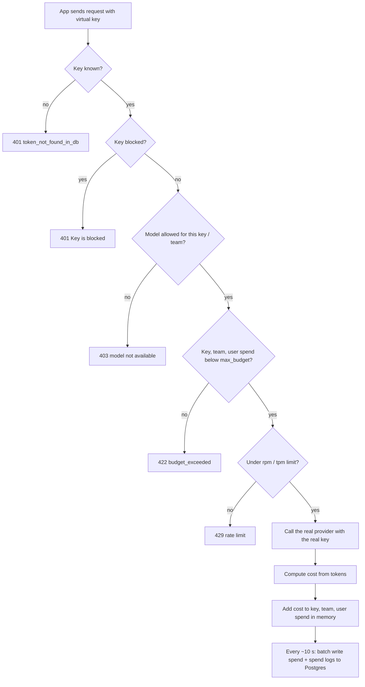

# 09 — Keys, teams, budgets: who may spend what

Project: M3 Multi-team cost control (ROADMAP.md) · Read: before you start building

Previous: [08 — The Proxy](./08-proxy-gateway.md) · Next: [10 — Caching and observability](./10-caching-observability.md)

---

## The idea in plain words

Think of a company credit card.
The company has one real card with a huge limit.
It would be crazy to photocopy that card and hand a copy to every employee.
One lost copy, and anyone can spend everything.

So the company gives each team a **prepaid card** instead.
Each prepaid card has its own limit, its own list of allowed shops, and its own statement.
If a card is lost, you cancel that one card. The real card is safe.

LiteLLM's proxy does the same thing for AI.
- The **real provider key** (your OpenAI or Anthropic key) stays inside the proxy. Only the proxy knows it.
- Every person, team, or app gets a **virtual key**: a key made up by the proxy, like `sk-Jvi...`.
- Each virtual key can have a **budget** (max dollars), a **rate limit** (max requests per minute), and a list of **allowed models**.
- The proxy writes down every call and its price. So at the end of the month you can say "the search team spent $412".

To remember all those keys and all that spending, the proxy needs a notebook that survives restarts.
That notebook is a **Postgres** database.
No database, no virtual keys.

## Jargon table

| Term | Full name | What it does | Tiny example |
|------|-----------|--------------|--------------|
| Provider key | Provider API key | The real secret from OpenAI, Anthropic, etc. Costs real money. | `OPENAI_API_KEY=sk-proj-...` in the proxy's `.env` only |
| Master key | Proxy master key | The admin password of the proxy. Can create and delete everything. | `LITELLM_MASTER_KEY=sk-master-1234` |
| Virtual key | LiteLLM virtual API key | A key the proxy invents and hands out. It points to limits, not to money. | `sk-Jvi...` given to Alice |
| Postgres | PostgreSQL database | Stores keys, teams, users, and spend. | `postgresql://postgres:pw@localhost:5409/litellm` |
| `DATABASE_URL` | Database connection string | Env var that tells the proxy where Postgres is. | `export DATABASE_URL=postgresql://...` |
| Budget | Max budget in US dollars | Spend limit. Over it, requests are refused. | `"max_budget": 10.0` |
| Budget duration | Budget reset period | How often spend goes back to 0. Units: `s`, `m`, `h`, `d`, `w`, `mo`. | `"budget_duration": "30d"` |
| RPM | Requests per minute | Max number of calls per minute. | `"rpm_limit": 60` |
| TPM | Tokens per minute | Max number of tokens per minute. | `"tpm_limit": 100000` |
| Team | Team | A group that shares one budget and one model list. | `search-team`, max $500 |
| User | Internal user | A person. Can own keys and belong to teams. | `user_id: "bob"` |
| Spend log | Spend log row | One row per request: who, which model, tokens, cost. | `success cheap-model tokens 28 spend 0.048` |
| Soft budget | Soft budget | A warning line. Crossing it sends an alert but does not block. | `"soft_budget": 8.0` with `max_budget: 10.0` |
| Chargeback | Internal billing | Sending each team a bill for its own AI use. | "Search: $412, Support: $97" |

## Life of a request with a virtual key



Two things to notice.
The checks happen **before** the call. The cost is added **after** the call.
And Postgres is updated in batches, not instantly.
Both facts show up in the demos below.

## Setup used for every demo

Postgres runs in Docker on port 5409. The proxy runs on port 4009.

```bash
docker run -d --name lm-ch09-pg -e POSTGRES_PASSWORD=pw -e POSTGRES_DB=litellm \
  -p 5409:5432 postgres:16-alpine
```

The proxy config. There are no real API keys on this machine, so both models use `mock_response`.
A mock call still has token counts, so it still has a cost.
I checked: a plain `gpt-4o-mini` mock call cost `1.35e-05` dollars. That is too small to hit a budget quickly.
So I override the price per token to make each call cost about $0.05.

```yaml
model_list:
  - model_name: cheap-model
    litellm_params:
      model: openai/gpt-4o-mini
      api_key: fake-key            # never called: mock_response short-circuits
      mock_response: "Hello from the mock model"
      input_cost_per_token: 0.001  # force a visible price for the demo
      output_cost_per_token: 0.002
  - model_name: big-model
    litellm_params:
      model: openai/gpt-4o
      api_key: fake-key
      mock_response: "Hello from the big mock model"

general_settings:
  master_key: os.environ/LITELLM_MASTER_KEY  # read from env, not hardcoded
```

Not run here: with a real key you delete `mock_response`, `input_cost_per_token`, `output_cost_per_token`, and set `api_key: os.environ/OPENAI_API_KEY`. LiteLLM then uses its built-in price list.

Start the proxy (pip install route, from a venv with `litellm[proxy]==1.104.0`):

```bash
export DATABASE_URL=postgresql://postgres:pw@localhost:5409/litellm
export LITELLM_MASTER_KEY=sk-master-1234
litellm --config config.yaml --port 4009
```

Output (real, captured with litellm 1.104.0, 189 migration lines and the banner trimmed):

```
189 migrations found in prisma/migrations
Applying migration `20250326162113_baseline`
...
All migrations have been successfully applied.
INFO:     Application startup complete.
INFO:     Uvicorn running on http://0.0.0.0:4009 (Press CTRL+C to quit)
```

On first start the proxy creates all its tables in Postgres by itself ("migrations").

I also ran the official Docker image `ghcr.io/berriai/litellm:v1.104.0` against the same Postgres, with `-e DATABASE_URL=...` and `-e LITELLM_MASTER_KEY=...`.
`/health/readiness` answered (real, captured with litellm 1.104.0):

```
{"status":"healthy","db":"connected"}
```

## Part 1 — No database, no keys

Same config, but `DATABASE_URL` not set. Then ask for a key:

```bash
curl -s localhost:7009/key/generate -H 'Authorization: Bearer sk-master-1234' \
  -H 'Content-Type: application/json' -d '{"models":["cheap-model"]}'
```

Output (real, captured with litellm 1.104.0, HTTP 500):

```
{"error":{"message":"{'error': 'DB not connected. This endpoint needs a database; set DATABASE_URL to a PostgreSQL connection string (postgresql://...) to enable it. See https://docs.litellm.ai/docs/proxy/virtual_keys'}","type":"internal_server_error","param":null,"code":"500"}}
```

The proxy still starts without a database. It just cannot hand out virtual keys.

## Part 2 — Make a virtual key

Only the admin (holder of the master key) can call `/key/generate`.

```python
import os
import httpx

PROXY = "http://localhost:4009"
MASTER_KEY = os.environ["LITELLM_MASTER_KEY"]  # only the admin holds this

admin_headers = {"Authorization": "Bearer " + MASTER_KEY}

body = {
    "key_alias": "alice-laptop",
    "models": ["cheap-model"],          # this key may ONLY call cheap-model
    "max_budget": 0.10,                 # US dollars per budget window
    "budget_duration": "30d",           # how often spend resets to 0
    "rpm_limit": 3,                     # requests per minute
    "tpm_limit": 1000,                  # tokens per minute
    "metadata": {"owner": "alice", "purpose": "demo"},
}

response = httpx.post(PROXY + "/key/generate", headers=admin_headers, json=body)
data = response.json()

print("status:", response.status_code)
print("key:", data["key"][:6] + "...")
print("key_alias:", data["key_alias"])
print("models:", data["models"])
print("max_budget:", data["max_budget"])
print("budget_duration:", data["budget_duration"])
print("rpm_limit:", data["rpm_limit"], "tpm_limit:", data["tpm_limit"])
print("metadata:", data["metadata"])

# Save the full key for the next parts (a real app would put it in .env).
with open("alice.key", "w") as file:
    file.write(data["key"])
```

Output (real, captured with litellm 1.104.0):

```
status: 200
key: sk-Jvi...
key_alias: alice-laptop
models: ['cheap-model']
max_budget: 0.1
budget_duration: 30d
rpm_limit: 3 tpm_limit: 1000
metadata: {'owner': 'alice', 'purpose': 'demo'}
```

The full key is shown **once**, in this response. Postgres only stores a hash (a scrambled fingerprint) of it.
Lose it, and you make a new one.

## Part 3 — Use the key, and get refused for the wrong model

Alice uses the normal OpenAI SDK. She never sees the provider key.

```python
import openai

with open("alice.key") as file:
    alice_key = file.read().strip()

# Alice only gets her virtual key, never the real provider key.
client = openai.OpenAI(base_url="http://localhost:4009", api_key=alice_key)

# Allowed model: works.
reply = client.chat.completions.create(
    model="cheap-model",
    messages=[{"role": "user", "content": "Hi"}],
)
print("cheap-model says:", reply.choices[0].message.content)

# Model not on her key: the proxy refuses before any provider is called.
try:
    client.chat.completions.create(
        model="big-model",
        messages=[{"role": "user", "content": "Hi"}],
    )
except openai.APIStatusError as error:
    print("big-model status:", error.status_code)
    print("big-model error:", error.body["message"])
```

Output (real, captured with litellm 1.104.0):

```
cheap-model says: Hello from the mock model
big-model status: 403
big-model error: The requested model 'big-model' is not available for this API key, or the model name is invalid. Check the models available to you and try again.
```

A made-up key gets a 401 (real, captured with litellm 1.104.0, via curl):

```
{"error":{"message":"Authentication Error, Invalid proxy server token passed. Received API Key = sk-..., Key Hash (Token) =dc2ba6188880395c02af3b010d82df67e9c1559c33bda956ecf7376ca222b058. Unable to find token in cache or `LiteLLM_VerificationTokenTable`","type":"token_not_found_in_db","param":"key","code":"401"}}
```

## Part 4 — Look up spend with `/key/info`

A key may read its own info. So Alice can check her own spend with her own key.

```python
import time
import httpx

with open("alice.key") as file:
    alice_key = file.read().strip()

# A key may look up its own info, so Alice uses her own key here.
headers = {"Authorization": "Bearer " + alice_key}

time.sleep(15)  # spend is written to Postgres in batches (about every 10s)

response = httpx.get(
    "http://localhost:4009/key/info",
    headers=headers,
    params={"key": alice_key},
)
info = response.json()["info"]

print("key_alias:", info["key_alias"])
print("spend:", info["spend"])
print("max_budget:", info["max_budget"])
print("budget_reset_at:", info["budget_reset_at"])
print("models:", info["models"])
```

Output (real, captured with litellm 1.104.0, second run):

```
key_alias: alice-laptop
spend: 0.048
max_budget: 0.1
budget_reset_at: 2026-11-01T00:00:00+00:00
models: ['cheap-model']
```

Two honest notes from running this:
- The **first** run, right after the proxy started, printed `spend: 0.0`. The batch writer had not flushed yet. A minute later it printed `0.048`. Spend in Postgres is *eventually* correct, not instantly.
- I asked for `"30d"` and got a reset date of the 1st of next month. LiteLLM snaps resets to clean calendar boundaries.

Where does `0.048` come from? The mock call used 8 prompt tokens and 20 completion tokens:
8 x 0.001 + 20 x 0.002 = 0.008 + 0.040 = $0.048.

## Part 5 — Hit a key budget

A new key with a $0.10 budget. Each call costs $0.048.

```python
import os
import httpx
import openai

PROXY = "http://localhost:4009"
admin_headers = {"Authorization": "Bearer " + os.environ["LITELLM_MASTER_KEY"]}

# A fresh key with a tiny budget: $0.10.
body = {"key_alias": "tiny-budget", "models": ["cheap-model"], "max_budget": 0.10}
tiny_key = httpx.post(PROXY + "/key/generate", headers=admin_headers, json=body).json()["key"]

client = openai.OpenAI(base_url=PROXY, api_key=tiny_key)

# Each cheap-model call costs $0.048 in our config.
for attempt in range(1, 6):
    try:
        client.chat.completions.create(
            model="cheap-model",
            messages=[{"role": "user", "content": "Hi"}],
        )
        print("call", attempt, "ok")
    except openai.APIStatusError as error:
        print("call", attempt, "blocked, status", error.status_code)
        print("  type:", error.body["type"])
        print("  message:", error.body["message"])
        break
```

Output (real, captured with litellm 1.104.0):

```
call 1 ok
call 2 ok
call 3 ok
call 4 blocked, status 422
  type: budget_exceeded
  message: Budget has been exceeded! Key=tiny-budget (sk-..._X4Q) Current cost: 0.14400000000000507, Max budget: 0.1
```

Read it slowly:
- Before call 3, spend was $0.096. That is under $0.10, so call 3 was allowed.
- Call 3 pushed spend to $0.144. Only then was the key over.
- So a budget is a **stop line**, not an exact wall. The last allowed call can overshoot by one request.
- The status was 422 in this version. Check `type == "budget_exceeded"`, not the number.

Note: the in-memory spend updated instantly here, even though Postgres lags. Blocking uses the fast in-memory copy.

## Part 6 — Hit a rate limit

```python
import os
import httpx
import openai

PROXY = "http://localhost:4009"
admin_headers = {"Authorization": "Bearer " + os.environ["LITELLM_MASTER_KEY"]}

# A fresh key that may send at most 2 requests per minute.
body = {"key_alias": "rpm-demo", "models": ["cheap-model"], "rpm_limit": 2}
rpm_key = httpx.post(PROXY + "/key/generate", headers=admin_headers, json=body).json()["key"]

# The SDK retries 429s by default; max_retries=0 lets us see the error.
client = openai.OpenAI(base_url=PROXY, api_key=rpm_key, max_retries=0)

for attempt in range(1, 5):
    try:
        client.chat.completions.create(
            model="cheap-model",
            messages=[{"role": "user", "content": "Hi"}],
        )
        print("call", attempt, "ok")
    except openai.RateLimitError as error:
        print("call", attempt, "rate limited, status", error.status_code)
        print("  message:", error.body["message"])
        print("  retry-after header:", error.response.headers.get("retry-after"))
        break
```

Output (real, captured with litellm 1.104.0):

```
call 1 ok
call 2 ok
call 3 rate limited, status 429
  message: Rate limit exceeded for api_key: 679a19070287423919e8922eb41591300f44f53d5d916e1e9a121d2e82b877b7. Limit type: requests. Current limit: 2, Remaining: 0. Limit resets at: 2026-10-05 16:31:03 UTC
  retry-after header: 60
```

Budget = "how much money in total". Rate limit = "how fast". You usually want both.
A budget alone does not stop a buggy loop from burning the whole month's money in five minutes.

## Part 7 — Teams and users

A **team** is a shared wallet. A **user** is a person. A key can belong to both.
One script in two blocks: people and wallets first, then the key.

```python
import os
import httpx

PROXY = "http://localhost:4009"
admin_headers = {"Authorization": "Bearer " + os.environ["LITELLM_MASTER_KEY"]}

# 1. A team: the "wallet" shared by everyone in it.
team_body = {
    "team_alias": "search-team",
    "models": ["cheap-model"],
    "max_budget": 0.10,          # whole team, all keys together
    "budget_duration": "30d",
}
team = httpx.post(PROXY + "/team/new", headers=admin_headers, json=team_body).json()
team_id = team["team_id"]
print("team_id:", team_id, "max_budget:", team["max_budget"])

# 2. A user (a person) who belongs to that team.
user_body = {
    "user_id": "bob",
    "user_email": "bob@example.com",
    "teams": [team_id],
    "max_budget": 5.0,           # Bob's personal cap across everything
}
user = httpx.post(PROXY + "/user/new", headers=admin_headers, json=user_body).json()
print("user_id:", user["user_id"], "teams:", user["teams"])
```

```python
# 3. A key owned by Bob, billed to the team.
key_body = {"user_id": "bob", "team_id": team_id, "key_alias": "bob-search-svc"}
key = httpx.post(PROXY + "/key/generate", headers=admin_headers, json=key_body).json()
print("key team_id:", key["team_id"], "key user_id:", key["user_id"])

# Save the key for the next part (a real app would read it from .env).
with open("bob.key", "w") as file:
    file.write(key["key"])
with open("team.id", "w") as file:
    file.write(team_id)
```

Output (real, captured with litellm 1.104.0):

```
team_id: 09098bb7-830c-4d6f-bc01-e67fb6b26974 max_budget: 0.1
user_id: bob teams: ['09098bb7-830c-4d6f-bc01-e67fb6b26974']
key team_id: 09098bb7-830c-4d6f-bc01-e67fb6b26974 key user_id: bob
```

Side effect I saw in Postgres: `/user/new` also creates a key for the user (a row with no alias). That is because `auto_create_key` defaults to `true`. Send `"auto_create_key": false` if you do not want it.

## Part 8 — Hit a team budget

Bob's key has no budget of its own. The team budget still applies.

```python
import openai

with open("bob.key") as file:
    bob_key = file.read().strip()

client = openai.OpenAI(base_url="http://localhost:4009", api_key=bob_key)

# Bob's KEY has no budget of its own. The TEAM budget ($0.10) still applies.
for attempt in range(1, 6):
    try:
        client.chat.completions.create(
            model="cheap-model",
            messages=[{"role": "user", "content": "Hi"}],
        )
        print("call", attempt, "ok")
    except openai.APIStatusError as error:
        print("call", attempt, "blocked, status", error.status_code)
        print("  message:", error.body["message"])
        break
```

Output (real, captured with litellm 1.104.0):

```
call 1 ok
call 2 ok
call 3 ok
call 4 blocked, status 422
  message: Budget has been exceeded! Team=09098bb7-830c-4d6f-bc01-e67fb6b26974 Current cost: 0.14400000000000507, Max budget: 0.1
```

The proxy checks every level: key, team, user (and more, like organization). The first one over its limit blocks the call.

## Part 9 — Spend logs: one row per request

`/spend/logs` still works but is marked deprecated in the source and is not paginated. Use `/spend/logs/v2`.

```python
import os
import time
from datetime import datetime, timedelta, timezone
import httpx

PROXY = "http://localhost:4009"
admin_headers = {"Authorization": "Bearer " + os.environ["LITELLM_MASTER_KEY"]}

with open("team.id") as file:
    team_id = file.read().strip()

time.sleep(15)  # spend logs are flushed to Postgres in batches

now = datetime.now(timezone.utc)
params = {
    "start_date": (now - timedelta(hours=1)).strftime("%Y-%m-%d %H:%M:%S"),
    "end_date": (now + timedelta(hours=1)).strftime("%Y-%m-%d %H:%M:%S"),
    "team_id": team_id,
    "page_size": 10,
}
response = httpx.get(PROXY + "/spend/logs/v2", headers=admin_headers, params=params)
page = response.json()

print("total rows for this team:", page["total"])
for row in page["data"]:
    print(row["status"], row["model_group"], "tokens", row["total_tokens"], "spend", row["spend"], "user", row["user"])
```

Output (real, captured with litellm 1.104.0):

```
total rows for this team: 4
failure cheap-model tokens 0 spend 0.0 user bob
success cheap-model tokens 28 spend 0.048 user bob
success cheap-model tokens 28 spend 0.048 user bob
success cheap-model tokens 28 spend 0.048 user bob
```

The blocked call is logged too, as a `failure` with spend 0. Good for audits: you can see who tried.

## Part 10 — Totals per team and per user

```python
import os
import httpx

PROXY = "http://localhost:4009"
admin_headers = {"Authorization": "Bearer " + os.environ["LITELLM_MASTER_KEY"]}

with open("team.id") as file:
    team_id = file.read().strip()

team_response = httpx.get(
    PROXY + "/team/info",
    headers=admin_headers,
    params={"team_id": team_id},
)
team_info = team_response.json()["team_info"]
print("team:", team_info["team_alias"])
print("  spend:", team_info["spend"], "of max_budget", team_info["max_budget"])

user_response = httpx.get(PROXY + "/user/info", headers=admin_headers, params={"user_id": "bob"})
user_info = user_response.json()["user_info"]
print("user: bob")
print("  spend:", user_info["spend"], "of max_budget", user_info["max_budget"])
```

Output (real, captured with litellm 1.104.0):

```
team: search-team
  spend: 0.144 of max_budget 0.1
user: bob
  spend: 0.144 of max_budget 5.0
```

And it really is in Postgres (real, captured with litellm 1.104.0):

```bash
docker exec lm-ch09-pg psql -U postgres -d litellm -c 'SELECT team_alias, spend, max_budget FROM "LiteLLM_TeamTable";'
```

```
 team_alias  | spend | max_budget
-------------+-------+------------
 search-team | 0.144 |        0.1
(1 row)
```

## Part 11 — The kill switch: block a key

A key leaked into a public repo? Block it in one call. No restart.

```bash
curl -s http://localhost:4009/key/block -H "Authorization: Bearer $LITELLM_MASTER_KEY" \
  -H "Content-Type: application/json" -d "{\"key\": \"$ALICE_KEY\"}" \
  -o /dev/null -w "block status: %{http_code}\n"
curl -s http://localhost:4009/chat/completions -H "Authorization: Bearer $ALICE_KEY" \
  -H "Content-Type: application/json" \
  -d '{"model": "cheap-model", "messages": [{"role": "user", "content": "Hi"}]}'
```

Output (real, captured with litellm 1.104.0):

```
block status: 200
{"error":{"message":"Authentication Error, Key is blocked. Update via `/key/unblock` if you're an admin.","type":"auth_error","param":"None","code":"401"}}
```

## Alerts: tell a human before the money is gone (not run here)

Blocking is the last line. You want a warning first.
LiteLLM can post to a Slack channel through a Slack "incoming webhook" URL.
The config keys below are the ones read by `proxy_server.py` in 1.104.0 (`alerting`, `alert_types`, `alerting_threshold`); see the [alerting docs](https://docs.litellm.ai/docs/proxy/alerting).

```yaml
general_settings:
  master_key: os.environ/LITELLM_MASTER_KEY
  alerting: ["slack"]
  alert_types: ["budget_alerts", "llm_exceptions", "llm_too_slow"]
  alerting_threshold: 300   # seconds before a request counts as "too slow" / hanging
```

```bash
# .env, never in code
SLACK_WEBHOOK_URL=https://hooks.slack.com/services/XXX/YYY/ZZZ
```

To get a warning *before* the hard stop, give the key or team a `soft_budget` below its `max_budget`
(for example `"soft_budget": 8.0, "max_budget": 10.0`). Crossing the soft budget alerts but does not block.
The docs also list `GET /health/services?service=slack` to send a test alert.
Not run here because there is no Slack workspace on this machine.

## The admin UI

Everything above can also be done by clicking. Open `http://localhost:4009/ui`.
Login: username `admin` (or `UI_USERNAME`), password = the master key (or `UI_PASSWORD` if set).
I checked this in `proxy/auth/login_utils.py` for 1.104.0, and `/ui` answered with HTTP 200.
The UI shows keys, teams, users, and spend charts. It reads the same Postgres tables you just queried.

## How big companies use this

Named companies (source opened: [litellm.ai](https://www.litellm.ai/), testimonials section):
- A Netflix staff engineer is quoted saying LiteLLM lets his team give users new models "usually within a day of them being released".
- An Okta architect is quoted saying a backend model switch is "a simple configuration update in the gateway".
Those quotes are about the gateway in general, not budgets in particular.

Typical patterns for cost control (no company named, because I found no public source):
- **One key per app, not per person.** A service gets `search-api-prod`. People get personal keys for experiments with small budgets.
- **Team = cost center.** Each team maps to the finance department's cost center. Monthly `budget_duration`. Finance gets a CSV built from spend logs (chargeback).
- **Two lines per budget.** Soft budget at about 80% posts to the team's Slack channel. Max budget stops the bleeding.
- **Rate limits on every key**, even with a budget, so a bug cannot burn a month's budget in an hour.
- **Short-lived keys for CI and demos** (`duration: "1d"`), so forgotten keys expire on their own.
- **Model allow-lists by tier.** Interns and experiments get cheap models; only approved production keys get the expensive ones.

## Traps

1. **Giving out the master key.** It can create, change, and delete every key and team. Anyone who has it is admin. Apps should only ever get virtual keys.
2. **Expecting exact budgets.** The check happens before the call; the cost is added after. The last call can overshoot (Part 5: $0.144 on a $0.10 budget). Leave room, and use rate limits.
3. **Reading spend right after a call.** Postgres is updated in batches (default every ~10 s). Part 4's first run showed `0.0`. Wait, or read from the in-memory side (blocking already uses it).
4. **Wrong Prisma version on the pip route.** The proxy talks to Postgres through Prisma. With `prisma==0.15.0` the proxy failed with `'Prisma' object has no attribute '_Prisma__engine'` and shut down. `prisma==0.11.0` plus `prisma generate --schema <litellm>/proxy/schema.prisma` worked. The Docker image already has the right one, so prefer Docker.
5. **Testing budgets with a $0 model.** If your test model has no price, spend stays 0 and budgets never trigger. Mocks do have token counts, but the price is tiny; set `input_cost_per_token` / `output_cost_per_token` for tests.
6. **Letting the OpenAI SDK hide 429s.** The SDK retries 429 by default. Your rate-limit test then "passes" slowly instead of failing fast. Use `max_retries=0` when testing limits.

## Project brief: M3

**Goal:** Turn your M2 gateway into a cost-controlled platform for three fake teams: `search`, `support`, `research`.

**Features**
- `docker compose` (or plain `docker run`) with Postgres on 5409 and the proxy on 4009, `DATABASE_URL` set from `.env`.
- At least two models in `config.yaml`: one cheap, one expensive. Use `mock_response` plus a per-token price override, or real models.
- An admin script (`admin.py`) with commands: create team, create user, create key, block key, show report.
- Each team has a monthly budget and its own model list. `research` may use the expensive model; the others may not.
- Each key has an `rpm_limit` and a `metadata` field with an owner.
- A report command that prints, per team: spend, budget, percent used, and the top user. Data must come from the proxy (`/team/info`, `/spend/logs/v2`), not from your own counters.
- A "runaway job" script that loops calls until it is stopped, and prints the final error it gets.
- Slack alerting config with `soft_budget` set (it may stay unused if you have no webhook).

**Rules**
- No provider key and no master key in code. Everything comes from `.env`. `.env` is in `.gitignore`.
- Apps use virtual keys only. Only `admin.py` uses the master key.
- Write your own code. Do not copy the demos above into the project; rebuild them.

**Done when**
- [ ] `curl localhost:4009/health/readiness` shows `"db":"connected"`.
- [ ] A `support` key calling the expensive model gets a 403.
- [ ] The runaway script is stopped by a budget error (`type: budget_exceeded`), and you can explain why it overshot.
- [ ] A burst test gets a 429 with a `retry-after` header.
- [ ] Two keys in the same team stop together when the team budget is used up.
- [ ] The report shows spend per team, and the numbers match `psql` on `LiteLLM_TeamTable`.
- [ ] Blocking a key makes its next call fail with 401, without restarting the proxy.
- [ ] Restarting the proxy keeps all keys, teams, and spend.
- [ ] `git grep sk-` finds no real keys.

**Hints**
- Which level should own the budget for a shared service: the key, the user, or the team? What happens to the others when one is over?
- How will your report wait for spend to land in Postgres before it reads it?
- Where in your admin script should the full new key be shown, given that the proxy shows it only once?
- What `budget_duration` makes sense for a CI key, and would `duration` (key expiry) be a better tool?
- How do you test "the team stops together" without spending real money?

## Check yourself

1. Why not just give each team the real OpenAI key and ask them to be careful?

<details><summary>Answer</summary>
You cannot limit, track, or revoke a shared real key per team. One leak exposes everything, and rotating it breaks every team at once. A virtual key has its own budget, rate limit, model list, and spend log, and you can block it alone.
</details>

2. What happens if you start the proxy without `DATABASE_URL` and call `/key/generate`?

<details><summary>Answer</summary>
The proxy starts and serves the master key, but `/key/generate` returns HTTP 500 with "DB not connected. This endpoint needs a database; set DATABASE_URL ...". Keys, teams, users, and spend all live in Postgres.
</details>

3. A key has `max_budget: 0.10`, each call costs $0.048. How many calls succeed, and why not two?

<details><summary>Answer</summary>
Three. The budget is checked before each call: before call 3 the spend is $0.096, which is still under $0.10, so it is allowed. After call 3 the spend is $0.144, so call 4 is blocked with `budget_exceeded`.
</details>

4. What is the difference between `max_budget` and `rpm_limit`? Why use both?

<details><summary>Answer</summary>
`max_budget` limits total dollars per budget window. `rpm_limit` limits how many requests per minute. A budget alone lets a buggy loop spend the whole month's money very fast; a rate limit slows it so alerts and humans can react.
</details>

5. You call a model, then immediately read `/key/info`, and spend is 0. Is tracking broken?

<details><summary>Answer</summary>
Probably not. Spend is kept in memory right away (that is what blocking uses) but is written to Postgres in batches, about every 10 seconds by default. Wait a bit and read again.
</details>

6. Bob's key has no budget, but his team has `max_budget: 0.10`. What happens when the team spend passes $0.10?

<details><summary>Answer</summary>
Bob's next call is blocked with "Budget has been exceeded! Team=... Current cost: ..., Max budget: 0.1". The proxy checks key, team, and user limits on every request; any one being over blocks the call. Every other key in the same team is blocked too.
</details>
