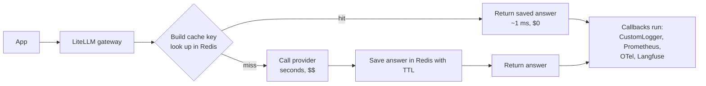
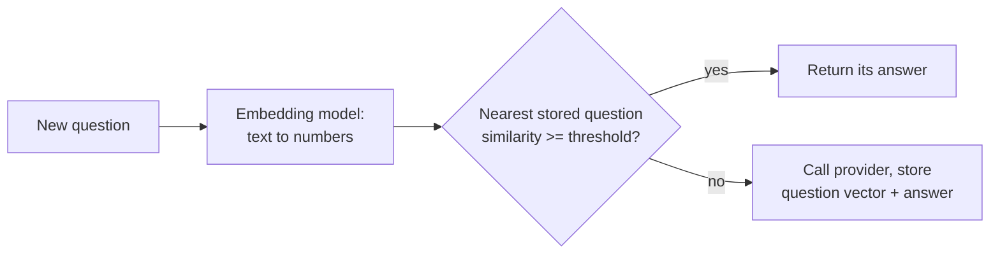

# 10 — Caching and observability: a fast gateway you can see inside

Project: M4 Fast + observable gateway (ROADMAP.md) · Read: before you start building

Previous: [09 — Keys, teams, budgets](./09-keys-teams-budgets.md) · Next: [11 — RAG and guardrails](./11-rag-and-guardrails.md)

---

## The idea in plain words

Think of a help desk that gets the same question 200 times a day: "What is the Wi-Fi password?"
A smart help desk writes the answer on a sticky note the first time.
After that, it reads the note. It does not phone the IT team again.
That sticky note is a **cache**.
Reading the note is fast and free. Phoning IT is slow and costs money.

An LLM call is the slow, paid phone call. It can take seconds and costs tokens.
If the exact same question comes in again, the gateway can reuse the saved answer.
That is the "fast" half of this chapter.

Now think of a shop owner who wants to know what happens in the shop.
They install a door counter, a camera, and a till receipt printer.
The counter gives numbers ("312 customers today").
The camera shows one customer's whole path.
The receipts list every sale.
That is **observability**: seeing what happens inside your system.
For a gateway the questions are: how many calls, how slow, how much money, which ones failed, and why.
That is the "observable" half.

LiteLLM gives you both:

- `litellm.Cache` stores answers (in memory, in files, or in Redis).
- **Callbacks** run your code (or a tool like Langfuse) after every call, with latency, tokens, and cost already worked out.
- **Prometheus** gives counters, **OpenTelemetry** gives traces, **Langfuse** gives a browsable history of calls.

## Jargon table

| Term | Full name | What it does | Tiny example |
|---|---|---|---|
| Cache | — | Stores answers so a repeat request skips the provider | Second "What is 2+2?" answered from memory |
| Cache hit / miss | — | Hit = answer found in cache. Miss = not found, call the provider | `cache_hit=True` |
| Cache key | — | A fingerprint (hash) of the request, used to look up the answer | `be16777e...19f0` |
| Hash | — | Turns any text into a fixed-length string. Same input, same output | `sha256("hi")` |
| TTL | Time To Live | How long a cached answer is kept before it expires | `ttl=600` = 10 minutes |
| Redis | Remote Dictionary Server | A fast in-memory database that many servers can share | One cache for 5 proxy copies |
| Namespace | — | A prefix on keys so different apps do not mix their entries | `m4demo:e37e...` |
| Semantic cache | — | Reuses an answer for a question with the same *meaning*, not the same text | "capital of France?" ≈ "tell me France's capital" |
| Embedding | — | A list of numbers that represents the meaning of a text | `[0.12, -0.03, ...]` |
| Similarity threshold | — | How close two embeddings must be to count as "same question" | `0.8` |
| Observability | — | Being able to answer "what happened and why" from outside | Dashboards, traces, logs |
| Callback | — | A function the library calls for you after an event | `on_success(...)` after each call |
| CustomLogger | — | LiteLLM base class you subclass to write your own callback | `class MyLogger(CustomLogger)` |
| Metric | — | A number that changes over time | `litellm_cache_hits_metric_total 1.0` |
| Prometheus | — | A tool that collects metrics by reading a `/metrics` page every few seconds | Grafana chart of requests/second |
| Trace / span | — | A trace is one request's full story; a span is one step in it | Span `litellm_request` 0.73s |
| OpenTelemetry (OTel) | Open Telemetry | A vendor-neutral standard for sending traces and metrics | Send spans to Jaeger, Datadog, Langfuse |
| Langfuse | — | An open-source tool to browse LLM calls: prompt, answer, cost, latency | Search "all failed calls today" |

## The request path



Two things to notice.
The cache is checked *before* the provider call.
The callbacks run for *every* call, hit or miss. A hit is logged with cost `$0`.

## Cache types in litellm 1.104.0

These are the values allowed for `Cache(type=...)`, read from `litellm/types/caching.py` (`LiteLLMCacheType`):

| `type` | Where answers live | Shared across servers? | Extra needs |
|---|---|---|---|
| `local` | Memory of this Python process | No | Nothing |
| `disk` | Files on this machine | No | `pip install 'litellm[caching]'` (the `diskcache` package) |
| `redis` | A Redis server | Yes | Redis |
| `redis-semantic` | Redis with vector search | Yes | Redis 8 or Redis Stack, `redisvl` package, an embedding model |
| `qdrant-semantic`, `valkey-semantic` | Qdrant / Valkey vector search | Yes | That server, an embedding model |
| `s3`, `gcs`, `azure-blob` | Cloud object storage | Yes | A bucket |

Import path: `from litellm.caching.caching import Cache`.

## Part 1 — Exact cache in memory, with timing

One idea: the second identical request is served from memory.
`mock_delay=1.5` makes the fake provider take 1.5 seconds, so the speed-up is visible.

```python
import time
import litellm
from litellm.caching.caching import Cache

# Turn on an in-memory cache for every litellm call in this process.
litellm.cache = Cache(type="local")


def ask(question):
    start = time.perf_counter()
    response = litellm.completion(
        model="openai/gpt-4o-mini",
        messages=[{"role": "user", "content": question}],
        mock_response="Paris.",  # fake answer, no API key needed
        mock_delay=1.5,          # pretend the provider takes 1.5 seconds
    )
    seconds = time.perf_counter() - start
    cache_hit = response._hidden_params.get("cache_hit", False)
    print(f"{seconds:.3f}s  cache_hit={cache_hit}  question={question!r}")


# Warm-up: the first cache hit in a process is slow (one-time setup). Keep it out of the timing.
for warm_up in [1, 2]:
    litellm.completion(
        model="openai/gpt-4o-mini",
        messages=[{"role": "user", "content": "warm up"}],
        mock_response="ok",
    )

ask("What is the capital of France?")   # miss: goes to the "provider"
ask("What is the capital of France?")   # hit: same request, served from memory
ask("What is the capital of france?")   # one letter changed -> different key -> miss
```

Output (real, captured with litellm 1.104.0):

```
1.506s  cache_hit=False  question='What is the capital of France?'
0.001s  cache_hit=True  question='What is the capital of France?'
1.506s  cache_hit=False  question='What is the capital of france?'
```

`response._hidden_params["cache_hit"]` is the hit indicator in the library.
Without the warm-up, the first hit in a fresh process took 0.18 to 2 seconds in my runs. Later hits took about 1 ms.
With a real key: delete `mock_response` and `mock_delay`, put `OPENAI_API_KEY` in `.env` (not run here).

## Part 2 — What goes into the cache key

The cache key is a hash of the request fields that change the answer: model, messages, temperature, and so on.
You can ask the cache for a key directly.

```python
from litellm.caching.caching import Cache

cache = Cache(type="local")
messages = [{"role": "user", "content": "hi"}]

key_a = cache.get_cache_key(model="gpt-4o-mini", messages=messages)
key_b = cache.get_cache_key(model="gpt-4o-mini", messages=messages)
key_c = cache.get_cache_key(model="gpt-4o-mini", messages=messages, temperature=0.2)
key_d = cache.get_cache_key(model="gpt-4o", messages=messages)

print("a:", key_a)
print("a == b (same request):      ", key_a == key_b)
print("a == c (temperature added): ", key_a == key_c)
print("a == d (different model):   ", key_a == key_d)
```

Output (real, captured with litellm 1.104.0):

```
a: be16777e0c9abaf94bb688cff0f016a45a446bbc193ee79445d02e3275e319f0
a == b (same request):       True
a == c (temperature added):  False
a == d (different model):    False
```

So "exact cache" means *exact*: one extra space, a different temperature, or a different model is a new key.

## Part 3 — Per-request cache controls

You can steer the cache for one call with `cache={...}`.
The keys below were checked in `litellm/caching/caching_handler.py` and `caching.py`:

| Control | Meaning |
|---|---|
| `{"no-cache": True}` | Do not read from the cache for this call (always ask the provider) |
| `{"no-store": True}` | Do not save this answer |
| `{"ttl": 60}` | Save this answer for 60 seconds only |
| `{"s-maxage": 60}` | Only accept a cached answer younger than 60 seconds |
| `{"namespace": "team-a"}` | Use a key prefix for this call |
| `{"use-cache": True}` | Opt in, when the cache was built with `mode="default_off"` |

```python
import time
import litellm
from litellm.caching.caching import Cache

litellm.cache = Cache(type="local")


def ask(label, question, cache_controls):
    response = litellm.completion(
        model="openai/gpt-4o-mini",
        messages=[{"role": "user", "content": question}],
        mock_response="some answer",
        cache=cache_controls,  # per-request cache settings
    )
    print(f"{label:<36} cache_hit={response._hidden_params.get('cache_hit', False)}")


ask("A1 no-store: answer is not saved", "joke", {"no-store": True})
ask("A2 normal: nothing saved, so miss", "joke", {})
ask("A3 normal again: hit", "joke", {})
ask("A4 no-cache: skip the lookup", "joke", {"no-cache": True})

ask("B1 ttl=2: saved for 2 seconds", "weather", {"ttl": 2})
ask("B2 right away: hit", "weather", {})
time.sleep(3)  # wait longer than the ttl
ask("B3 after 3s: expired, miss", "weather", {})
```

Output (real, captured with litellm 1.104.0):

```
A1 no-store: answer is not saved     cache_hit=False
A2 normal: nothing saved, so miss    cache_hit=False
A3 normal again: hit                 cache_hit=True
A4 no-cache: skip the lookup         cache_hit=False
B1 ttl=2: saved for 2 seconds        cache_hit=False
B2 right away: hit                   cache_hit=True
B3 after 3s: expired, miss           cache_hit=False
```

`ttl` is not part of the key. It only matters when an answer is *saved*.
If an answer is already cached, a later call with `{"ttl": 2}` simply hits the old entry.

## Part 4 — Disk cache survives a restart

A `local` cache dies with the process. A `disk` cache does not.
This needs the `diskcache` package (`pip install 'litellm[caching]'`); without it you get `ModuleNotFoundError: Please install litellm with litellm[caching] to use disk caching.`

```python
import litellm
from litellm.caching.caching import Cache

# Answers are saved in files, so they survive a restart of this script.
litellm.cache = Cache(type="disk", disk_cache_dir="/tmp/litellm-lab/ch10/diskcache")

response = litellm.completion(
    model="openai/gpt-4o-mini",
    messages=[{"role": "user", "content": "Explain caching in one line"}],
    mock_response="Save answers, reuse them.",
)
print("cache_hit =", response._hidden_params.get("cache_hit", False))
```

Output (real, captured with litellm 1.104.0), the same script run twice:

```
--- run 1
cache_hit = False
--- run 2 (new process)
cache_hit = True
```

## Part 5 — Redis cache from the library

Redis is the cache a real gateway uses: every copy of your app sees the same entries.
Start Redis on your project port: `docker run -d --name lm-ch10-redis -p 6310:6379 redis:8`.

```python
import os
import litellm
from litellm.caching.caching import Cache

# Shared cache in Redis. Every process pointing here shares the same answers.
litellm.cache = Cache(
    type="redis",
    host=os.getenv("REDIS_HOST", "localhost"),
    port=int(os.getenv("REDIS_PORT", "6310")),
    namespace="m4demo",  # prefix for keys, so many apps can share one Redis
    ttl=600,             # keep answers 10 minutes
)

for attempt in [1, 2]:
    response = litellm.completion(
        model="openai/gpt-4o-mini",
        messages=[{"role": "user", "content": "Name one planet."}],
        mock_response="Mars.",
    )
    hidden = response._hidden_params
    print(f"call {attempt}: cache_hit={hidden.get('cache_hit', False)} key={hidden.get('cache_key')}")
```

Output (real, captured with litellm 1.104.0), followed by `redis-cli KEYS '*'` and `redis-cli TTL <key>`:

```
call 1: cache_hit=False key=None
call 2: cache_hit=True key=m4demo:e37ea3efde9c1ddee6f4a671bb424fec8f545a1b19a1ad9c6709adb91c538520
m4demo:e37ea3efde9c1ddee6f4a671bb424fec8f545a1b19a1ad9c6709adb91c538520
599
```

On a hit, `_hidden_params` also carries `cache_key`. You can find the very same key inside Redis, with its TTL counting down.

## Part 6 — Redis cache in the proxy, seen from the client

Now the gateway does the caching, so *every* app behind it benefits.
`config.yaml` (proxy on port 4010, Redis on 6310):

```yaml
model_list:
  - model_name: fast-model
    litellm_params:
      model: openai/gpt-4o-mini
      api_key: os.environ/OPENAI_API_KEY
      mock_response: "Hello from the gateway."   # remove this line with a real key
      mock_delay: 1.0                             # pretend the provider takes 1s

litellm_settings:
  cache: true
  cache_params:
    type: redis
    host: os.environ/REDIS_HOST
    port: os.environ/REDIS_PORT
    ttl: 600
  callbacks: ["prometheus", "custom_callbacks.proxy_handler_instance"]

general_settings:
  master_key: os.environ/LITELLM_MASTER_KEY
```

`.env` holds `OPENAI_API_KEY`, `REDIS_HOST=localhost`, `REDIS_PORT=6310`, `LITELLM_MASTER_KEY`.
Start it with `litellm --config config.yaml --port 4010` (the `callbacks` line is explained in Parts 8 and 9).

The client reads the `x-litellm-cache-key` response header. The proxy sets it from the cache key (see `proxy/common_request_processing.py`), so it is filled on a hit and `None` on a miss.

```python
import time
from openai import OpenAI

# The app only knows the gateway URL and a gateway key.
client = OpenAI(base_url="http://localhost:4010", api_key="sk-m4-master")

for attempt in [1, 2]:
    start = time.perf_counter()
    raw = client.chat.completions.with_raw_response.create(
        model="fast-model",
        messages=[{"role": "user", "content": "Say hello"}],
    )
    seconds = time.perf_counter() - start
    response = raw.parse()  # the normal response object
    cache_key = raw.headers.get("x-litellm-cache-key")
    print(f"call {attempt}: {seconds:.2f}s  x-litellm-cache-key={cache_key}")
    print(f"        answer={response.choices[0].message.content}")
```

Output (real, captured with litellm 1.104.0):

```
call 1: 1.75s  x-litellm-cache-key=None
        answer=Hello from the gateway.
call 2: 0.01s  x-litellm-cache-key=9a7ba150b913c2dc4efa78a4e349f1723ce7abb02780560a65cc1c757b66c35f
        answer=Hello from the gateway.
```

Clients turn the cache off for one call through `extra_body`:

```python
raw = client.chat.completions.with_raw_response.create(
    model="fast-model",
    messages=[{"role": "user", "content": "Say hello"}],  # same as before: would be a hit
    extra_body={"cache": {"no-cache": True}},  # but we ask the gateway to skip the cache
)
```

Output (real, captured with litellm 1.104.0):

```
1.15s  x-litellm-cache-key=None
```

## Part 7 — Semantic cache: same meaning, different words

An exact cache misses "Tell me the capital of France please" after "What is the capital of France?".
A semantic cache turns each question into an **embedding** and looks for a stored question that is close enough.



There is no real embedding model on this machine. So the demo points LiteLLM at a toy local server on port 7010 that speaks the OpenAI `/embeddings` format. It makes "bag of words" vectors: sentences that share words get close vectors. It ignores filler words like "what", "is", "tell", "please". A real embedding model understands meaning; the toy only counts shared words. The LiteLLM side is real.

```python
import os
import litellm
from litellm.caching.caching import Cache

# Embeddings come from a toy local server (see the note above).
os.environ["OPENAI_API_BASE"] = "http://127.0.0.1:7010"
os.environ["OPENAI_API_KEY"] = "fake-key"

litellm.cache = Cache(
    type="redis-semantic",
    redis_url="redis://localhost:6310",  # needs Redis with vector search (Redis 8 / Redis Stack)
    similarity_threshold=0.8,            # 1.0 = identical meaning only, lower = looser
    redis_semantic_cache_embedding_model="openai/text-embedding-3-small",
)

questions = [
    "What is the capital of France?",
    "Tell me the capital of France please",  # different words, same meaning
    "What is the capital of Japan?",         # different meaning
]

for question in questions:
    response = litellm.completion(
        model="openai/gpt-4o-mini",
        messages=[{"role": "user", "content": question}],
        mock_response=f"(fresh answer to: {question})",
    )
    hit = response._hidden_params.get("cache_hit", False)
    print(f"cache_hit={hit!s:<5} asked={question!r}")
    print(f"           got={response.choices[0].message.content!r}")
```

Output (real, captured with litellm 1.104.0, Redis 8, `redisvl` installed, toy embeddings):

```
cache_hit=False asked='What is the capital of France?'
           got='(fresh answer to: What is the capital of France?)'
cache_hit=True  asked='Tell me the capital of France please'
           got='(fresh answer to: What is the capital of France?)'
cache_hit=False asked='What is the capital of Japan?'
           got='(fresh answer to: What is the capital of Japan?)'
```

Things I hit while running this:

- With `host`/`port` but no password, 1.104.0 raises `Missing required Redis configuration: REDIS_PASSWORD`. Pass `redis_url` instead.
- Plain `redis:7` has no vector search. Use `redis:8` or Redis Stack.
- `redisvl` is not installed by `litellm[proxy]`. Install it yourself.

The proxy version (not run here): `cache_params` takes the same names, and the embedding model can be a `model_name` from your `model_list`.

```yaml
litellm_settings:
  cache: true
  cache_params:
    type: redis-semantic
    redis_url: os.environ/REDIS_URL
    similarity_threshold: 0.8
    redis_semantic_cache_embedding_model: my-embedder   # a model_name in model_list
```

With Ollama you would add a `model_list` entry `my-embedder` with `model: ollama/nomic-embed-text` (not run here).

## Part 8 — Callbacks: plain functions

Now the "observable" half.
A **callback** is a function LiteLLM calls after each request.
`success_callback` runs after a good call. `failure_callback` runs after an error.

```python
import litellm


def on_success(kwargs, completion_response, start_time, end_time):
    seconds = (end_time - start_time).total_seconds()
    cost = kwargs.get("response_cost")  # litellm puts the cost here for you
    print(f"success: model={kwargs['model']} took {seconds:.2f}s cost={cost}")


def on_failure(kwargs, completion_response, start_time, end_time):
    print(f"failure: model={kwargs['model']} error={kwargs.get('exception')}")


litellm.suppress_debug_info = True
litellm.success_callback = [on_success]   # plain function, called on success
litellm.failure_callback = [on_failure]   # plain function, called on failure

messages = [{"role": "user", "content": "hi"}]

litellm.completion(
    model="openai/gpt-4o-mini",
    messages=messages,
    mock_response="Hello!",
    mock_delay=0.2,
)
try:
    litellm.completion(
        model="openai/gpt-4o-mini",
        messages=messages,
        mock_response=Exception("boom"),  # fake a failure
    )
except Exception:
    pass
```

Output (real, captured with litellm 1.104.0):

```
success: model=gpt-4o-mini took 0.22s cost=1.35e-05
failure: model=gpt-4o-mini error=litellm.InternalServerError: InternalServerError: OpenAIException - litellm.MockException: boom
```

The same lists also take names of built-in loggers: `["langfuse"]`, `["otel"]`, `["prometheus"]`.

## Part 9 — A CustomLogger that prints latency and cost

For anything bigger, subclass `CustomLogger`.
Every hook receives `kwargs["standard_logging_object"]`: one dict with model, tokens, cost, cache hit, errors, and more. Use it instead of digging through raw kwargs.

```python
import sys
import time
import litellm
from litellm.caching.caching import Cache
from litellm.integrations.custom_logger import CustomLogger


class CostLatencyLogger(CustomLogger):
    # Called after every successful call (in a background thread for sync calls).
    def log_success_event(self, kwargs, response_obj, start_time, end_time):
        payload = kwargs["standard_logging_object"]  # one clean dict with the facts
        latency_ms = (end_time - start_time).total_seconds() * 1000
        line = (
            f"OK    model={payload['model']}  latency={latency_ms:.0f}ms  "
            f"tokens={payload['total_tokens']}  cost=${payload['response_cost']:.6f}  "
            f"cache_hit={payload['cache_hit']}"
        )
        sys.stdout.write(line + "\n")  # one write, so lines from threads do not mix

    # Called after every failed call.
    def log_failure_event(self, kwargs, response_obj, start_time, end_time):
        payload = kwargs["standard_logging_object"]
        sys.stdout.write(f"FAIL  model={payload['model']}  error={payload['error_str'][:50]}\n")


litellm.suppress_debug_info = True  # hide the long help banner printed on errors
litellm.cache = Cache(type="local")
litellm.callbacks = [CostLatencyLogger()]
```

The calls (same file, continued):

```python
messages = [{"role": "user", "content": "hi"}]

for attempt in [1, 2]:  # second one is a cache hit
    litellm.completion(
        model="openai/gpt-4o-mini",
        messages=messages,
        mock_response="Hello there, how can I help?",
        mock_delay=0.3,
    )
    time.sleep(0.2)  # let the background logger print before the next call

litellm.completion(
    model="anthropic/claude-haiku-4-5",
    messages=messages,
    mock_response="Hi!",
)
time.sleep(0.2)

try:
    litellm.completion(
        model="openai/gpt-4o-mini",
        messages=[{"role": "user", "content": "this one fails"}],
        mock_response=Exception("provider is down"),  # fake a failure
    )
except Exception:
    pass  # the logger already recorded it
time.sleep(0.2)
```

Output (real, captured with litellm 1.104.0):

```
OK    model=gpt-4o-mini  latency=318ms  tokens=30  cost=$0.000013  cache_hit=None
OK    model=openai/gpt-4o-mini  latency=1ms  tokens=30  cost=$0.000000  cache_hit=True
OK    model=claude-haiku-4-5  latency=10ms  tokens=30  cost=$0.000110  cache_hit=None
FAIL  model=gpt-4o-mini  error=litellm.InternalServerError: InternalServerError: 
```

Read this output carefully:

- The cache hit costs `$0.000000` and takes 1 ms. That is your saving, measured.
- On a miss, `cache_hit` is `None`, not `False`. Check `is True`, not `== False`.
- For sync `completion()`, LiteLLM runs success logging in a background thread (`executor.submit` in `litellm/utils.py`). In my first run, two lines printed at once got glued together. Hence the single `sys.stdout.write` and the short sleeps.

**The same logger in the proxy.** Put the class in `custom_callbacks.py` next to `config.yaml`, with `async_` hooks because the proxy is async:

```python
from litellm.integrations.custom_logger import CustomLogger


class GatewayLogger(CustomLogger):
    # The proxy is async, so it calls the async_ version of the hook.
    async def async_log_success_event(self, kwargs, response_obj, start_time, end_time):
        payload = kwargs["standard_logging_object"]
        latency_ms = (end_time - start_time).total_seconds() * 1000
        print(
            f"[gateway-log] model={payload['model_group']} latency={latency_ms:.0f}ms "
            f"cost=${payload['response_cost']:.6f} cache_hit={payload['cache_hit']}",
            flush=True,
        )


# The config file points at this exact variable name.
proxy_handler_instance = GatewayLogger()
```

Proxy log during Part 6 (real, captured with litellm 1.104.0): a miss, a hit, then the `no-cache` call:

```
INFO:     127.0.0.1:63434 - "POST /chat/completions HTTP/1.1" 200 OK
[gateway-log] model=fast-model latency=1011ms cost=$0.000013 cache_hit=None
INFO:     127.0.0.1:63434 - "POST /chat/completions HTTP/1.1" 200 OK
[gateway-log] model=fast-model latency=0ms cost=$0.000000 cache_hit=True
INFO:     127.0.0.1:63502 - "POST /chat/completions HTTP/1.1" 200 OK
[gateway-log] model=fast-model latency=1001ms cost=$0.000013 cache_hit=None
```

## Part 10 — Prometheus metrics from the proxy

`callbacks: ["prometheus"]` in the Part 6 config turns on a `/metrics` page.
Facts checked for 1.104.0:

- **Not enterprise-gated.** It ran here with no license. The source (`integrations/prometheus.py`) has no premium check, and the docs only mark the managed-batch metrics as enterprise.
- It needs the `prometheus_client` package. The `litellm[proxy]` install did not include it; I installed it separately. The official Docker image already has it.
- `/metrics` **requires auth by default** (a key in the `Authorization` header). `litellm_settings: require_auth_for_metrics_endpoint: false` makes it public.
- `/metrics` redirects (307) to `/metrics/`.

```bash
curl -s -o /dev/null -w "without key: HTTP %{http_code}\n" localhost:4010/metrics/
curl -s -H "Authorization: Bearer $LITELLM_MASTER_KEY" localhost:4010/metrics/ \
  | grep -E '^litellm_(requests_metric_total|cache_hits_metric_total|spend_metric_total)\{' \
  | sed -E 's/\{.*\}//'   # drop the labels to keep the output short
```

Output (real, captured with litellm 1.104.0), after the three Part 6 calls:

```
without key: HTTP 401
litellm_spend_metric_total 2.7e-05
litellm_requests_metric_total 3.0
litellm_cache_hits_metric_total 1.0
```

3 requests, 1 cache hit, $0.000027 spent. Every real line also has labels such as `team`, `hashed_api_key`, `requested_model`. Those labels are what let you build a "spend per team" chart. The docs list `litellm_requests_metric` as deprecated; use `litellm_proxy_total_requests_metric` in dashboards.

## Part 11 — OpenTelemetry traces

`callbacks: ["otel"]` sends one span per call. With `OTEL_EXPORTER=console` the spans print to the terminal, so you can see them without any server.
This needs `opentelemetry-sdk` and `opentelemetry-exporter-otlp` (not in `litellm[proxy]`; I installed them).

```python
import os
import time
import litellm

os.environ["OTEL_EXPORTER"] = "console"       # print spans to the terminal
os.environ["OTEL_SERVICE_NAME"] = "m4-demo"   # how this app shows up in traces

litellm.callbacks = ["otel"]                  # built-in OpenTelemetry logger

litellm.completion(
    model="openai/gpt-4o-mini",
    messages=[{"role": "user", "content": "hi"}],
    mock_response="Hello!",
)
time.sleep(2)  # spans are exported in the background
```

Output (real, captured with litellm 1.104.0, trimmed with `grep` to the key lines):

```
    "name": "litellm_request",
        "trace_id": "0x0331dce17dcdcd895e59b35af3b1e952",
    "start_time": "2026-10-05T16:24:56.178337Z",
    "end_time": "2026-10-05T16:24:56.907853Z",
        "gen_ai.cost.total_cost": 1.35e-05,
        "gen_ai.request.model": "gpt-4o-mini",
        "gen_ai.usage.output_tokens": 20,
        "gen_ai.usage.input_tokens": 10,
            "service.name": "m4-demo",
    "name": "raw_gen_ai_request",
        "trace_id": "0x0331dce17dcdcd895e59b35af3b1e952",
```

Two spans share one `trace_id`: that is how a trace tool draws them as one request.
Note: by default the span also holds the full prompt and answer (`gen_ai.input.messages`). Think about privacy before shipping traces.

To send to a real collector instead (not run here), set in `.env`:

```
OTEL_EXPORTER=otlp_http
OTEL_ENDPOINT=http://otel-collector:4318
```

## Part 12 — Langfuse (config only, not run here)

Langfuse needs its own server (cloud or self-hosted). Not run here.
For Langfuse v3/v4 the LiteLLM docs recommend the OpenTelemetry-based preset:

```yaml
litellm_settings:
  callbacks: ["langfuse_otel"]
```

```
LANGFUSE_PUBLIC_KEY=pk-...
LANGFUSE_SECRET_KEY=sk-...
LANGFUSE_HOST=https://cloud.langfuse.com   # or your self-hosted URL
```

The older `success_callback: ["langfuse"]` callback also exists. In 1.104.0 docs it needs the Langfuse Python SDK v4 (`langfuse>=4.7,<5`).
You can list several callbacks at once: `callbacks: ["prometheus", "langfuse_otel", "custom_callbacks.proxy_handler_instance"]`.

## How big companies use this

Typical patterns:

- **One shared Redis cache behind many gateway copies.** A local cache only helps one process. With 5 gateway copies, Redis makes a hit on one copy a hit for all.
- **Cache only what is safe to repeat.** FAQ bots, classification, and fixed prompts with `temperature=0` get cached. Creative or personal answers use `no-cache`/`no-store`, or `mode="default_off"` so callers must opt in.
- **Namespaces per team or per environment**, so staging never serves production answers.
- **Three views of the same traffic.** Prometheus counters for dashboards and alerts ("error rate above 2%"). Traces (OTel, Langfuse) to debug one slow or wrong call. A custom logger to ship each call's cost into the company's own billing or data warehouse.
- **Alerts on cache hit rate and spend**, because a sudden drop in hit rate often means someone changed a prompt template.

Named examples (sources opened):

- Datadog ships a LiteLLM integration that scrapes the proxy's Prometheus `/metrics` endpoint, with metrics such as `litellm.cache.hits.metric.count` ([Datadog docs](https://docs.datadoghq.com/integrations/litellm/)).
- Langfuse documents logging every LiteLLM Proxy call, with token usage, cost, and latency per request ([Langfuse docs](https://langfuse.com/integrations/gateways/litellm)).

## Traps

1. **Expecting the cache to match "similar" requests.** The exact cache is a hash. One changed character or a different `temperature` is a miss (Part 2). Normalize prompts before sending if you want more hits.
2. **Caching answers that must be fresh or private.** A cached "current stock price" is wrong. A cached answer about one user's data can be served to another user if the prompts match. Use `no-store`, short `ttl`, or namespaces.
3. **A loose semantic threshold.** At `0.6`, "capital of France" and "capital of Japan" may count as the same question. You return a confident wrong answer, and logs say "cache hit". Start strict (0.9+) and test with near-miss questions.
4. **Using `local` cache in a multi-worker proxy.** Each worker has its own memory, so hit rate looks random. Use Redis.
5. **Slow or crashing callbacks.** Your logger runs on every call. A slow network call inside a sync hook, or an exception in it, adds work to every request. Keep hooks short; send heavy work to a queue.
6. **Leaving `/metrics` and traces wide open.** Metrics labels include key hashes and team names; traces include full prompts. Keep `/metrics` behind auth (the default) and treat trace storage as sensitive data.

## Project brief: M4

**Goal:** take your M2/M3 gateway and make it fast (Redis cache) and observable (metrics, traces, your own cost logger). Then prove both with numbers.

**Features**

- Redis cache in the proxy (`cache: true`, `type: redis`), with a default TTL and a namespace.
- A second gateway copy (another port) using the same Redis, to show the cache is shared.
- Per-request controls work through the OpenAI SDK: `no-cache`, `no-store`, `ttl`.
- A semantic cache experiment: a separate config with `redis-semantic`, and a written note on the threshold you chose and why.
- A `CustomLogger` that writes one JSON line per call to a file: time, model group, key alias or team, latency ms, tokens, cost, cache hit, error.
- Prometheus `/metrics` enabled, scraped by a Prometheus container, with one Grafana (or Prometheus UI) chart for requests, cache hits, and spend.
- Traces exported with OpenTelemetry (console first, then a collector or Jaeger), or Langfuse if you have an account.
- A small load script that sends a mix of repeated and new questions and prints the hit rate and money saved.

**Rules**

- No keys in code. Everything secret lives in `.env`, and config uses `os.environ/...`.
- Use Ollama or `mock_response` while building; real paid keys are optional.
- Your own ports only. Name containers clearly and remove them when you are done.

**Done when**

- [ ] The same request twice: the second is under 50 ms and returns the `x-litellm-cache-key` header.
- [ ] `redis-cli KEYS '*'` shows your namespaced keys, and `redis-cli TTL` shows a countdown.
- [ ] A hit on gateway copy A after a miss on copy B is visible in your logs.
- [ ] `no-cache` forces a provider call; `no-store` leaves no new key in Redis.
- [ ] Your JSON log file has one line per call, and cache hits show cost 0.
- [ ] `curl /metrics/` without a key returns 401; with a key it shows `litellm_cache_hits_metric_total`.
- [ ] A chart shows requests and cache hits rising while your load script runs.
- [ ] One trace of a single request is visible (console, Jaeger, or Langfuse).
- [ ] Your load script prints hit rate and dollars saved, and the numbers match the metrics.

**Hints**

- Where does the proxy already put cost and cache-hit facts, so your logger never has to compute them itself?
- How would you prove a key was *not* stored, using only `redis-cli`?
- What should happen to a user's request if Redis goes down? Try it: stop the Redis container and send a request.
- Which labels on the Prometheus metrics would let you split spend by team, and where do those labels come from (M3)?
- If the proxy runs with several workers, what does the Prometheus docs page say you must set?

## Check yourself

1. You send the same prompt twice, but the second call has `temperature=0.7` added. Hit or miss? Why?

<details><summary>Answer</summary>
Miss. `temperature` is part of the cache key, so the hash is different (Part 2: `a == c` was `False`).
</details>

2. What is the difference between `no-cache` and `no-store`?

<details><summary>Answer</summary>
`no-cache` skips *reading* the cache for this call, so it always goes to the provider. `no-store` skips *saving* this call's answer. They can be used together.
</details>

3. Why does a production gateway use Redis and not `type="local"`?

<details><summary>Answer</summary>
`local` lives in one process's memory. Several workers or gateway copies would each have their own cache, and a restart empties it. Redis is shared by all copies and survives gateway restarts.
</details>

4. In the CustomLogger demo, what did the cache hit cost, and what was `cache_hit` on a miss?

<details><summary>Answer</summary>
The hit cost `$0.000000` and took about 1 ms. On a miss, `cache_hit` was `None`, not `False`, so code should check `is True`.
</details>

5. Is Prometheus `/metrics` an enterprise feature in litellm 1.104.0? What do you need to see it?

<details><summary>Answer</summary>
No. It ran without a license. You need `callbacks: ["prometheus"]`, the `prometheus_client` package (pre-installed in the Docker image), and an `Authorization: Bearer <key>` header, because auth is on by default.
</details>

6. Name one risk of a semantic cache that an exact cache does not have.

<details><summary>Answer</summary>
It can return the answer to a *different* question if the threshold is too loose (for example France vs Japan). It also needs an embedding call per request, which adds latency and a dependency on the embedding model.
</details>
