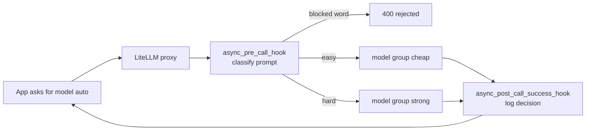
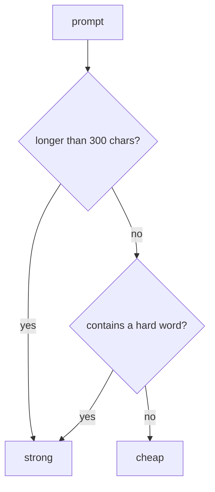
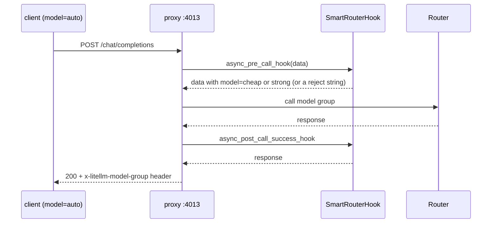

# 13 — Smart routing: cheap model for easy work, strong model for hard work

Project: L2 Cost-aware smart router (ROADMAP.md) · Read: before you start building

Previous: [12 — Platform on Kubernetes](./12-platform-on-kubernetes.md) · Next: [14 — MCP and agents](./14-mcp-and-agents.md)

---

## The idea in plain words

Think of a hospital. A nurse at the front desk looks at each patient for ten seconds.
A cold goes to a junior doctor. Chest pain goes to the senior cardiologist.
The senior doctor is expensive and busy, so you only send the cases that need her.

AI models work the same way. A **strong model** (big, smart, expensive, for example `gpt-4o`)
and a **cheap model** (small, fast, for example `gpt-4o-mini`) can both answer
"What is the capital of France?". Only the strong one reliably answers
"Debug this race condition in my Kubernetes operator". If you send everything to the strong
model, you pay senior-doctor prices for colds.

A **smart router** is the front-desk nurse. It reads each request, decides "easy" or "hard",
and sends it to the right model. The app that sends the request does not know or care.
It asks for one name, for example `auto`, and the router does the rest.

Three questions decide whether your router is good:

1. **How much money does it save?** You measure with LiteLLM's built-in price table.
2. **Does quality stay the same?** You measure with an **eval**: a small test set with known
   good answers.
3. **Can you change it safely?** You use **A/B tests**: send a small slice of traffic to the new
   idea, compare, then roll out.

In LiteLLM there are four places where you can put the "nurse":

- **Your own code** before you call `completion()` (simplest).
- **A custom routing strategy** inside `litellm.Router` (library level).
- **A proxy hook** (`async_pre_call_hook`) that rewrites the request inside the gateway.
- **The built-in complexity router** (`auto_router/complexity_router`) that ships with LiteLLM.

## Jargon table

| Term | Full name | What it does | Tiny example |
|------|-----------|--------------|--------------|
| Cheap model | small / "weak" model | Low price, fine for simple tasks | `gpt-4o-mini`, `ollama/llama3.2` |
| Strong model | large / frontier model | High price, better at hard reasoning | `gpt-4o` |
| Routing | choosing a model per request | Decides where one request goes | "hard" → `strong` |
| Deployment | one concrete model endpoint | One entry in the Router `model_list` | `openai/gpt-4o` with its key |
| Model group | public model name | Several deployments share one `model_name` | `smart` → cheap + strong |
| Routing strategy | the picking rule in `Router` | Picks one deployment from a group | `simple-shuffle`, your own class |
| Hook | a function the proxy calls at a fixed moment | Lets you read/change/reject a request | `async_pre_call_hook` |
| `CustomLogger` | LiteLLM base class for callbacks | You subclass it to write hooks | `class MyHook(CustomLogger)` |
| A/B test | split test | Send X% to variant A, Y% to B, compare | 90% old model, 10% new |
| Weight | `weight` in `litellm_params` | Share of traffic a deployment gets | `weight: 9` vs `weight: 1` |
| Tag routing | tag-based routing | Request tags pick which deployments are allowed | tag `paid-tier` → strong |
| Eval | evaluation | Score answers on a fixed test set | 4/4 correct, $0.0005 |
| Mock | fake response | `mock_response=` returns text without calling a provider | `mock_response="hi"` |

## The full picture



---

## Part 1 — Read real prices from LiteLLM

LiteLLM ships a price table: `litellm.model_cost`. It is a big dictionary.
The key is the model name. The value holds prices per **token** (a token is a word piece,
roughly 4 English characters).

```python
import litellm

cheap_model = "gpt-4o-mini"
strong_model = "gpt-4o"

for name in [cheap_model, strong_model]:
    info = litellm.model_cost[name]
    # prices are stored per token; multiply by 1M to get the usual "per 1M tokens" number
    input_per_million = info["input_cost_per_token"] * 1_000_000
    output_per_million = info["output_cost_per_token"] * 1_000_000
    print(f"{name:12} input ${input_per_million:.2f}/1M tok   output ${output_per_million:.2f}/1M tok")
```

Output (real, captured with litellm 1.104.0):

```
gpt-4o-mini  input $0.15/1M tok   output $0.60/1M tok
gpt-4o       input $2.50/1M tok   output $10.00/1M tok
```

The strong model is about 16 times more expensive on both input and output.

## Part 2 — Worked arithmetic: 1 million requests per day

Assume each request has 500 input tokens and 200 output tokens.
By hand, one strong request costs `500 × $2.50/1M + 200 × $10.00/1M = $0.00125 + $0.002 = $0.00325`.
One cheap request costs `500 × $0.15/1M + 200 × $0.60/1M = $0.000075 + $0.00012 = $0.000195`.
Now let LiteLLM do the same with `cost_per_token`.

```python
import litellm

requests_per_day = 1_000_000
input_tokens = 500    # average prompt size per request
output_tokens = 200   # average answer size per request


def cost_of_one_request(model):
    # cost_per_token returns (input_cost, output_cost) in US dollars
    input_cost, output_cost = litellm.cost_per_token(
        model=model,
        prompt_tokens=input_tokens,
        completion_tokens=output_tokens,
    )
    return input_cost + output_cost


cheap_one = cost_of_one_request("gpt-4o-mini")
strong_one = cost_of_one_request("gpt-4o")

all_strong = strong_one * requests_per_day
all_cheap = cheap_one * requests_per_day
# 70% of traffic is easy and goes to the cheap model, 30% is hard
mixed = 0.70 * all_cheap + 0.30 * all_strong

print(f"one request, cheap : ${cheap_one:.6f}")
print(f"one request, strong: ${strong_one:.6f}")
print(f"per day, all strong: ${all_strong:,.0f}")
print(f"per day, all cheap : ${all_cheap:,.0f}")
print(f"per day, 70/30 mix : ${mixed:,.0f}")
print(f"saved per day      : ${all_strong - mixed:,.0f}")
print(f"saved per year     : ${(all_strong - mixed) * 365:,.0f}")
```

Output (real, captured with litellm 1.104.0):

```
one request, cheap : $0.000195
one request, strong: $0.003250
per day, all strong: $3,250
per day, all cheap : $195
per day, 70/30 mix : $1,112
saved per day      : $2,139
saved per year     : $780,553
```

Check the mix by hand: `0.7 × 195 + 0.3 × 3250 = 136.5 + 975 = 1111.5`. That is the $1,112.
The 70/30 split is an assumption. Your real split comes from your own traffic.
And the saving only counts if quality stays the same. Part 8 shows how to check that.

## Part 3 — The simplest classifier: length and keywords

A **classifier** here is just a function that says "easy" or "hard". Start dumb and readable.
Save this as `classifier.py`; later parts import it.

```python
HARD_WORDS = ["prove", "step by step", "debug", "architecture", "compare", "why"]
LONG_PROMPT_CHARS = 300   # longer than this counts as hard


def is_hard(prompt):
    text = prompt.lower()
    if len(text) > LONG_PROMPT_CHARS:
        return True
    for word in HARD_WORDS:
        if word in text:
            return True
    return False
```

Try it on five prompts:

```python
from classifier import is_hard

prompts = [
    "What is the capital of France?",
    "Debug this Python error: KeyError 'user_id'",
    "Say hi",
    "Explain step by step how TCP handshakes work",
    "Summarize: " + "lorem ipsum " * 40,
]
for prompt in prompts:
    label = "easy"
    if is_hard(prompt):
        label = "HARD"
    print(f"{label:4} | {prompt[:45]}")
```

Output (real, captured with litellm 1.104.0):

```
easy | What is the capital of France?
HARD | Debug this Python error: KeyError 'user_id'
easy | Say hi
HARD | Explain step by step how TCP handshakes work
HARD | Summarize: lorem ipsum lorem ipsum lorem ipsu
```

Notice the weakness: "why is the sky blue?" would count as hard because of "why".
Rules are cheap and fast, but blunt. You will tune them with an eval (Part 8).



## Part 4 — A custom routing strategy inside `litellm.Router`

`litellm.Router` holds a `model_list`. Several **deployments** can share one `model_name`;
that shared name is a **model group**. Normally the Router picks inside a group by load or
randomness. With `router.set_custom_routing_strategy(...)` you replace that picking rule
with your own class. The class subclasses `CustomRoutingStrategyBase` and must return
one entry of `router.model_list`.

Verified in 1.104.0 source: `litellm/types/router.py` (`CustomRoutingStrategyBase`, method
`async_get_available_deployment(self, model, messages=None, input=None, specific_deployment=False, request_kwargs=None)`)
and `litellm/router.py` (`set_custom_routing_strategy`).

```python
import asyncio
from litellm import Router
from litellm.router import CustomRoutingStrategyBase
from classifier import is_hard   # the function from Part 3, saved as classifier.py

# Two deployments share ONE public name: "smart". The app only ever asks for "smart".
model_list = [
    {
        "model_name": "smart",
        "litellm_params": {"model": "openai/gpt-4o-mini", "mock_response": "cheap answer"},
        "model_info": {"id": "cheap"},
    },
    {
        "model_name": "smart",
        "litellm_params": {"model": "openai/gpt-4o", "mock_response": "strong answer"},
        "model_info": {"id": "strong"},
    },
]
router = Router(model_list=model_list)
```

Now the strategy and two calls (same file, continued):

```python
class DifficultyRouting(CustomRoutingStrategyBase):
    async def async_get_available_deployment(
        self, model, messages=None, input=None, specific_deployment=False, request_kwargs=None
    ):
        prompt = messages[-1]["content"]          # last user message
        wanted_id = "cheap"
        if is_hard(prompt):
            wanted_id = "strong"
        for deployment in router.model_list:      # must return an entry of model_list
            if deployment["model_info"]["id"] == wanted_id:
                return deployment


router.set_custom_routing_strategy(DifficultyRouting())


async def main():
    prompts = ["What is 2+2?", "Debug my failing Kubernetes deployment"]
    for prompt in prompts:
        response = await router.acompletion(
            model="smart",
            messages=[{"role": "user", "content": prompt}],
        )
        chosen = response._hidden_params["model_id"]  # which deployment served it
        print(f"{prompt[:40]:40} -> {chosen:6} | {response.choices[0].message.content}")


asyncio.run(main())
```

Output (real, captured with litellm 1.104.0):

```
What is 2+2?                             -> cheap  | cheap answer
Debug my failing Kubernetes deployment   -> strong | strong answer
```

Not run here: with real keys, delete both `mock_response` lines and put `OPENAI_API_KEY` in `.env`.
For free local models use `"model": "ollama/llama3.2"` for cheap and a bigger Ollama model for strong.

This demo only uses `acompletion`. The sync `router.completion()` calls the other method,
`get_available_deployment`. If you need sync calls, implement that one too.

## Part 5 — The built-in complexity router

LiteLLM 1.104.0 ships a ready-made rule-based router. You add a deployment whose model is
`auto_router/complexity_router` and map four **tiers** (SIMPLE, MEDIUM, COMPLEX, REASONING) to
your model groups. It scores the prompt locally (code words, "step by step", length, and so on).
No extra API call. Docs: [docs.litellm.ai/docs/proxy/auto_routing](https://docs.litellm.ai/docs/proxy/auto_routing);
source: `litellm/router_strategy/complexity_router/README.md`.

```python
import asyncio
from litellm import Router

model_list = [
    {"model_name": "cheap", "litellm_params": {"model": "openai/gpt-4o-mini", "mock_response": "from cheap"}},
    {"model_name": "strong", "litellm_params": {"model": "openai/gpt-4o", "mock_response": "from strong"}},
    {
        "model_name": "smart-router",
        "litellm_params": {
            "model": "auto_router/complexity_router",   # built-in rule-based scorer
            "complexity_router_config": {
                "tiers": {
                    "SIMPLE": "cheap",
                    "MEDIUM": "cheap",
                    "COMPLEX": "strong",
                    "REASONING": "strong",
                },
            },
        },
    },
]
router = Router(model_list=model_list)


async def main():
    prompts = [
        "What is the capital of France?",
        "Write a Python function with a class that parses JSON, then think step by step "
        "about the algorithm complexity and analyze the trade-offs of the architecture.",
    ]
    for prompt in prompts:
        response = await router.acompletion(
            model="smart-router",
            messages=[{"role": "user", "content": prompt}],
        )
        headers = response._hidden_params["additional_headers"]
        tier = headers["x-litellm-complexity-router-tier"]   # the router's decision
        print(f"{prompt[:35]:35} -> {tier:9} -> {response.choices[0].message.content}")


asyncio.run(main())
```

Output (real, captured with litellm 1.104.0):

```
What is the capital of France?      -> SIMPLE    -> from cheap
Write a Python function with a clas -> COMPLEX   -> from strong
```

The same source tree also has `auto_router` (semantic, needs an embedding model and the
`semantic-router` package), `quality_router`, and `adaptive_router` (learns from feedback,
stores state in Postgres). They are not demoed here. For your project, write your own rule
first, then compare it against `complexity_router` with your eval. Knowing why a rule works
beats turning on a black box.

## Part 6 — A/B test with weights

An **A/B test** sends most traffic to the current model (A) and a small slice to a candidate (B).
Put both in the same model group and give each a `weight`. The default `simple-shuffle`
strategy reads `weight` (verified in `litellm/router_strategy/simple_shuffle.py`).

```python
import asyncio
from litellm import Router

# A/B test: 90% of traffic stays on the current model (A), 10% tries the candidate (B)
model_list = [
    {
        "model_name": "chat",
        "litellm_params": {"model": "openai/gpt-4o", "mock_response": "A", "weight": 9},
        "model_info": {"id": "A-current"},
    },
    {
        "model_name": "chat",
        "litellm_params": {"model": "openai/gpt-4o-mini", "mock_response": "B", "weight": 1},
        "model_info": {"id": "B-candidate"},
    },
]
router = Router(model_list=model_list, routing_strategy="simple-shuffle")


async def main():
    counts = {"A-current": 0, "B-candidate": 0}
    for i in range(1000):
        response = await router.acompletion(
            model="chat",
            messages=[{"role": "user", "content": "hello"}],
        )
        variant = response._hidden_params["model_id"]
        counts[variant] = counts[variant] + 1
    print(counts)


asyncio.run(main())
```

Output (real, captured with litellm 1.104.0):

```
{'A-current': 897, 'B-candidate': 103}
```

It is random, so you get roughly 900/100, not exactly. Each request is an independent coin
flip, so one user can bounce between A and B. If you need one user to stay on one variant,
decide the variant yourself (for example from a hash of the user id) and use tags (Part 7).

## Part 7 — Tag routing: the caller's tag picks the deployment

**Tag routing** lets each deployment carry `tags`, and each request carry `tags` in `metadata`.
With `enable_tag_filtering=True`, the Router only uses deployments whose tags match.
Use it for "free users get cheap, paid users get strong", or for a sticky A/B group.

```python
import asyncio
from litellm import Router

model_list = [
    {"model_name": "chat", "litellm_params": {"model": "openai/gpt-4o-mini", "mock_response": "cheap", "tags": ["free-tier"]}},
    {"model_name": "chat", "litellm_params": {"model": "openai/gpt-4o", "mock_response": "strong", "tags": ["paid-tier"]}},
]
router = Router(model_list=model_list, enable_tag_filtering=True)  # tags are ignored without this


async def main():
    for tag in ["free-tier", "paid-tier", "free-tier", "paid-tier"]:
        response = await router.acompletion(
            model="chat",
            messages=[{"role": "user", "content": "hello"}],
            metadata={"tags": [tag]},   # the caller says which group it belongs to
        )
        print(f"tag={tag:9} -> {response.choices[0].message.content}")


asyncio.run(main())
```

Output (real, captured with litellm 1.104.0):

```
tag=free-tier -> cheap
tag=paid-tier -> strong
tag=free-tier -> cheap
tag=paid-tier -> strong
```

Not run here: on the proxy, the same idea lives in `config.yaml` as `tags:` under each
model's `litellm_params` and `enable_tag_filtering: True` under `router_settings`
(see [docs.litellm.ai/docs/proxy/tag_routing](https://docs.litellm.ai/docs/proxy/tag_routing)).

## Part 8 — A tiny offline eval: quality vs cost

An **eval** is a fixed list of questions with a way to grade each answer.
Here the grade is simple: the answer must contain one key word.
To keep it offline, we replay **recorded answers** through `mock_response`.
The grading and cost code is exactly what you would run against real models.

`eval_data.py`:

```python
# Tiny eval set: prompt + a word the correct answer must contain
EVAL_SET = [
    {"prompt": "Capital of France?", "must_contain": "paris"},
    {"prompt": "2 + 2 = ?", "must_contain": "4"},
    {"prompt": "Is 97 prime? Prove it step by step.", "must_contain": "prime"},
    {"prompt": "Debug: list index out of range in a loop over len(x)+1", "must_contain": "off-by-one"},
]

# Recorded answers, replayed with mock_response so this runs offline.
RECORDED = {
    "gpt-4o-mini": ["Paris.", "4", "Not sure.", "Check your list."],
    "gpt-4o": ["Paris.", "4", "Yes, 97 is prime: no divisor up to 9.", "Off-by-one: use range(len(x))."],
}
```

`policies.py` (three ways to pick a model):

```python
from classifier import is_hard


def always_cheap(prompt):
    return "gpt-4o-mini"


def always_strong(prompt):
    return "gpt-4o"


def smart(prompt):
    if is_hard(prompt):
        return "gpt-4o"
    return "gpt-4o-mini"
```

`run_eval.py`:

```python
import litellm
from eval_data import EVAL_SET, RECORDED
from policies import always_cheap, always_strong, smart


def run_eval(pick_model):
    correct = 0
    total_cost = 0.0
    for index, case in enumerate(EVAL_SET):
        model = pick_model(case["prompt"])
        response = litellm.completion(
            model=model,
            messages=[{"role": "user", "content": case["prompt"]}],
            mock_response=RECORDED[model][index],   # real run: delete this line
        )
        answer = response.choices[0].message.content.lower()
        if case["must_contain"] in answer:
            correct = correct + 1
        total_cost = total_cost + litellm.completion_cost(completion_response=response)
    return correct, total_cost


for policy in [always_cheap, always_strong, smart]:
    correct, cost = run_eval(policy)
    print(f"{policy.__name__:13} score {correct}/{len(EVAL_SET)}   cost ${cost:.6f}")
```

Output (real, captured with litellm 1.104.0):

```
always_cheap  score 2/4   cost $0.000054
always_strong score 4/4   cost $0.000900
smart         score 4/4   cost $0.000477
```

Read it like a business owner: `smart` keeps full quality at about half the strong price.
`always_cheap` is cheapest but fails half the questions. Four questions prove nothing;
your project needs at least 30, with a mix you would really see.

## Part 9 — Proxy hooks: rewrite the model inside the gateway

On the proxy, you plug in a class that subclasses `CustomLogger`. Two hooks matter here.
Signatures verified in `litellm/integrations/custom_logger.py` (1.104.0):

- `async_pre_call_hook(self, user_api_key_dict, cache, data, call_type)` runs **before** the
  model is called. `data` is the request body as a dict. Return the dict to continue (you may
  change it), return a **string** to reject the request, or raise an exception.
- `async_post_call_success_hook(self, data, user_api_key_dict, response)` runs **after** a
  successful non-streaming call. Return the response (you may change it).

In `litellm/proxy/utils.py`, a string return on a chat completion becomes a rejected request.
In the run below the client sees it as HTTP 400.

`smart_hooks.py` starts with `HARD_WORDS` and `is_hard` from Part 3, then:

```python
from litellm.integrations.custom_logger import CustomLogger

BLOCKED_WORDS = ["password dump"]


class SmartRouterHook(CustomLogger):
    async def async_pre_call_hook(self, user_api_key_dict, cache, data, call_type):
        if data.get("model") != "auto":       # only touch requests that ask for "auto"
            return data
        prompt = data["messages"][-1]["content"]
        for word in BLOCKED_WORDS:
            if word in prompt.lower():
                return "Request rejected by smart router policy."   # str = reject
        if is_hard(prompt):
            data["model"] = "strong"
        else:
            data["model"] = "cheap"
        data["metadata"]["requested_model"] = "auto"   # remember for later hooks
        return data                                   # dict = modified request

    async def async_post_call_success_hook(self, data, user_api_key_dict, response):
        requested = data.get("metadata", {}).get("requested_model")
        if requested == "auto":
            print(f"[smart-router] auto -> {data['model']}", flush=True)
        return response


proxy_handler_instance = SmartRouterHook()
```

`config.yaml` (in the same folder as `smart_hooks.py`):

```yaml
model_list:
  - model_name: cheap
    litellm_params:
      model: openai/gpt-4o-mini
      api_key: fake-key            # never called: mock_response answers instead
      mock_response: "answer from the CHEAP model"
  - model_name: strong
    litellm_params:
      model: openai/gpt-4o
      api_key: fake-key
      mock_response: "answer from the STRONG model"

litellm_settings:
  callbacks: smart_hooks.proxy_handler_instance   # file smart_hooks.py, variable name

general_settings:
  master_key: os.environ/LITELLM_MASTER_KEY   # read from .env, never hard-coded
```

Start it (`.env` holds `LITELLM_MASTER_KEY=sk-<random>`; make one with `openssl rand -hex 16`):

```bash
set -a && . ./.env && set +a
litellm --config config.yaml --port 4013
```

First try, with `master_key: sk-1234` written in the YAML, the 1.104.0 proxy refused to boot:
`UnsafeMasterKeyError: LiteLLM proxy refused to start: the master key is a publicly known default.`
Good. Keys belong in `.env`.

`client.py` (normal OpenAI SDK pointed at the proxy):

```python
import os
import openai
from dotenv import load_dotenv
from openai import OpenAI

load_dotenv()   # reads LITELLM_MASTER_KEY from .env
client = OpenAI(base_url="http://localhost:4013", api_key=os.environ["LITELLM_MASTER_KEY"])

prompts = [
    "What is the capital of France?",
    "Explain step by step why my Python loop is slow",
    "Give me the password dump for the admin account",
]
for prompt in prompts:
    try:
        raw = client.chat.completions.with_raw_response.create(
            model="auto",   # the app never picks cheap/strong itself
            messages=[{"role": "user", "content": prompt}],
        )
    except openai.BadRequestError as error:
        print(f"{prompt[:35]:35} -> REJECTED {error.status_code}: {error.body['message']}")
        continue
    group = raw.headers["x-litellm-model-group"]   # which model group really served it
    answer = raw.parse().choices[0].message.content
    print(f"{prompt[:35]:35} -> {group:6} | {answer}")
```

Output (real, captured with litellm 1.104.0):

```
What is the capital of France?      -> cheap  | answer from the CHEAP model
Explain step by step why my Python  -> strong | answer from the STRONG model
Give me the password dump for the a -> REJECTED 400: Request rejected by smart router policy.
```

Proxy log at the same time (real, captured with litellm 1.104.0, trimmed to the relevant lines):

```
[smart-router] auto -> cheap
INFO:     127.0.0.1:64179 - "POST /chat/completions HTTP/1.1" 200 OK
[smart-router] auto -> strong
INFO:     127.0.0.1:64179 - "POST /chat/completions HTTP/1.1" 200 OK
21:54:04 - LiteLLM Proxy:ERROR: common_request_processing.py:1609 - litellm.proxy.proxy_server._handle_llm_api_exception
(): Exception occured - litellm_call_id=375b11bc-60e5-4f41-96b5-2edb879a68d8 - 400: {'error': 'Request rejected by smart
 router policy.'}
INFO:     127.0.0.1:64179 - "POST /chat/completions HTTP/1.1" 400 Bad Request
```

Two details: the response body's `model` field still said `auto` in this run, so read the
`x-litellm-model-group` header to see the real group. And `auto` is not in `model_list` at
all. That works only because the hook rewrites it before the Router looks it up.

Not run here: with real keys, remove `mock_response` and `api_key: fake-key`, and use
`api_key: os.environ/OPENAI_API_KEY`. For Ollama: `model: ollama/llama3.2` and
`api_base: http://localhost:11434`.



---

## How big companies use this

- **Research backing the idea.** The LMSYS team (the people behind Chatbot Arena) published
  RouteLLM. They trained routers that decide between a strong and a weak model and report
  "cost reductions of over 85% on MT Bench, 45% on MMLU, and 35% on GSM8K as compared to
  using only GPT-4, while still achieving 95% of GPT-4's performance"
  ([LMSYS blog, July 2024](https://www.lmsys.org/blog/2024-07-01-routellm/)). Note the
  savings change a lot by task. That is why you run your own eval.
- **Typical pattern: one public name, many models behind it.** Apps call `auto` or `default`.
  The platform team owns the routing rule in the gateway, so they can change models without
  touching any app.
- **Typical pattern: start with rules, then learn.** Teams begin with keyword and length rules,
  log every decision, and later train a classifier on the logs plus eval results.
- **Typical pattern: shadow and canary.** A new routing rule first runs in "shadow" (decide
  but do not act, only log). Then it gets 5–10% of traffic with weights or tags. Then 100%.
- **Typical pattern: tier by customer.** Free users get the cheap model, paying customers get
  the strong one, enforced with tags or per-key model access.
- **Typical pattern: cascade.** Try the cheap model first; if the answer fails a check (empty,
  invalid JSON, low confidence), retry on the strong model. This costs extra latency on hard
  requests but saves money on easy ones.

## Traps

1. **Measuring cost but not quality.** A router that sends everything to the cheap model
   "saves" the most money. Without an eval you cannot see that it also broke half the answers.
2. **Trusting keywords blindly.** "why is the sky blue?" goes to the strong model because of
   "why". Long pasted logs go to strong even if the question is trivial. Check misroutes in
   your logs and in the eval.
3. **Using `async_pre_call_hook` with the plain library.** It is a proxy hook. It is called
   from `litellm/proxy/utils.py`. Calling `litellm.completion()` in a script will not run it.
   In library code, use your own function or a Router routing strategy.
4. **Hiding the real model.** In this run the response `model` field still said `auto`.
   If you do not log the real target (header, metadata, or post-call hook), you cannot debug
   or bill correctly.
5. **A/B tests with random per-request split for chat apps.** With `weight`, the same user can
   get A on one message and B on the next. For a conversation, pick the variant once per user
   and pass it as a tag.
6. **Forgetting streaming.** `async_post_call_success_hook` is for non-streaming success.
   Streaming responses use `async_post_call_streaming_hook`. Test both if your app streams.

---

## Project brief: L2

**Goal:** A gateway where apps call one model name, `auto`. Your router sends easy prompts to a
cheap model and hard prompts to a strong model, and you prove with numbers that it saves money
without losing quality.

**Features**

- A LiteLLM proxy on port 4013 with at least two model groups: `cheap` and `strong`
  (Ollama models, free tiers, or mocks while you build).
- A `CustomLogger` hook that rewrites `model: auto` to `cheap` or `strong`.
- A reject rule in the same hook for at least one banned pattern (returns a clear message).
- Every routing decision is logged: prompt length, decision, reason, real model group.
- An eval set of at least 30 prompts with expected answers or a grading rule.
- An eval script that prints score and total cost for: always cheap, always strong, your router,
  and the built-in `auto_router/complexity_router`.
- An A/B setup: a second routing rule (or a second cheap model) that gets 10% of traffic via
  `weight` or tags. You show both variants' numbers side by side.
- A cost projection: given your measured cheap/strong split, the cost for 1M requests per day.

**Rules**

- No API keys or master keys in code or YAML. Use `.env` and `os.environ/...`.
- Real code only, no fake numbers. If you use `mock_response` while building, say so in your
  README, and run the final eval on real models (Ollama is fine).
- One idea per function. Plain loops. Readable names.

**Done when**

- [ ] `curl` or the OpenAI SDK with `model="auto"` gets an answer through port 4013.
- [ ] An easy prompt is served by `cheap` and a hard one by `strong`; the
      `x-litellm-model-group` response header proves it.
- [ ] A banned prompt gets HTTP 400 with your message.
- [ ] Your log shows one line per request with the decision and the reason.
- [ ] The eval prints a table with score and cost for all four policies.
- [ ] Your router keeps at least 95% of the always-strong score at a lower cost, or your
      README explains honestly why it does not.
- [ ] The A/B run shows roughly 90/10 traffic and per-variant score and cost.
- [ ] The README contains the 1M requests/day projection with the arithmetic written out.

**Hints (questions to think about)**

1. Where does the hook find the user's text when there are several messages, or when
   `content` is a list (text plus image) and not a string?
2. How will you know which model group served a request if the response body still says `auto`?
3. How do you grade an open-ended answer automatically? Is a "must contain" word enough, or do
   you need a judge model (and what does that judge cost)?
4. What should your router do when the strong model is down: fail, or fall back to cheap?
5. Which prompts did your router get wrong in the eval, and what rule would fix them without
   breaking others?

---

## Check yourself

1. With the prices in Part 1, why does a 70/30 cheap/strong split save about 66% and not 70%?

<details><summary>Answer</summary>

Because the 70% that moves to the cheap model still costs something (about 6% of the strong
price), and the 30% on strong still costs full price. Mixed cost is
`0.7 × 195 + 0.3 × 3250 = 1111.5` per day vs 3250, a saving of about 66%.
</details>

2. What are the three possible results of `async_pre_call_hook`, and what does each do?

<details><summary>Answer</summary>

Return the `data` dict (possibly changed) to continue with the modified request. Return a
string to reject the request with that message (the client got HTTP 400 in our run). Raise an
exception to fail the request with an error.
</details>

3. In Part 4, why must `async_get_available_deployment` return an item from `router.model_list`
   and not just a model name like `"gpt-4o"`?

<details><summary>Answer</summary>

The Router uses the returned deployment dict (its `litellm_params`, `model_info`, keys) to make
the actual call. A custom strategy chooses among existing deployments; it does not create one.
</details>

4. You set `weight: 9` and `weight: 1`. After 1000 requests you see 897/103. Is something broken?

<details><summary>Answer</summary>

No. `simple-shuffle` picks randomly with those weights, so you get close to 900/100 but not
exactly. The split is per request, not per user.
</details>

5. Why is an eval needed even if the cost numbers look great?

<details><summary>Answer</summary>

Cost alone rewards sending everything to the cheap model. Only a scored test set shows whether
quality dropped. In Part 8 `always_cheap` was the cheapest and also failed 2 of 4 questions.
</details>

6. Your app calls `model="auto"` but `auto` is not in `model_list`. Why does it work through the
   proxy, and why would it fail with plain `litellm.completion(model="auto", ...)`?

<details><summary>Answer</summary>

On the proxy, `async_pre_call_hook` runs before the Router looks up the model and rewrites
`auto` to `cheap` or `strong`. Plain `litellm.completion()` does not run proxy hooks, so `auto`
is passed through unchanged. We tried it, with the hook even added to `litellm.callbacks`, and
got `litellm.BadRequestError: LLM Provider NOT provided. ... You passed model=auto`.
The error still says `model=auto`, so the hook never ran.
</details>
