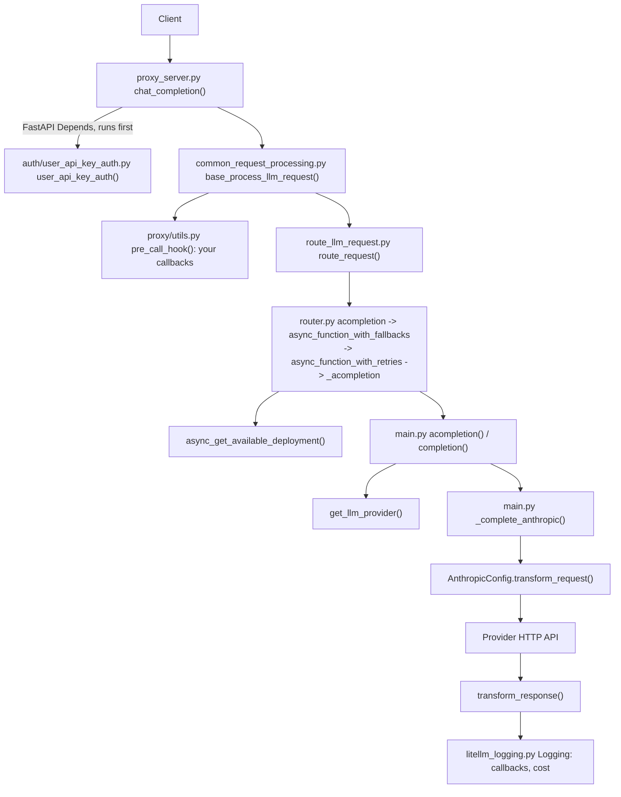
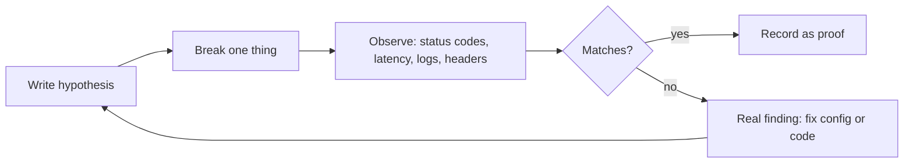
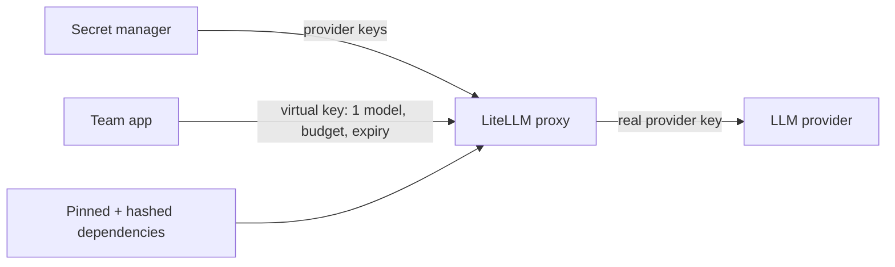

# 15 — Top 1%: read the source, extend it, break it, measure it, secure it, contribute

Project: T1–T6 Top-1% capstone (ROADMAP.md, "Top 1% — beyond users") · Read: before you start building

Previous: [14 — MCP and agents](./14-mcp-and-agents.md) · Next: none, this is the last chapter

---

## The idea in plain words

Until now you have been a driver. This chapter turns you into a mechanic. A mechanic can:

1. **Open the hood** and name each part (T1, reading the source).
2. **Fit a new part** the factory never made (T2, plugins).
3. **Crash-test the car** on purpose (T3, chaos drills).
4. **Put it on a dyno**, a machine that measures real speed (T4, performance).
5. **Lock it up** and know who holds which key (T5, security).
6. **Send a fix back to the factory** (T6, contributing).

Words you will meet:

- **Source code**: the Python files of LiteLLM. They are already on your disk, inside your venv.
- **Call path**: the chain of functions that run, one calling the next.
- **Stack**: the functions that are "open" right now. A **stack trace** prints them.
- **Overhead**: extra time LiteLLM adds on top of the provider's time.
- **p50 / p95**: sort all request times. p50 is the middle one. p95 is slower than 95% of requests. It shows the slow tail users feel.
- **Supply chain**: every package you install, and every package they install. One poisoned package poisons you.
- **PR (pull request)**: a request to a project's owners to merge your change.

---

## Jargon table

| Term | Full name | What it does | Tiny example |
|---|---|---|---|
| `site-packages` | Python's install folder | Holds installed libraries, with source | `.venv/lib/python3.12/site-packages/litellm/` |
| Transformation class | Provider config class | Turns an OpenAI-style request into a provider's format, and back | `AnthropicConfig.transform_request()` |
| `CustomLLM` | Custom provider base class | Subclass it to add your own backend | `class ShoutLLM(CustomLLM)` |
| `custom_provider_map` | Custom provider registry | Maps a prefix like `shout/` to your object | `[{"provider": "shout", "custom_handler": obj}]` |
| `CustomLogger` | Callback base class | Hooks that run before and after calls | `async_pre_call_hook(...)` |
| Cooldown | Temporary bench | Router stops using a failing deployment for a while | default 5 s |
| Circuit breaker | Fast-fail switch | After N failures, stop calling a sick dependency | Redis breaker opens after 5 failures |
| Worker | Server process | One copy of the proxy, one CPU core | `litellm --num_workers 4` |
| Lockfile + hash | Pinned list + file fingerprint | Installs only the exact files you approved | `--hash=sha256:5494...` |
| Least privilege | Smallest needed access | Each key does only its owner's job | key limited to one model and a budget |
| CLA | Contributor License Agreement | Legal form you sign before code is merged | cla-assistant.io/BerriAI/litellm |

---

## T1 — Reading the source

Find your install with `python -c "import litellm; print(litellm.__file__)"`. Key files in 1.104.0:

| File | Lines | What lives there |
|---|---|---|
| `chat_completions/dispatch.py` | 126 | The `completion` you import. Hands off to Python or Rust (`rust_bridge/`) |
| `utils.py` | 10,334 | `def client` (line 1646): the `@client` decorator that wraps every call |
| `main.py` | 9,371 | `completion()` (line 5113), `acompletion()` (line 400), one `_complete_<provider>()` per provider |
| `litellm_core_utils/get_llm_provider_logic.py` | 936 | `get_llm_provider()`: `"anthropic/x"` becomes provider `anthropic`, model `x` |
| `llms/` | 145 folders | One per provider. `llms/anthropic/chat/transformation.py` has `class AnthropicConfig` |
| `llms/base_llm/chat/transformation.py` | 454 | `class BaseConfig`: the shape every provider config follows |
| `router.py` | 14,557 | `class Router`: fallbacks, retries, picking a deployment |
| `proxy/proxy_server.py` | 20,107 | FastAPI app. `chat_completion()` (line 11673) is `/v1/chat/completions` |
| `proxy/auth/user_api_key_auth.py` | 3,794 | `user_api_key_auth()`: checks the `Authorization` header |
| `proxy/common_request_processing.py` | 4,287 | `base_process_llm_request()`: hooks, then the Router |
| `proxy/route_llm_request.py` | 720 | `route_request()`: calls the Router method for the route |
| `litellm_core_utils/litellm_logging.py` | 6,896 | `class Logging`: callbacks, timing, cost |

Never read these top to bottom. Pick one function, search `def <name>`, follow one call. Or let Python trace it for you, as below.



Every box was seen in a real trace below, or read in source at the line shown.

### Part 1 — Trace `completion()` with `sys.setprofile`

`sys.setprofile(fn)` makes Python call `fn` every time any function starts. We print only LiteLLM functions we care about. There is no API key, so a short `http.server` script on port 7015 answers in Anthropic's format. The real Anthropic code path runs.

```python
import sys
import litellm

WATCH = {
    "completion",
    "run",  # rust_bridge dispatcher
    "wrapper",  # the @client decorator in utils.py
    "get_llm_provider",
    "_complete_anthropic",
    "transform_request",
    "transform_response",
    "post_call",
    "success_handler",
}
seen = set()
package_root = litellm.__file__.rsplit("/", 1)[0] + "/"


def tracer(frame, event, arg):
    if event != "call":
        return
    code = frame.f_code
    if code.co_name not in WATCH:
        return
    if not code.co_filename.startswith(package_root):
        return  # skip functions outside litellm
    short_path = code.co_filename.replace(package_root, "litellm/")
    key = (short_path, code.co_name)
    if key in seen:
        return  # print each function once
    seen.add(key)
    print(f"{code.co_name:22} {short_path}:{code.co_firstlineno}")
```

Then the call:

```python
sys.setprofile(tracer)
response = litellm.completion(
    model="anthropic/claude-fake",
    messages=[{"role": "user", "content": "hi"}],
    api_base="http://127.0.0.1:7015",  # our fake server, not Anthropic
    api_key="fake-key",
)
sys.setprofile(None)
print("answer:", response.choices[0].message.content)
```

Output (real, captured with litellm 1.104.0; blank lines removed):

```
completion             litellm/chat_completions/dispatch.py:98
run                    litellm/rust_bridge/dispatch.py:60
wrapper                litellm/utils.py:1652
get_llm_provider       litellm/litellm_core_utils/get_llm_provider_logic.py:158
completion             litellm/main.py:5111
_complete_anthropic    litellm/main.py:2859
run                    litellm/rust_bridge/runtime.py:56
completion             litellm/llms/anthropic/chat/handler.py:323
transform_request      litellm/llms/anthropic/chat/transformation.py:1896
Provider List: https://docs.litellm.ai/docs/providers
transform_response     litellm/llms/anthropic/chat/transformation.py:2711
post_call              litellm/litellm_core_utils/litellm_logging.py:1548
answer: hello from fake anthropic
```

The fake server logged `path: /v1/messages keys: ['max_tokens', 'messages', 'model']`. You never sent `max_tokens`. `transform_request` added it, because Anthropic requires it. That is what a transformation class does.

Reading it: `rust_bridge/dispatch.py` `PublicDispatch.run()` decides Python or Rust; here it ran `python(*args, **kwargs)`. `main.py` `completion` is a long `elif custom_llm_provider == "..."` chain; `anthropic` goes to `_complete_anthropic` (line 5928). The "Provider List" line is printed by LiteLLM; the call still worked.

### Part 2 — Trace the Router

Same tracer, new `WATCH`, and the call goes through a `Router`:

```python
WATCH = {
    "completion",
    "function_with_fallbacks",
    "function_with_retries",
    "_completion",
    "get_available_deployment",
    "_complete_anthropic",
}

router = litellm.Router(
    model_list=[
        {
            "model_name": "chat",  # the name callers use
            "litellm_params": {
                "model": "anthropic/claude-fake",
                "api_base": "http://127.0.0.1:7015",
                "api_key": "fake-key",
            },
        }
    ]
)

sys.setprofile(tracer)
response = router.completion(model="chat", messages=[{"role": "user", "content": "hi"}])
sys.setprofile(None)
print("answer:", response.choices[0].message.content)
```

Output (real, captured with litellm 1.104.0):

```
completion             litellm/router.py:2484
function_with_fallbacks litellm/router.py:7876
_completion            litellm/router.py:2501
get_available_deployment litellm/router.py:13951
completion             litellm/chat_completions/dispatch.py:98
completion             litellm/main.py:5111
_complete_anthropic    litellm/main.py:2859
completion             litellm/llms/anthropic/chat/handler.py:323
answer: hello from fake anthropic
```

The Router adds a fallback layer, picks a deployment, then calls the same `litellm.completion()`. It is a layer on top, not a second engine. The proxy uses the async path: the same idea on `await router.acompletion(...)` printed `acompletion` (router.py:2730), `async_function_with_fallbacks` (7440), `async_function_with_retries` (7575), `_acompletion` (3583), `async_get_available_deployment` (13083), then `acompletion` in `main.py`.

### Part 3 — See the proxy path from inside a callback

A callback can print who called it with `traceback.extract_stack()`. File `my_callbacks.py`:

```python
import traceback
from litellm.integrations.custom_logger import CustomLogger


class StackPrinter(CustomLogger):
    async def async_pre_call_hook(self, user_api_key_dict, cache, data, call_type):
        print("--- pre_call_hook: who called me? ---", flush=True)
        for frame in traceback.extract_stack():
            if "litellm/proxy" not in frame.filename:
                continue  # keep only proxy frames
            short_name = frame.filename.split("site-packages/")[-1]
            print(f"  {frame.name:28} {short_name}:{frame.lineno}", flush=True)
        return data  # unchanged request goes on to the Router

    async def async_log_success_event(self, kwargs, response_obj, start_time, end_time):
        seconds = (end_time - start_time).total_seconds()
        print(f"--- success logged: model={kwargs['model']} took={seconds:.4f}s", flush=True)


stack_printer = StackPrinter()
```

Loaded by `callbacks: my_callbacks.stack_printer` in the config of Part 5. One request printed this in the proxy log.

Output (real, captured with litellm 1.104.0; 6 middleware lines trimmed):

```
--- pre_call_hook: who called me? ---
  run_server                   litellm/proxy/proxy_cli.py:1541
  __call__                     litellm/proxy/middleware/admission_control_middleware.py:151
  __call__                     litellm/proxy/middleware/prometheus_auth_middleware.py:47
  chat_completion              litellm/proxy/proxy_server.py:11724
  base_process_llm_request     litellm/proxy/common_request_processing.py:2476
  open_sse_before_first_byte   litellm/proxy/common_request_processing.py:1219
  _process_llm_request         litellm/proxy/common_request_processing.py:2539
  _pre_call_with_fallbacks     litellm/proxy/common_request_processing.py:2246
  common_processing_pre_call_logic litellm/proxy/common_request_processing.py:2187
  pre_call_hook                litellm/proxy/utils.py:2507
INFO:     127.0.0.1:50300 - "POST /v1/chat/completions HTTP/1.1" 200 OK
--- success logged: model=v1 took=0.0420s
```

The full stack had eight middleware layers. Auth is missing: the route is declared with `dependencies=[Depends(user_api_key_auth)]` (proxy_server.py line 11654), so FastAPI ran auth and finished it before calling `chat_completion`.

---

## T2 — Extending LiteLLM

| You want to... | Subclass | Register with |
|---|---|---|
| Add a backend LiteLLM does not know | `litellm.CustomLLM` (`llms/custom_llm.py`) | `custom_provider_map` |
| Run code before/after every call | `CustomLogger` (`integrations/custom_logger.py`) | `callbacks` (Part 3 above) |
| Block or rewrite unsafe input/output | `CustomGuardrail` | `guardrails:` in config, see [chapter 11](./11-rag-and-guardrails.md) |

### Part 4 — A custom provider

Pretend your company has an internal model with its own API. This toy one shouts the question back. `my_provider.py`:

```python
import litellm
from litellm import CustomLLM
from litellm.types.utils import ModelResponse


class ShoutLLM(CustomLLM):
    def completion(self, model, messages, *args, **kwargs) -> ModelResponse:
        last_message = messages[-1]["content"]
        answer = last_message.upper()
        response = ModelResponse()  # an empty OpenAI-shaped response
        response.model = model
        response.choices[0].message.content = answer
        return response

    async def acompletion(self, model, messages, *args, **kwargs) -> ModelResponse:
        # A real provider would await an HTTP call here.
        return self.completion(model, messages)


shout_llm = ShoutLLM()  # the proxy config imports this object by name
```

`use_provider.py`:

```python
import asyncio
import litellm
from my_provider import shout_llm

# "shout/<anything>" now goes to ShoutLLM.
litellm.custom_provider_map = [
    {"provider": "shout", "custom_handler": shout_llm},
]

sync_response = litellm.completion(model="shout/v1", messages=[{"role": "user", "content": "hello gateway"}])
print("sync :", sync_response.choices[0].message.content)
print("model:", sync_response.model)


async def main():
    async_response = await litellm.acompletion(model="shout/v1", messages=[{"role": "user", "content": "async works too"}])
    print("async:", async_response.choices[0].message.content)


asyncio.run(main())
```

Output (real, captured with litellm 1.104.0):

```
sync : HELLO GATEWAY
model: v1
async: ASYNC WORKS TOO
```

LiteLLM stripped `shout/` before calling you. If you skip `acompletion`, async calls hit the base class, which raises `CustomLLMError("Not implemented yet!")`. For streaming, also override `streaming` and `astreaming` ([Custom API Server docs](https://docs.litellm.ai/docs/providers/custom_llm_server)).

### Part 5 — The same provider behind the proxy

`config.yaml`, in the same folder as the two Python files:

```yaml
model_list:
  - model_name: shout
    litellm_params:
      model: shout/v1

litellm_settings:
  custom_provider_map:
    - provider: shout
      custom_handler: my_provider.shout_llm
  callbacks: my_callbacks.stack_printer

general_settings:
  master_key: os.environ/LITELLM_MASTER_KEY
```

Start with `LITELLM_MASTER_KEY=sk-ch15-master litellm --config config.yaml --port 4015`, then call it with the master key and with a wrong key:

```bash
curl -s http://127.0.0.1:4015/v1/chat/completions -H "Authorization: Bearer sk-ch15-master" \
  -H "Content-Type: application/json" -d '{"model":"shout","messages":[{"role":"user","content":"through the proxy"}]}'
curl -s http://127.0.0.1:4015/v1/chat/completions -H "Authorization: Bearer wrong" \
  -H "Content-Type: application/json" -d '{"model":"shout","messages":[{"role":"user","content":"x"}]}'
```

Output (real, captured with litellm 1.104.0):

```
{"id":"chatcmpl-aaec0e51-1b1d-485d-91ba-8577f20dd866","created":1791218251,"model":"shout","object":"chat.completion","choices":[{"finish_reason":"stop","index":0,"message":{"content":"THROUGH THE PROXY","role":"assistant"}}]}
{"error":{"message":"No connected db.","type":"no_db_connection","param":null,"code":"400"}}
```

The wrong key got a 400 "No connected db.", not a 401. Without a database, the proxy cannot look up virtual keys at all. Read the errors your system really returns. The loader is in `proxy_server.py` near line 6217: `get_instance_fn()` imports your object, then `custom_llm_setup()` (utils.py line 569) adds `shout` to `litellm.provider_list`.

---

## T3 — Chaos drills

A chaos drill is a fire drill. You break one thing on purpose, in a test setup, and record what happened.



### Part 6 — Drill: the provider dies

Group `chat` points at port 7015, where nothing listens. `chaos_dead_provider.py`:

```python
import time
import litellm
from my_provider import shout_llm

litellm.custom_provider_map = [{"provider": "shout", "custom_handler": shout_llm}]

router = litellm.Router(
    model_list=[
        {
            "model_name": "chat",
            "litellm_params": {
                "model": "openai/fake-gpt",
                "api_base": "http://127.0.0.1:7015/v1",  # nothing listens here: a dead provider
                "api_key": "fake-key",
            },
        },
        {"model_name": "backup", "litellm_params": {"model": "shout/v1"}},
    ],
    fallbacks=[{"chat": ["backup"]}],  # if "chat" fails, try "backup"
    num_retries=0,  # fail fast so the drill is quick
)

for attempt in range(3):
    start = time.perf_counter()
    response = router.completion(model="chat", messages=[{"role": "user", "content": "still alive?"}])
    elapsed_ms = (time.perf_counter() - start) * 1000
    served_by = response._hidden_params.get("litellm_model_name")  # the deployment that answered
    answer = response.choices[0].message.content
    print(f"call {attempt + 1}: served_by={served_by} answer={answer!r} took={elapsed_ms:.0f} ms")
```

Output (real, captured with litellm 1.104.0):

```
call 1: served_by=shout/v1 answer='STILL ALIVE?' took=488 ms
call 2: served_by=shout/v1 answer='STILL ALIVE?' took=6 ms
call 3: served_by=shout/v1 answer='STILL ALIVE?' took=6 ms
```

All calls survived. A good drill asks one more question: was the dead deployment put in cooldown? Checking with `_get_cooldown_deployments()` (`router_utils/cooldown_handlers.py`) printed `chat in cooldown: False`. The reason is in `_should_cooldown_deployment()`: a group with one deployment is cooled down only if 100% of requests fail and at least `SINGLE_DEPLOYMENT_TRAFFIC_FAILURE_THRESHOLD` (default 1000, `constants.py`) arrive in a minute. Benching your only deployment would leave nothing to call. A drill that teaches you that has done its job.

### Drill list for your capstone

| # | Break this | How (offline) | Expected behaviour to prove |
|---|---|---|---|
| 1 | Provider dead | `api_base` to a closed port | Fallback answers; proxy header `x-litellm-attempted-fallbacks: 1` |
| 2 | Provider rate-limits | `mock_response="litellm.RateLimitError"` (main.py line 766) | Retries, then fallback; with 2+ deployments in a group, the failing one is cooled down (429 rule) |
| 3 | Provider slow | fake server sleeping 30 s, `timeout: 5` | `litellm.Timeout` after about 5 s, not 30 s |
| 4 | Redis killed | `docker stop` your Redis | Still 200s. Breaker opens after `REDIS_CIRCUIT_BREAKER_FAILURE_THRESHOLD` (5) failures, probes after `REDIS_CIRCUIT_BREAKER_RECOVERY_TIMEOUT` (60 s), both in `constants.py`. Cache hits drop to 0 |
| 5 | Postgres killed | `docker stop` your Postgres | Virtual-key calls fail, unless `general_settings.allow_requests_on_db_unavailable: true` (see `auth/auth_exception_handler.py`). Record your choice and why |
| 6 | Budget full | key with `max_budget: 0.0001`, a few calls | Later calls fail with a budget error; other keys unaffected |
| 7 | Replica killed | `kubectl delete pod` (chapter 12) | Load test sees zero or a short blip of errors; a new pod starts |

---

## T4 — Performance

Rule one: measure first, find the bottleneck, then change one thing.

### Part 7 — Library overhead with `mock_response`

`mock_response` returns early in `completion()` (main.py line 5713), after provider detection and parameter mapping, before any HTTP. So this measures LiteLLM's own Python work.

```python
import statistics
import time
import litellm

messages = [{"role": "user", "content": "hi"}]
timings_ms = []

litellm.completion(model="gpt-4o-mini", messages=messages, mock_response="ok")  # warm-up

for i in range(500):
    start = time.perf_counter()
    litellm.completion(model="gpt-4o-mini", messages=messages, mock_response="ok")
    timings_ms.append((time.perf_counter() - start) * 1000)

timings_ms.sort()
print(f"calls: {len(timings_ms)}")
print(f"mean : {statistics.mean(timings_ms):.2f} ms")
print(f"p50  : {timings_ms[len(timings_ms) // 2]:.2f} ms")
print(f"p95  : {timings_ms[int(len(timings_ms) * 0.95)]:.2f} ms")
```

Output (real, captured with litellm 1.104.0, Apple Silicon laptop):

```
calls: 500
mean : 0.33 ms
p50  : 0.27 ms
p95  : 0.48 ms
```

A real model takes hundreds of milliseconds. Library overhead is almost never your problem.

### Part 8 — Proxy overhead and load

A fake OpenAI-compatible server listens on 7015. A proxy on 4015 points at it:

```yaml
model_list:
  - model_name: fake-gpt
    litellm_params:
      model: openai/fake-gpt
      api_base: http://127.0.0.1:7015/v1
      api_key: os.environ/FAKE_OPENAI_KEY
general_settings:
  master_key: os.environ/LITELLM_MASTER_KEY
```

`perf_proxy.py` times 300 requests straight to the fake, then 300 through the proxy. The proxy also reports its own overhead in the `x-litellm-overhead-duration-ms` header (`common_request_processing.py` line 1806).

```python
import time
import httpx

BODY = {"model": "fake-gpt", "messages": [{"role": "user", "content": "hi"}]}
DIRECT = "http://127.0.0.1:7015/v1/chat/completions"  # the fake provider itself
PROXY = "http://127.0.0.1:4015/v1/chat/completions"  # LiteLLM in front of it
KEY = {"Authorization": "Bearer sk-ch15-master"}


def p50_ms(client, url, headers, rounds):
    timings = []
    proxy_reported = []
    for i in range(rounds):
        start = time.perf_counter()
        reply = client.post(url, headers=headers, json=BODY)
        timings.append((time.perf_counter() - start) * 1000)
        reported = reply.headers.get("x-litellm-overhead-duration-ms")  # set by the proxy
        if reported is not None:
            proxy_reported.append(float(reported))
    timings.sort()
    proxy_reported.sort()
    reported_p50 = None
    if proxy_reported:  # only the proxy sends this header
        reported_p50 = proxy_reported[rounds // 2]
    return timings[rounds // 2], reported_p50


with httpx.Client() as client:
    p50_ms(client, PROXY, KEY, 20)  # warm-up
    direct, unused = p50_ms(client, DIRECT, {}, 300)
    proxied, reported = p50_ms(client, PROXY, KEY, 300)
print(f"direct p50 {direct:.2f} ms | proxy p50 {proxied:.2f} ms | added {proxied - direct:.2f} ms")
print(f"proxy's own x-litellm-overhead-duration-ms p50: {reported:.2f} ms")
```

`perf_load.py` keeps 50 requests in flight until 2000 are done, against the URL you pass:

```python
import asyncio
import sys
import time
import httpx

URL = sys.argv[1]  # proxy or the fake provider directly
BODY = {"model": "fake-gpt", "messages": [{"role": "user", "content": "hi"}]}
KEY = {"Authorization": "Bearer sk-ch15-master"}
TOTAL = 2000
IN_FLIGHT = 50  # requests running at the same moment


async def one_user(client, latencies):
    while len(latencies) < TOTAL:
        start = time.perf_counter()
        reply = await client.post(URL, headers=KEY, json=BODY)
        reply.raise_for_status()
        latencies.append((time.perf_counter() - start) * 1000)


async def main():
    latencies = []
    limits = httpx.Limits(max_connections=IN_FLIGHT)
    async with httpx.AsyncClient(limits=limits, timeout=60) as client:  # default 5 s is too short under load
        started = time.perf_counter()
        users = []
        for i in range(IN_FLIGHT):
            users.append(one_user(client, latencies))
        await asyncio.gather(*users)
        seconds = time.perf_counter() - started
    latencies.sort()
    print(f"{len(latencies) / seconds:.0f} req/s, p95 {latencies[int(len(latencies) * 0.95)]:.0f} ms")


asyncio.run(main())
```

A shell script started the fake and the proxy (`--num_workers 1`, then `--num_workers 4`), ran `perf_proxy.py`, then `perf_load.py` at the proxy and straight at the fake.

Output (real, captured with litellm 1.104.0, 10-core laptop, no database, no Redis):

```
== workers=1 sequential
direct p50 0.22 ms | proxy p50 2.86 ms | added 2.65 ms
proxy's own x-litellm-overhead-duration-ms p50: 1.31 ms
== workers=1 load via proxy
373 req/s, p95 203 ms
== load direct to fake provider
354 req/s, p95 531 ms
== workers=4 sequential
direct p50 0.23 ms | proxy p50 3.18 ms | added 2.95 ms
proxy's own x-litellm-overhead-duration-ms p50: 1.45 ms
== workers=4 load via proxy
206 req/s, p95 708 ms
== load direct to fake provider
342 req/s, p95 563 ms
```

What this says:

- One request through the proxy costs about 2.7 ms more. The proxy counts 1.3 ms as its own work. The rest is the extra network hop.
- Four workers were **slower**. Earlier runs with a first version of the load script agreed (1 vs 4 workers: 292 vs 173, 297 vs 258, 307 vs 146 req/s).
- The fake provider alone tops out near 350 req/s. It is a single-process Python server. The ceiling here is the upstream, not LiteLLM. A likely reason 4 workers did worse is more parallel connections hitting a server that was already full. That is a guess to test, not a proven fact.
- Load generator, fake, and proxy share one laptop CPU here. Real tests put them on separate machines.

Official numbers to compare: the [Benchmarks page](https://docs.litellm.ai/docs/benchmarks) reports, for 2 instances on 4 CPU / 8 GB machines against a fake OpenAI endpoint at about 1,035 RPS with Postgres, a "LiteLLM Overhead Duration" median of 12 ms and p95 of 29 ms. The [Proxy Performance page](https://docs.litellm.ai/docs/proxy/perf) states 0.00325 s added latency compared to the raw OpenAI API. If yours are far off, use the [Latency Overhead Troubleshooting guide](https://docs.litellm.ai/docs/troubleshoot/latency_overhead).

Knobs (verified in `litellm --help` / source for 1.104.0): `--num_workers`, `--run_granian` with `--granian_threads`, and `LITELLM_DETAILED_TIMING`, which adds `x-litellm-timing-pre-processing-ms`, `-llm-api-ms` and `-post-processing-ms` headers.

---

## T5 — Security



**Least privilege.** Virtual key fields in `proxy/_types.py` (1.104.0): `models`, `max_budget`, `budget_duration`, `tpm_limit`, `rpm_limit`, `duration` (auto-expiry), `allowed_routes`, and `key_type` (`llm_api`, `management`, `read_only`, `default`). The master key is the root password; apps never get it.

**Key rotation.**
- Virtual keys: `POST /key/{key}/regenerate`, with optional `grace_period` like `"48h"` so old and new both work during the switch ([Key Rotations](https://docs.litellm.ai/docs/proxy/virtual_keys)). This is Enterprise-only: the code raises "Regenerating Virtual Keys is an Enterprise feature" for non-premium users (`key_management_endpoints.py` near line 5848). On open source: create a new key, move the app, delete the old one.
- Provider keys: rotate at the provider, update the secret manager. Config only says `os.environ/...`, so it does not change.
- Master key: stored credentials are encrypted with `LITELLM_SALT_KEY`, and fall back to the master key if it is unset (`_get_salt_key()` in `proxy/common_utils/encrypt_decrypt_utils.py`). Set a separate salt key before adding models, never change it, and the master key becomes safe to rotate.

**Secret managers.** `general_settings.key_management_system` accepts (enum in `types/secret_managers/main.py`): `google_kms`, `azure_key_vault`, `aws_secret_manager`, `google_secret_manager`, `hashicorp_vault`, `cyberark`, `aws_kms`, `custom`, `local`. Setup: [Secret Managers docs](https://docs.litellm.ai/docs/secret).

### Part 9 — Pin versions with hashes

```bash
printf 'litellm==1.104.0\n' > requirements.in
uv pip compile requirements.in --generate-hashes --python-version 3.12 -o requirements.txt
grep -n -A4 "^litellm==" requirements.txt
grep -c "==" requirements.txt
```

Output (real, captured with uv 0.11.19 for litellm 1.104.0):

```
777:litellm==1.104.0 \
778-    --hash=sha256:3c4a15692a9dd259033195c5d4ca1697a14e6bd50d679435a799a9028e99b453 \
779-    --hash=sha256:414d31b0bda41aa8fb8696c78d5f728a446e37a34476c6f5f2b6fa17ddd66ee4 \
780-    --hash=sha256:5494970a1f035db8557aa87fd5e289757a26b204f25e53430c181e608a42a864 \
781-    --hash=sha256:574acb77ed62ca2b2a751f7182e2fa1055dbbf047fabfa03d8e8af6d5502636d \
58
```

58 packages, each pinned with hashes. Now copy it to `tampered.txt`, replace litellm's hashes with zeros (as if the file on PyPI was swapped), and install with `uv pip install --require-hashes -r tampered.txt`.

Output (real, captured with uv 0.11.19; repeated zero hashes trimmed):

```
Resolved 58 packages in 23ms
  × Failed to download `litellm==1.104.0`
  ╰─▶ Hash mismatch for `litellm==1.104.0`

      Expected:
        sha256:0000000000000000000000000000000000000000000000000000000000000000
      Computed:
        sha256:5494970a1f035db8557aa87fd5e289757a26b204f25e53430c181e608a42a864
```

### This really happened to LiteLLM

On March 24, 2026, two poisoned versions, `litellm==1.82.7` and `1.82.8`, were published to PyPI. They contained a credential stealer that collected environment variables, SSH keys, and cloud credentials and sent them to `models.litellm.cloud`, which is not a LiteLLM domain. LiteLLM's report says they were live from 10:39 UTC for about 40 minutes before PyPI quarantined them. Users of the official proxy Docker image were not affected, because it pins dependencies. The likely entry point was a compromised Trivy security scanner in LiteLLM's CI. Version 1.82.8 added a `litellm_init.pth` file, which Python runs at every startup, even without `import litellm`. Sources: [LiteLLM security update](https://docs.litellm.ai/blog/security-update-march-2026), [GitHub issue #24518](https://github.com/BerriAI/litellm/issues/24518), [Aqua Security on Trivy](https://www.aquasec.com/blog/trivy-supply-chain-attack-what-you-need-to-know/).

The report lists "ran `pip install litellm` without pinning a version" as one way to be affected. A hashed lockfile made in advance would have refused the new file.

---

## T6 — Contributing

**Repo layout** (github.com/BerriAI/litellm, checked via the GitHub API): `litellm/` (the same tree as T1), `tests/` (`tests/unit/` mirrors `litellm/`, so `litellm/utils.py` maps to `tests/unit/test_utils.py`), `ui/litellm-dashboard/` (admin UI), `litellm-rust/` (Rust code behind `rust_bridge/`), `ARCHITECTURE.md` (request-flow diagram; compare with your trace), `AGENTS.md` (rules for AI tools and PR writing style), `model_prices_and_context_window.json` (price list; common small PRs).

**Running tests**, from [CONTRIBUTING.md](https://github.com/BerriAI/litellm/blob/main/CONTRIBUTING.md) (not run here, needs a clone):

```bash
make install-dev
make install-hooks                               # enforces commit/branch names
make format
make lint                                        # same checks as CI
uv run pytest tests/unit/<your_test_file>.py -v  # only tests for your change; CI runs the rest
```

**Finding work.** The guide points to the [good first issue label](https://github.com/BerriAI/litellm/labels/good%20first%20issue). On the day this chapter was written it had 0 open issues, `help wanted` had 0, and `docs` had 12. The best source is a bug you hit yourself in T1–T4: you already have a reproduction.

**PR etiquette.**
- Sign the [CLA](https://cla-assistant.io/BerriAI/litellm) first.
- One problem per PR ("Keep scope isolated").
- At least one test is required for backend PRs. Tests are mocked; no real API calls.
- Conventional Commits (`fix(router): ...`) and Conventional Branches.
- Search issues and PRs first; say on the issue that you are on it.
- PR text: what was wrong, how to reproduce, what changed, how you tested. Short and plain.
- Answer review with new commits so reviewers see the change.

---

## How big companies use this

- **Pfizer** runs LiteLLM as a self-hosted gateway for every team and load-tests every version bump in CI against fixed baselines. That caught a throughput drop from about 300 to 156 RPS with zero HTTP errors. They isolated it by enabling features one at a time (Redis caching was the trigger). The cause was one line in `litellm/_redis.py` that checked whether the `ssl` key was present, not whether it was true. The fix and their load-test setup were contributed upstream. That is T1, T3, T4 and T6 in one story. Source: [LiteLLM blog, Pfizer case study](https://docs.litellm.ai/blog/pfizer-gateway-performance-and-resiliency).
- **LiteLLM's own gateway** runs on 100+ pods. They treat a *slow* Redis as worse than a dead one, which is why drill 4 has a circuit breaker. Source: [Making the AI Gateway Resilient to Redis Failures](https://docs.litellm.ai/blog/redis-circuit-breaker).
- **Typical pattern**: platform teams pin gateway versions, load-test upgrades against a mock backend in CI, wrap internal models as custom or OpenAI-compatible providers, give every app a least-privilege key, and keep provider keys in a secret manager.

---

## Traps

1. **Reading a 20,000-line file from the top.** Start from one function and follow one call, or trace it.
2. **Treating mock benchmarks as real-world numbers.** `mock_response` skips HTTP. Say so in any report.
3. **Adding workers before finding the bottleneck.** Part 8 showed more workers making it worse because the upstream was full.
4. **Forgetting `acompletion` in a custom provider.** The proxy uses the async path, so every proxy request fails with "Not implemented yet!".
5. **Running a drill without a written hypothesis.** Then any result looks "fine".
6. **Unpinned `pip install litellm` in Dockerfiles and CI.** That was the exposure in the March 2026 incident.

---

## Project brief: Top-1% capstone (T1–T6)

**Goal:** prove you understand LiteLLM from the inside. Ship a plugin, break your gateway on purpose, measure it, lock it down, and send a change upstream.

**Features:**

1. **T1 Source map.** `SOURCE_MAP.md` with a mermaid diagram of the proxy request path. Every box names a real file and function from your installed version, backed by your own trace output.
2. **T2 Custom provider + callback.** A `CustomLLM` wrapping something real and local (an Ollama model, a small HTTP service you write, or a rules engine) with `completion`, `acompletion`, and streaming, running behind your proxy. Plus one custom callback that logs something useful, such as latency per key alias.
3. **T3 Chaos report.** Five or more drills from the list, including Redis and Postgres. Each: hypothesis, command, evidence, verdict, any fix.
4. **T4 Perf report.** Library overhead, proxy overhead (p50 and p95), and a Locust load test with 1, 2 and 4 workers against a fake provider on a separate container or machine. Name the bottleneck and show the evidence.
5. **T5 Security setup.** Hashed lockfile, least-privilege keys for two apps, provider keys from a secret manager (or at least `.env`), and a rotation runbook you have practised once.
6. **T6 Contribution.** One PR opened against `BerriAI/litellm` (bug fix with a test, or a docs fix). Merged is the stretch goal.

**Rules:** no keys in code or git (use `.env`, listed in `.gitignore`, or a secret manager); pin `litellm==<exact version>` with hashes everywhere; run drills only on your own setup; every number in a report comes from a real run, with its command.

**Done when:**

- [ ] `SOURCE_MAP.md` matches a fresh trace on your installed version.
- [ ] `curl` to your proxy with your provider's model returns its answer, with and without `"stream": true`.
- [ ] Your callback's log line appears for every request.
- [ ] The chaos report has 5+ drills, each with evidence and a pass/fail verdict.
- [ ] The perf report shows overhead p50/p95, req/s for 1, 2, 4 workers, and the named bottleneck.
- [ ] `uv pip install --require-hashes -r requirements.txt` succeeds; a tampered copy fails.
- [ ] One app key gets an error when calling a model outside its `models` list.
- [ ] A PR link exists.

**Hints:**

1. Which method does the proxy call on your `CustomLLM`, sync or async? How can you prove it?
2. What must a `GenericStreamingChunk` contain, and how does LiteLLM know the stream ended?
3. How do you prove the fake provider is not the bottleneck before blaming LiteLLM?
4. When Redis is down, what should happen to rate limits and caching, and which log lines show the breaker opened?
5. Which bug from T1–T4 could you reproduce in a mocked test under `tests/unit/`?

---

## Check yourself

1. In 1.104.0, which `main.py` function handles an `anthropic/...` model, and what adds `max_tokens` to the request?

<details><summary>Answer</summary>

`_complete_anthropic()` (main.py line 2859). `AnthropicConfig.transform_request()` in `llms/anthropic/chat/transformation.py` builds the Anthropic body, including the required `max_tokens`. The fake server received `max_tokens` though we never sent it.

</details>

2. Why is `user_api_key_auth` not in the stack printed inside `async_pre_call_hook`?

<details><summary>Answer</summary>

It is a FastAPI dependency (`Depends(user_api_key_auth)` on the route). FastAPI runs it to completion before calling `chat_completion()`. Its result arrives in the hook as `user_api_key_dict`.

</details>

3. Your `CustomLLM` has only `completion()`. Scripts work, but every proxy request fails. Why?

<details><summary>Answer</summary>

The proxy uses the async path (`router.acompletion` → `litellm.acompletion`). Without your own `acompletion()`, the base class raises `CustomLLMError("Not implemented yet!")`.

</details>

4. In the dead-provider drill the deployment was never cooled down. Bug?

<details><summary>Answer</summary>

No. It was the only deployment in its group. `_should_cooldown_deployment()` avoids benching a single-deployment group unless 100% of requests fail and at least `SINGLE_DEPLOYMENT_TRAFFIC_FAILURE_THRESHOLD` (default 1000) arrive in a minute. The fallback group handled the failure.

</details>

5. Going from 1 to 4 workers dropped throughput from 373 to 206 req/s. What do you check before touching LiteLLM settings?

<details><summary>Answer</summary>

Whether something else is the bottleneck. The fake provider alone topped out near 350 req/s, and the load generator shared the CPU. Measure each part alone, then tune.

</details>

6. How would a hashed lockfile have protected you in the March 2026 incident, and what if you had installed 1.82.7 or 1.82.8?

<details><summary>Answer</summary>

The lockfile pins one exact file per package, and `--require-hashes` refuses any other, so an unpinned upgrade to the poisoned versions could not happen. If you did install one, the official report and issue #24518 say to treat every credential on that machine as stolen and rotate it all, and to check `site-packages` for `litellm_init.pth`.

</details>
