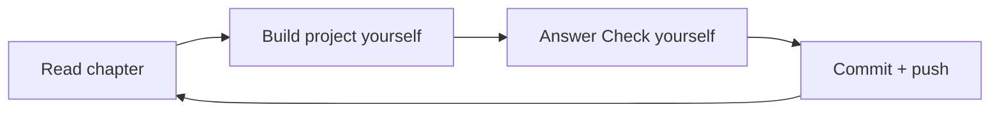

# Theory — LiteLLM Mastery

One chapter per project in [`../ROADMAP.md`](../ROADMAP.md).
Read the chapter, then build the project. Keep the chapter open while you build.

## How each chapter works

- Plain words first, with an everyday analogy. Every new word is explained.
- Small code demos in parts. Each demo shows one idea.
- Every output shown is **real**. It was captured by running the demo with `litellm 1.104.0`.
  No API keys were used: demos use `mock_response=` (a fake reply built into LiteLLM).
  Lines marked "not run here" need a real key or Ollama on your laptop.
- "How big companies use this", "Traps", a **project brief** (you write the code), and "Check yourself" questions.

## Chapters

| # | Chapter | Project |
|---|---------|---------|
| 01 | [LLM API basics, tokens, cost, setup](./01-llm-api-basics.md) | Level 0 |
| 02 | [`completion()` and providers](./02-completion-and-providers.md) | S1 Model switcher CLI |
| 03 | [Streaming and cost](./03-streaming-and-cost.md) | S2 Streaming chatbot with cost meter |
| 04 | [Reliability: retries, timeouts, fallbacks](./04-reliability.md) | S3 Unbreakable caller |
| 05 | [Tools and structured output](./05-tools-and-structured-output.md) | S4 Tool-calling assistant |
| 06 | [Async, batching, embeddings](./06-async-batch-embeddings.md) | S5 Async batch summarizer |
| 07 | [The Router](./07-router.md) | M1 Load balancer |
| 08 | [The Proxy (AI gateway)](./08-proxy-gateway.md) | M2 Self-hosted gateway |
| 09 | [Virtual keys, teams, budgets](./09-keys-teams-budgets.md) | M3 Multi-team cost control |
| 10 | [Caching and observability](./10-caching-observability.md) | M4 Fast + observable gateway |
| 11 | [RAG and guardrails](./11-rag-and-guardrails.md) | M5 Safe RAG service |
| 12 | [Platform on Kubernetes](./12-platform-on-kubernetes.md) | L1 Company AI platform |
| 13 | [Smart routing and hooks](./13-smart-routing-and-hooks.md) | L2 Cost-aware smart router |
| 14 | [MCP and agents](./14-mcp-and-agents.md) | L3 Agent platform |
| 15 | [Top 1%](./15-top-one-percent.md) | T1–T6 |

## Rhythm for every project

